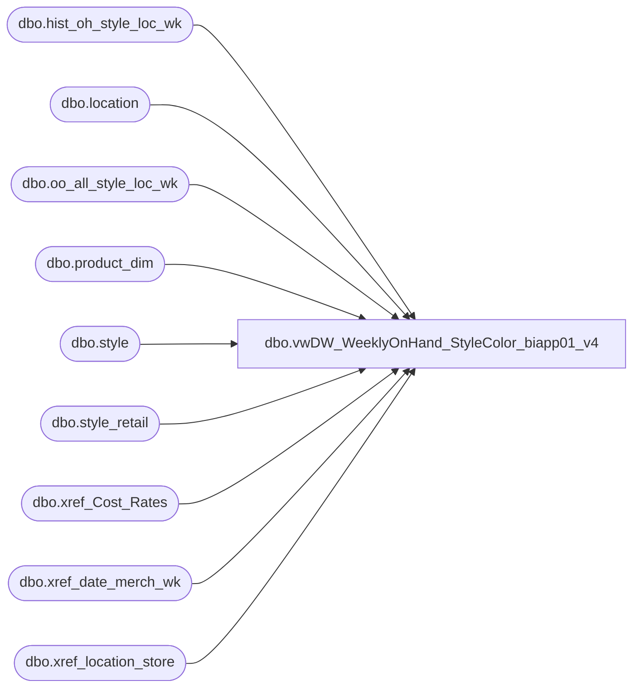

# dbo.vwDW_WeeklyOnHand_StyleColor_biapp01_v4

**Database:** ma_01  
**Server:** bedrockdb02  

## Architecture Diagram



## Table Dependencies

| Referenced Table |
|---|
| dbo.hist_oh_style_loc_wk |
| dbo.location |
| dbo.oo_all_style_loc_wk |
| dbo.product_dim |
| dbo.style |
| dbo.style_retail |
| dbo.xref_Cost_Rates |
| dbo.xref_date_merch_wk |
| dbo.xref_location_store |

## View Code

```sql
/*
G Murrish		3/1/2013		Changed lookup of product_key to handle the problems with R-B-Z products which go across 
								multiple jurisdictions
G Murrish		2/12/2013		Added currency conversion for Cost. All costs are stored in USD and need to be translated to 
								native currency.
K Shyr			7/8/2013		Added native lines for on_hand_cost_native and current_retail
                                Also changed the formula of on_hand_retail
*/

CREATE VIEW [dbo].[vwDW_WeeklyOnHand_StyleColor_biapp01_v4]
AS
SELECT
	-- dimension keys
	s.style_code,
	xs.jurisdiction_code,

	CASE
    WHEN xs.jurisdiction_code = 'US' THEN 1100
    WHEN xs.jurisdiction_code = 'CA' THEN 1700
    WHEN xs.jurisdiction_code IN ('UK','IE') THEN 2110
    WHEN xs.jurisdiction_code = 'CN' THEN 3001
    ELSE NULL
END AS LegalEntity,

	--CAST(ISNULL(xp.product_key, xpsoly.product_key) AS varchar) AS product_key,
	CAST(xs.store_key AS varchar) AS store_key,
	xd.date_key,
	oh.inventory_status_id,
	oh.price_status_id,
	oh.merch_year_wk,
	oh.style_id,
	oh.location_id,
	oh.on_hand_units,
	oh.on_hand_units AS on_hand_units_woa,
	oo.[allocation_units] AS [allocation_units],

	--Changed for Oct 2008 go-live to match Mark's validation query for OH Retail
	-- changed 2014-07-10 to change on_hand_retail and on_hand_retail_native calculations
	-- oh.on_hand_retail AS on_hand_retail,
	CAST(oh.on_hand_units * ISNULL(sr.current_sellcurr_retail, 0) * ISNULL(xchange.rate, 1) AS MONEY) AS on_hand_retail,
	-- CAST(oh.on_hand_retail / ISNULL(xchange.rate, 1) AS money) AS on_hand_retail_native, -- added 2014-07-09 by Kevin Shyr to accommondate currency conversion
	CAST(oh.on_hand_units * ISNULL(sr.current_sellcurr_retail, 0) AS MONEY) AS on_hand_retail_native, 
	-- Tax exclusive USD - Keith L 4/29/2010
	oh.on_hand_retail_te AS on_hand_retail_te,
	CASE
			WHEN l.jurisdiction_id = 2 THEN NULL -- UK
		ELSE oh.on_hand_units * ISNULL(sr.current_sellcurr_retail, 0)
	END AS on_hand_retail_old,

	--Changed for Oct 2008 go-live to match Mark's validation query for OH retail
	--		,case when p.division = 'Uk' then null  
	--			else (oh.on_hand_units) * isnull(sr.current_sellcurr_retail,0) 
	--		  end as on_hand_retail
	--			, oh.on_hand_retail as on_hand_retail_old
	--		
	sr.current_sellcurr_retail AS current_retail_native,
	sr.current_retail,
	l.location_code,
	oh.on_hand_cost AS on_hand_cost, -- changed 2014-07-09 by Kevin Shyr to accommondate currency conversion
	CAST(oh.on_hand_cost / ISNULL(xchange.rate, 1) AS money) AS on_hand_cost_native -- added 2014-07-09 by Kevin Shyr to accommondate currency conversion
--oh.on_hand_cost AS on_hand_cost
FROM
	dbo.hist_oh_style_loc_wk oh WITH (NOLOCK)
	join style s on oh.style_id = s.style_id

	INNER JOIN dbo.location l WITH (NOLOCK)
		ON l.location_id = oh.location_id
	INNER JOIN style_retail sr WITH (NOLOCK)
		ON sr.style_id = oh.style_id
		AND sr.jurisdiction_id = l.jurisdiction_id
	LEFT JOIN oo_all_style_loc_wk oo WITH (NOLOCK)
		ON oo.style_id = oh.style_id
		AND oo.location_id = oh.location_id
		AND oo.merch_year_wk = oh.merch_year_wk
	INNER JOIN dw_mirror.dbo.xref_location_store xs WITH (NOLOCK)
		ON oh.location_id = xs.location_id
	LEFT JOIN (SELECT
			pd.style_id,
			pd.jurisdiction_id,
			MIN(pd.product_key) AS product_key
		FROM
			dw_mirror.dbo.product_dim pd WITH (NOLOCK)
		GROUP BY	pd.style_id,
			pd.jurisdiction_id
	) xp
		ON oh.style_id = xp.style_id
		AND xs.jurisdiction_id = xp.jurisdiction_id
	LEFT JOIN (SELECT
			pd.style_id,
			MIN(pd.product_key) AS product_key
		FROM
			dw_mirror.dbo.product_dim pd WITH (NOLOCK)
		GROUP BY	pd.style_id
	) xpsoly
		ON oh.style_id = xpsoly.style_id
	INNER JOIN dw_mirror.dbo.xref_date_merch_wk xd WITH (NOLOCK)
		ON oh.merch_year_wk = xd.merch_year_wk
	LEFT JOIN dw_mirror.dbo.xref_Cost_Rates xchange
		ON xchange.jurisdiction_id = xs.jurisdiction_id
		AND xchange.weekKey = oh.merch_year_wk

		--where s.style_code = '432189'
```

