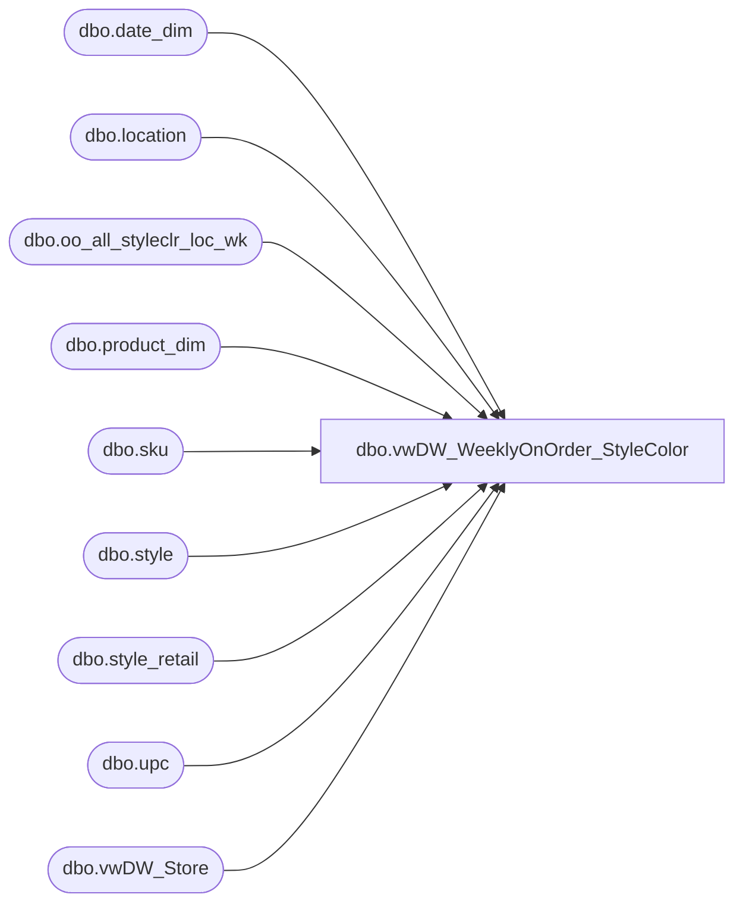

# dbo.vwDW_WeeklyOnOrder_StyleColor

**Database:** ma_01  
**Server:** bedrockdb02  

## Architecture Diagram



## Table Dependencies

| Referenced Table |
|---|
| dbo.date_dim |
| dbo.location |
| dbo.oo_all_styleclr_loc_wk |
| dbo.product_dim |
| dbo.sku |
| dbo.style |
| dbo.style_retail |
| dbo.upc |
| dbo.vwDW_Store |

## View Code

```sql
CREATE VIEW [dbo].[vwDW_WeeklyOnOrder_StyleColor]
AS

-- =============================================================================================================
-- Name: [dbo].[vwDW_WeeklyOnOrder_StyleColor]
--
-- Description: View underlying the SSAS Merchandising Cube used on the dashboard.   
-- Aggregates Weekly On Order information by Style color and product
-- Joinsdbo.oo_all_styleclr_loc_wk, dbo.style, dbo.sku, dbo.upc, dbo.style_retail, dbo.location to
-- dw_mirror.dbo.vwDW_Store, dw_mirror.dbo.product_dim and dw_mirror.dbo.date_dim
--
-- Dependencies: 
--
-- Revision History
--		Name:					Date:			Comments:
--		Funmi Agbebi			4/29/2010		added on_order_retail_te as on_order_retail_us_te
--		Outside Consultant		2006			original creation
-- =============================================================================================================

/*
vwDW_WeeklyOnOrder_StyleColor
	o on_order_retail – this column is very similar to the oh_hand_retail column above. It will need to be changed 
		to a calculation in order to provide dollars in native currency. 
		The calculation will be on_order_units * the product’s current retail value from the style_retail table.

select count(*) from [vwDW_WeeklyOnOrder_StyleColor_42]
157903, :36

select count(*) from [vwDW_WeeklyOnOrder_StyleColor]
157903, :04
*/

	SELECT
		-- dimension keys
		CAST(p.product_key AS varchar) AS product_key
		,s.store_key
		,d.date_key
		,oo.merch_year_wk
		-- facts
		,oo.on_order_units
		,case when (p.jurisdiction_code = 'Uk' OR p.division = 'Uk') then null  
			else oo.on_order_units * isnull(sr.current_sellcurr_retail,0)
		  end as on_order_retail
			,oo.on_order_retail as on_order_retail_old
			,oo.style_id
			,sku.sku_id

		,oo.allocation_units
		--Fields added 4/29/2010 by FA
		,oo.on_order_retail_te  as on_order_retail_us_te
		,oo.on_order_units * isnull(oo.on_order_retail_te,0) as on_order_retail_us_te_OOUnitsCalc
	FROM dbo.oo_all_styleclr_loc_wk oo WITH (NOLOCK) 
	INNER JOIN dbo.location l  WITH (NOLOCK) ON l.location_id = oo.location_id

	-- March 2007 - TMK
	-- NOTE: the join to style is an INNER join
	-- this filters out quite a few OO records, but it was decided that this was OK as these styles are no longer around
	INNER JOIN dbo.style ON style.style_id = oo.style_id
	INNER JOIN dbo.sku WITH (NOLOCK) ON sku.style_id = oo.style_id AND sku.color_id = oo.color_id
	LEFT JOIN dbo.upc ON upc_id =
		(SELECT TOP 1 u2.upc_id
		FROM upc u2 WITH (NOLOCK)
		WHERE u2.sku_id = sku.sku_id
			AND u2.upc_number < '000001000000'
			/*AND u2.upc_number = '000000' + style.style_code*/)
	INNER JOIN dw_mirror.dbo.vwDW_Store s  WITH (NOLOCK) ON s.store_id = CAST(CAST(l.location_code AS int) AS varchar)
	LEFT JOIN dw_mirror.dbo.product_dim p  WITH (NOLOCK) ON p.style_id = oo.style_id
		AND p.color_id = oo.color_id
		AND ((upc.upc_number IS NULL AND p.sku IS NULL) OR (p.sku = CAST(upc.upc_number AS int)))
	LEFT JOIN dw_mirror.dbo.date_dim d  WITH (NOLOCK) ON d.fiscal_year = CAST(SUBSTRING(CAST(oo.merch_year_wk AS varchar), 1, 4) AS int)
		AND fiscal_week = CAST(SUBSTRING(CAST(oo.merch_year_wk AS varchar), 5, 2) AS int)
		AND day_of_week = 7
	inner join style_retail sr  WITH (NOLOCK) 
		on sr.style_id = oo.style_id
			and sr.jurisdiction_id = l.jurisdiction_id
```

