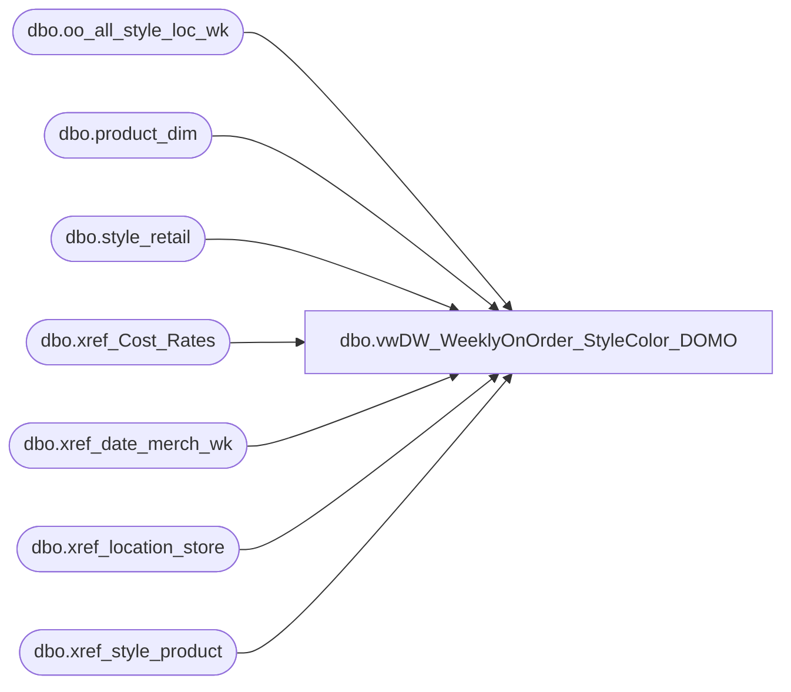

# dbo.vwDW_WeeklyOnOrder_StyleColor_DOMO

**Database:** ma_01  
**Server:** bedrockdb02  

## Architecture Diagram



## Table Dependencies

| Referenced Table |
|---|
| dbo.oo_all_style_loc_wk |
| dbo.product_dim |
| dbo.style_retail |
| dbo.xref_Cost_Rates |
| dbo.xref_date_merch_wk |
| dbo.xref_location_store |
| dbo.xref_style_product |

## View Code

```sql
CREATE VIEW [dbo].[vwDW_WeeklyOnOrder_StyleColor_DOMO]

AS 

--=============================================================================================================================================================
-- Dan Tweedie - 2016-08-31 - Created view as modified version of existing view vwDW_WeeklyOnOrder_StyleColor_biapp01, which is the view that feeds the cube.
--								This new view is for staging data to push to DOMO.
--=============================================================================================================================================================

with vw as
	(
		SELECT
			CAST(ISNULL(xp.product_key, xsp.product_key) AS varchar) AS product_key,
			CAST(xs.store_key AS varchar) AS store_key,
			xd.date_key,
			oo.merch_year_wk,
			oo.on_order_units,
			oo.on_order_retail_te,
			CAST(oo.on_order_cost / ISNULL(xchange.rate, 1) AS money) AS on_order_cost
		FROM
			dbo.oo_all_style_loc_wk oo WITH (NOLOCK)
			INNER JOIN dw_mirror.dbo.xref_location_store xs WITH (NOLOCK)
				ON oo.location_id = xs.location_id
			LEFT JOIN (SELECT
					pd.style_id,
					pd.jurisdiction_id,
					MIN(pd.product_key) AS product_key
				FROM
					dw_mirror.dbo.product_dim pd
				GROUP BY	pd.style_id,
					pd.jurisdiction_id)
					xp
				ON oo.style_id = xp.style_id
				AND xs.jurisdiction_id = xp.jurisdiction_id
			LEFT JOIN dw_mirror.dbo.xref_style_product xsp WITH (NOLOCK)
				ON xsp.style_id = oo.style_id
			INNER JOIN dw_mirror.dbo.xref_date_merch_wk xd WITH (NOLOCK)
				ON oo.merch_year_wk = xd.merch_year_wk
			INNER JOIN style_retail sr WITH (NOLOCK)
				ON sr.style_id = oo.style_id
				AND sr.jurisdiction_id = xs.jurisdiction_id
			LEFT JOIN dw_mirror.dbo.xref_Cost_Rates xchange
				ON xchange.jurisdiction_id = xs.jurisdiction_id
				AND xchange.weekKey = oo.merch_year_wk 
	)
SELECT
	vw.product_key,
	vw.store_key,
	vw.date_key,
	vw.merch_year_wk,
	sum(isnull(vw.on_order_units,0)) on_order_units,
	sum(isnull(vw.on_order_retail_te,0)) on_order_retail_te,
	sum(isnull(vw.on_order_cost,0)) on_order_cost
FROM vw
Group by
	vw.product_key,
	vw.store_key,
	vw.date_key,
	vw.merch_year_wk
```

