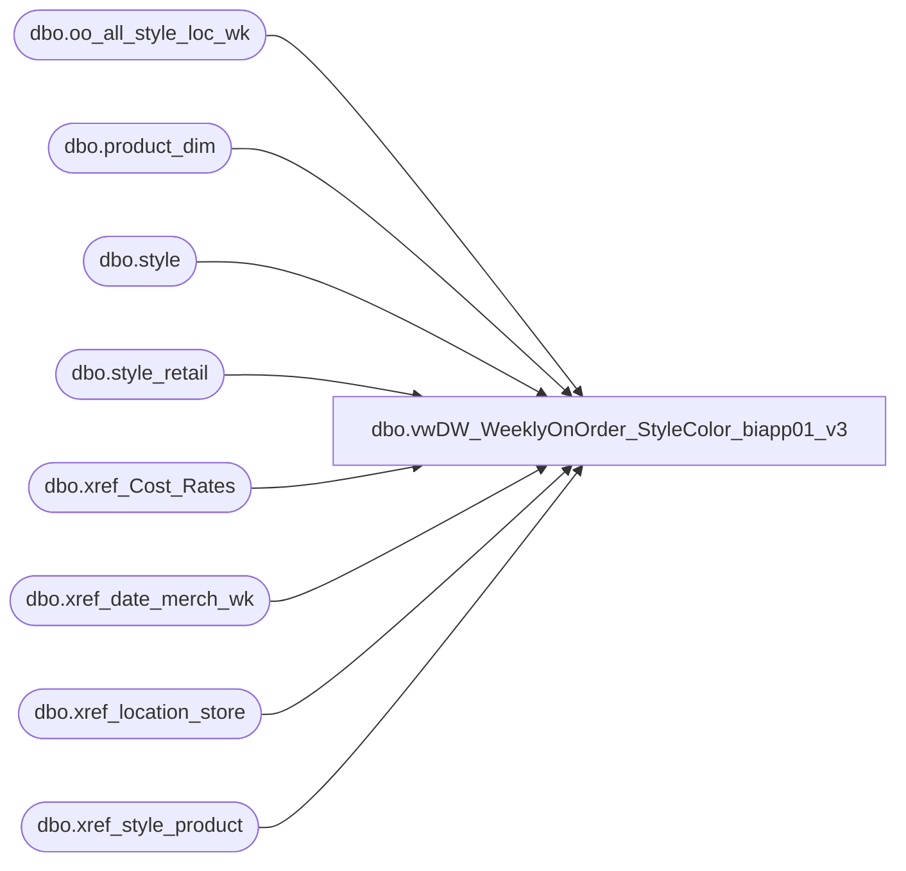

# dbo.vwDW_WeeklyOnOrder_StyleColor_biapp01_v3

**Database:** ma_01  
**Server:** bedrockdb02  

## Architecture Diagram



## Table Dependencies

| Referenced Table |
|---|
| dbo.oo_all_style_loc_wk |
| dbo.product_dim |
| dbo.style |
| dbo.style_retail |
| dbo.xref_Cost_Rates |
| dbo.xref_date_merch_wk |
| dbo.xref_location_store |
| dbo.xref_style_product |

## View Code

```sql
CREATE VIEW [dbo].[vwDW_WeeklyOnOrder_StyleColor_biapp01_v3]
AS -- =============================================================================================================
-- Name: [dbo].[vwDW_WeeklyOnOrder_StyleColor]
--
-- Description: View underlying the SSAS Merchandising Cube used on the dashboard.   
-- Aggregates Weekly On Order information by Style color and product
-- Joinsdbo.oo_all_styleclr_loc_wk, dbo.style, dbo.sku, dbo.upc, dbo.style_retail, dbo.location to
-- dw_mirror.dbo.vwDW_Store, dw_mirror.dbo.product_dim and dw_mirror.dbo.date_dim
--
-- Dependencies: 
--
-- Revision History
--		Name:					Date:			Comments:
--		G Murrish				2/12/2013		Added currency conversion for Cost. All costs are stored in USD and need to be translated to 
--												native currency.
--		Gary Murrish			2/13/2013		Adust cost for currency conversion since all costs are in USD.
--		Gary Murrish			8/23/2011		Rehabbed due to Product problems and efficiency improvements
--												Added on-order Cost
--		Funmi Agbebi			4/29/2010		added on_order_retail_te as on_order_retail_us_te
--		Outside Consultant		2006			original creation
-- =============================================================================================================

SELECT
	s.style_code, xs.jurisdiction_code,
	--CAST(ISNULL(xp.product_key, xsp.product_key) AS varchar) AS product_key,
	CAST(xs.store_key AS varchar) AS store_key,
	xd.date_key,
	oo.merch_year_wk
	-- facts
	,
	oo.on_order_units,
	CASE
			WHEN xs.location_type_label = 'UK' THEN NULL
		ELSE oo.on_order_units * ISNULL(sr.current_sellcurr_retail, 0)
		END AS on_order_retail,
	oo.on_order_retail AS on_order_retail_old,
	oo.style_id,
	oo.allocation_units,
	oo.on_order_retail_te AS on_order_retail_us_te,
	oo.on_order_units * ISNULL(oo.on_order_retail_te, 0) AS on_order_retail_us_te_OOUnitsCalc,
	CAST(oo.on_order_cost / ISNULL(xchange.rate, 1) AS money) AS on_order_cost
--oo.on_order_cost AS on_order_cost
FROM
	dbo.oo_all_style_loc_wk oo WITH (NOLOCK)
	
	join style s on oo.style_id = s.style_id

	--join dw_mirror.dbo.store_dim sd on xs.store_key  = sd.store_key

	INNER JOIN dw_mirror.dbo.xref_location_store xs WITH (NOLOCK)
		ON oo.location_id = xs.location_id
	LEFT JOIN (SELECT
			pd.style_id,
			pd.jurisdiction_id,
			MIN(pd.product_key) AS product_key
		FROM
			dw_mirror.dbo.product_dim pd
		GROUP BY	pd.style_id,
			pd.jurisdiction_id)
			xp
		ON oo.style_id = xp.style_id
		AND xs.jurisdiction_id = xp.jurisdiction_id
	LEFT JOIN dw_mirror.dbo.xref_style_product xsp WITH (NOLOCK)
		ON xsp.style_id = oo.style_id
	INNER JOIN dw_mirror.dbo.xref_date_merch_wk xd WITH (NOLOCK)
		ON oo.merch_year_wk = xd.merch_year_wk
	INNER JOIN style_retail sr WITH (NOLOCK)
		ON sr.style_id = oo.style_id
		AND sr.jurisdiction_id = xs.jurisdiction_id
	LEFT JOIN dw_mirror.dbo.xref_Cost_Rates xchange
		ON xchange.jurisdiction_id = xs.jurisdiction_id
		AND xchange.weekKey = oo.merch_year_wk
	
	--where s.style_code = '432189'
```

