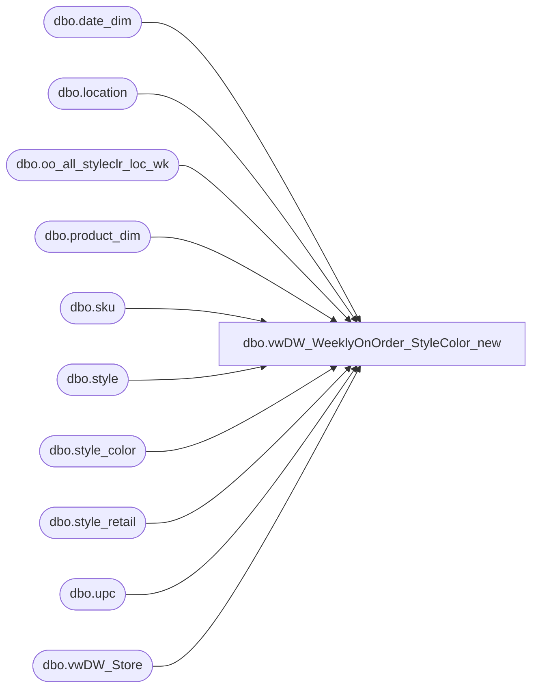

# dbo.vwDW_WeeklyOnOrder_StyleColor_new

**Database:** ma_01  
**Server:** bedrockdb02  

## Architecture Diagram



## Table Dependencies

| Referenced Table |
|---|
| dbo.date_dim |
| dbo.location |
| dbo.oo_all_styleclr_loc_wk |
| dbo.product_dim |
| dbo.sku |
| dbo.style |
| dbo.style_color |
| dbo.style_retail |
| dbo.upc |
| dbo.vwDW_Store |

## View Code

```sql
CREATE VIEW [dbo].[vwDW_WeeklyOnOrder_StyleColor_new]
AS
-- =============================================================================================================
-- Name: [dbo].[vwDW_WeeklyOnOrder_StyleColor]
--
-- Description: View underlying the SSAS Merchandising Cube used on the dashboard.   
-- Aggregates Weekly On Order information by Style color and product
-- Joinsdbo.oo_all_styleclr_loc_wk, dbo.style, dbo.sku, dbo.upc, dbo.style_retail, dbo.location to
-- dw_mirror.dbo.vwDW_Store, dw_mirror.dbo.product_dim and dw_mirror.dbo.date_dim
--
-- Dependencies: 
--
-- Revision History
--		Name:					Date:			Comments:
--		Funmi Agbebi			4/29/2010		added on_order_retail_te as on_order_retail_us_te
--		Outside Consultant		2006			original creation
-- =============================================================================================================

/*
vwDW_WeeklyOnOrder_StyleColor
	o on_order_retail – this column is very similar to the oh_hand_retail column above. It will need to be changed 
		to a calculation in order to provide dollars in native currency. 
		The calculation will be on_order_units * the product’s current retail value from the style_retail table.

select count(*) from [vwDW_WeeklyOnOrder_StyleColor_42]
157903, :36

select count(*) from [vwDW_WeeklyOnOrder_StyleColor]
157903, :04
*/

	SELECT
		-- dimension keys
--		CAST(p.product_key AS varchar) AS product_key

		(select max(product_key)
		from dw_mirror.dbo.product_dim pd, style_color sc 
		where oo.style_id = pd.style_id
		and oo.style_id = sc.style_id
		and sc.reorder_flag = 1
		and pd.jurisdiction_id = l.jurisdiction_id
		) AS product_key

		,s.store_key
		,d.date_key

		,oo.merch_year_wk

		-- facts
		,sum(oo.on_order_units) as on_order_units
		
		,case when (p.jurisdiction_code = 'Uk' OR p.division = 'Uk') then null  
			else sum(oo.on_order_units) * isnull(sr.current_sellcurr_retail,0)
		  end as on_order_retail
			,sum(oo.on_order_retail) as on_order_retail_old
			,oo.style_id
			,sku.sku_id

		,sum(oo.allocation_units) as allocation_units
		--Fields added 4/29/2010 by FA
		,sum(oo.on_order_retail_te)  as on_order_retail_us_te
		,sum(oo.on_order_units) * isnull(sum(oo.on_order_retail_te),0) as on_order_retail_us_te_OOUnitsCalc
	FROM dbo.oo_all_styleclr_loc_wk oo WITH (NOLOCK) 
	INNER JOIN dbo.location l  WITH (NOLOCK) ON l.location_id = oo.location_id

	-- March 2007 - TMK
	-- NOTE: the join to style is an INNER join
	-- this filters out quite a few OO records, but it was decided that this was OK as these styles are no longer around
	INNER JOIN dbo.style ON style.style_id = oo.style_id
	INNER JOIN dbo.sku WITH (NOLOCK) ON sku.style_id = oo.style_id AND sku.color_id = oo.color_id
	LEFT JOIN dbo.upc ON upc_id =
		(SELECT TOP 1 u2.upc_id
		FROM upc u2 WITH (NOLOCK)
		WHERE u2.sku_id = sku.sku_id
			AND u2.upc_number < '000001000000'
			/*AND u2.upc_number = '000000' + style.style_code*/)
	INNER JOIN dw_mirror.dbo.vwDW_Store s  WITH (NOLOCK) ON s.store_id = CAST(CAST(l.location_code AS int) AS varchar)
	LEFT JOIN dw_mirror.dbo.product_dim p  WITH (NOLOCK) ON p.style_id = oo.style_id
--		AND p.color_id = oo.color_id
		AND ((upc.upc_number IS NULL AND p.sku IS NULL) OR (p.sku = CAST(upc.upc_number AS int)))
	LEFT JOIN dw_mirror.dbo.date_dim d  WITH (NOLOCK) ON d.fiscal_year = CAST(SUBSTRING(CAST(oo.merch_year_wk AS varchar), 1, 4) AS int)
		AND fiscal_week = CAST(SUBSTRING(CAST(oo.merch_year_wk AS varchar), 5, 2) AS int)
		AND day_of_week = 7

	inner join style_retail sr  WITH (NOLOCK) 
		on sr.style_id = oo.style_id
			and sr.jurisdiction_id = l.jurisdiction_id

group by l.jurisdiction_id, p.division, p.jurisdiction_code,s.store_key,d.date_key,oo.merch_year_wk,sr.current_sellcurr_retail, oo.style_id,sku.sku_id


dbo,vwDW_WeeklySales_Style,CREATE VIEW [dbo].[vwDW_WeeklySales_Style]
AS

-- =============================================================================================================
-- Name: [dbo].[vwDW_WeeklySales_Style]
--
-- Description: View underlying the SSAS Merchandising Cube used on the dashboard.   
-- Aggregates Weekly Sales information by Style.  
-- Creates dummy products by concatenating subclass_code and style_code 

-- Joins dbo.hist_styleclr_loc_wk sales, dbo.style, dbo.sku, dbo.upc, dbo.location to
-- dw_mirror.dbo.vwDW_Store, dw_mirror.dbo.product_dim and dw_mirror.dbo.date_dim
--
-- Dependencies: 
--
-- Revision History
--		Name:					Date:			Comments:

--		Funmi Agbebi			4/30/2010		dw_mirror.dbo.product_dim.jurisdiction_id pulled in 
--												jurisdiction_id added to product_key for dummy products 
--												with introduction of products into the R-B-Z division
--		Outside Consultant		2006			original creation
-- =============================================================================================================

	SELECT
		-- dimension keys

		--	Commented out 4/30/2010 (FA )
--		,p.subclass_code + '-' + p.style_code AS product_key 
		-- Additional fields starts (FA - 4/30/2010)
		p.subclass_code + '-' + p.style_code + '-' + cast(p.jurisdiction_id as varchar(2)) AS product_key
		,p.jurisdiction_id as product_jurisdiction_id
		,l.jurisdiction_id as location_jurisdiction_id

		-- Additional fields ends (FA - 4/30/2010)

		,s.store_key
		,d.date_key

		,sales.merch_year_wk

		-- facts
		,sales.received_cost
		,sales.return_to_vendor_cost
		,sales.distributions_cost
		,sales.transfer_in_cost
		,sales.transfer_out_cost
		,sales.sales_total_cost
		,sales.return_cost
		,sales.shrink_actual_cost
		,sales.adjustments_total_cost
		,sales.cost_factors_total_cost
		,sales.discounts_total_cost

	FROM dbo.hist_style_loc_wk sales WITH (NOLOCK) 
	INNER JOIN dbo.location l  WITH (NOLOCK) ON l.location_id = sales.location_id
	INNER JOIN dbo.style  WITH (NOLOCK) ON style.style_id = sales.style_id
	LEFT JOIN dbo.sku  WITH (NOLOCK) ON sku.sku_id =
		(SELECT TOP 1 sku2.sku_id
		FROM sku sku2 WITH (NOLOCK) 
		WHERE sku2.style_id = sales.style_id AND sku2.sku_id IN
			(SELECT upc2.sku_id
			FROM upc upc2 WITH (NOLOCK) 
			WHERE upc2.upc_number < '000001000000'
				AND upc2.upc_number = '000000' + style.style_code))
	LEFT JOIN dbo.upc  WITH (NOLOCK) ON upc.upc_id =
		(SELECT TOP 1 upc3.upc_id
		FROM upc upc3 WITH (NOLOCK) 
		WHERE upc3.upc_number < '000001000000'
			AND upc3.sku_id = sku.sku_id)

	LEFT JOIN dw_mirror.dbo.vwDW_Store s  WITH (NOLOCK) ON s.store_id = CAST(l.location_code AS int)
	LEFT JOIN dw_mirror.dbo.product_dim p  WITH (NOLOCK) ON p.sku = CAST(upc.upc_number AS int)
	LEFT JOIN dw_mirror.dbo.date_dim d  WITH (NOLOCK) ON d.fiscal_year = CAST(SUBSTRING(CAST(sales.merch_year_wk AS varchar), 1, 4) AS int)
		AND fiscal_week = CAST(SUBSTRING(CAST(sales.merch_year_wk AS varchar), 5, 2) AS int)
		AND day_of_week = 7
```

