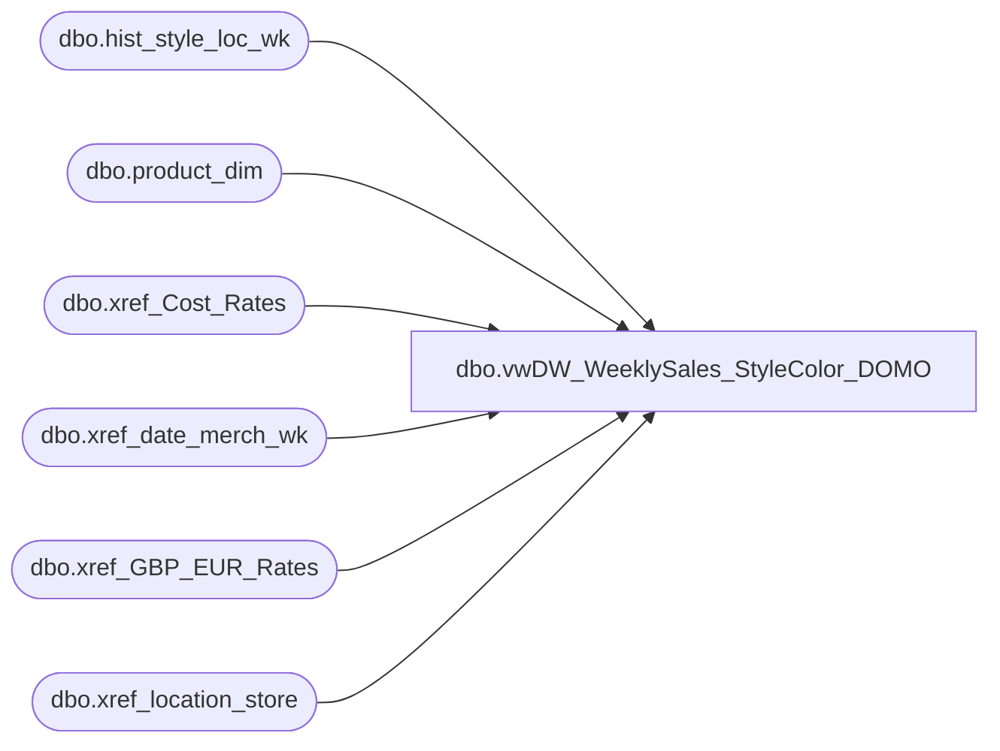

# dbo.vwDW_WeeklySales_StyleColor_DOMO

**Database:** ma_01  
**Server:** bedrockdb02  

## Architecture Diagram



## Table Dependencies

| Referenced Table |
|---|
| dbo.hist_style_loc_wk |
| dbo.product_dim |
| dbo.xref_Cost_Rates |
| dbo.xref_date_merch_wk |
| dbo.xref_GBP_EUR_Rates |
| dbo.xref_location_store |

## View Code

```sql
CREATE VIEW [dbo].[vwDW_WeeklySales_StyleColor_DOMO]

AS

--=============================================================================================================================================================
-- Dan Tweedie - 2016-08-31 - Created view as modified version of existing view vwDW_WeeklySales_StyleColor_biapp01, which is the view that feeds the cube.
--								This new view is for staging data to push to DOMO.
--=============================================================================================================================================================
WITH vw as 
(
	SELECT 
		CAST(ISNULL(xp.product_key, xpsoly.product_key) AS varchar) AS product_key,
		CAST(xs.store_key AS varchar) AS store_key,
		xd.date_key as date_key,
		sales.merch_year_wk,
		(sales.perm_md_retail_te + sales.perm_muc_retail_te) - (sales.perm_mu_retail_te + sales.perm_mdc_retail_te) as PermRetailTe,
		sales.promo_pc_total_retail_te,
		sales.received_units,
		sales.received_retail_te,
		sales.received_cost,
		(sales.sales_total_units - sales.return_units) as NetSalesUnits ,
		(sales.sales_total_retail_te - sales.return_retail_te) NetSalesRetailTe,
	
		(
			CAST(sales.sales_total_sellcurr_retail_te / ISNULL(GBPEUR.GBP_Euro_ExchangeRate, 1) AS money)
			-
			CAST(sales.return_sellcurr_retail_te / ISNULL(GBPEUR.GBP_Euro_ExchangeRate, 1) AS money)
		) as NetSalesRetailNativeTe,
	
		(
			CAST(sales.sales_total_cost / ISNULL(xchange.rate, 1) / ISNULL(GBPEUR.GBP_Euro_ExchangeRate, 1) AS money) 
			-
			CAST(sales.return_cost / ISNULL(xchange.rate, 1) / ISNULL(GBPEUR.GBP_Euro_ExchangeRate, 1) AS money)
		) as NetSalesCost,

		sales.shrink_actual_units,
		sales.shrink_actual_retail_te
	FROM
		dbo.hist_style_loc_wk sales WITH (NOLOCK)
		INNER JOIN dw_mirror.dbo.xref_location_store xs WITH (NOLOCK)
			ON sales.location_id = xs.location_id
		LEFT JOIN (SELECT
				pd.style_id,
				pd.jurisdiction_id,
				MIN(pd.product_key) AS product_key
			FROM
				dw_mirror.dbo.product_dim pd WITH (NOLOCK)
			GROUP BY	pd.style_id,
						pd.jurisdiction_id) xp
			ON sales.style_id = xp.style_id
			AND xs.jurisdiction_id = xp.jurisdiction_id
		LEFT JOIN (SELECT
				pd.style_id,
				MIN(pd.product_key) AS product_key
			FROM
				dw_mirror.dbo.product_dim pd WITH (NOLOCK)
			GROUP BY pd.style_id) xpsoly
			ON sales.style_id = xpsoly.style_id

		INNER JOIN dw_mirror.dbo.xref_date_merch_wk xd WITH (NOLOCK)
			ON sales.merch_year_wk = xd.merch_year_wk
		LEFT JOIN dw_mirror.dbo.xref_Cost_Rates xchange WITH (NOLOCK)
			ON xchange.jurisdiction_id = xs.jurisdiction_id
			AND xchange.weekKey = sales.merch_year_wk
		LEFT JOIN dw_mirror.dbo.xref_GBP_EUR_Rates GBPEUR WITH (NOLOCK)
			ON xs.jurisdiction_id = GBPEUR.jurisdiction_id
			AND sales.merch_year_wk = GBPEUR.weekKey
	)
select
	vw.product_key,
	vw.store_key,
	vw.date_key,
	vw.merch_year_wk,
	sum(isnull(vw.PermRetailTe,0)) as PermRetailTe,
	sum(isnull(vw.promo_pc_total_retail_te,0)) as promo_pc_total_retail_te,
	sum(isnull(vw.received_units,0)) as received_units,
	sum(isnull(vw.received_retail_te,0)) as received_retail_te,
	sum(isnull(vw.received_cost, 0)) as received_cost,
	sum(isnull(vw.NetSalesUnits,0)) as NetSalesUnits,
	sum(isnull(vw.NetSalesRetailTe,0)) as NetSalesRetailTe,
	sum(isnull(vw.NetSalesRetailNativeTe,0)) as NetSalesRetailNativeTe,
	sum(isnull(vw.NetSalesCost,0)) as NetSalesCost,
	sum(isnull(vw.shrink_actual_units,0)) as shrink_actual_units,
	sum(isnull(vw.shrink_actual_retail_te,0)) as shrink_actual_retail_te
from vw
group by
	vw.product_key,
	vw.store_key,
	vw.date_key,
	vw.merch_year_wk
```

