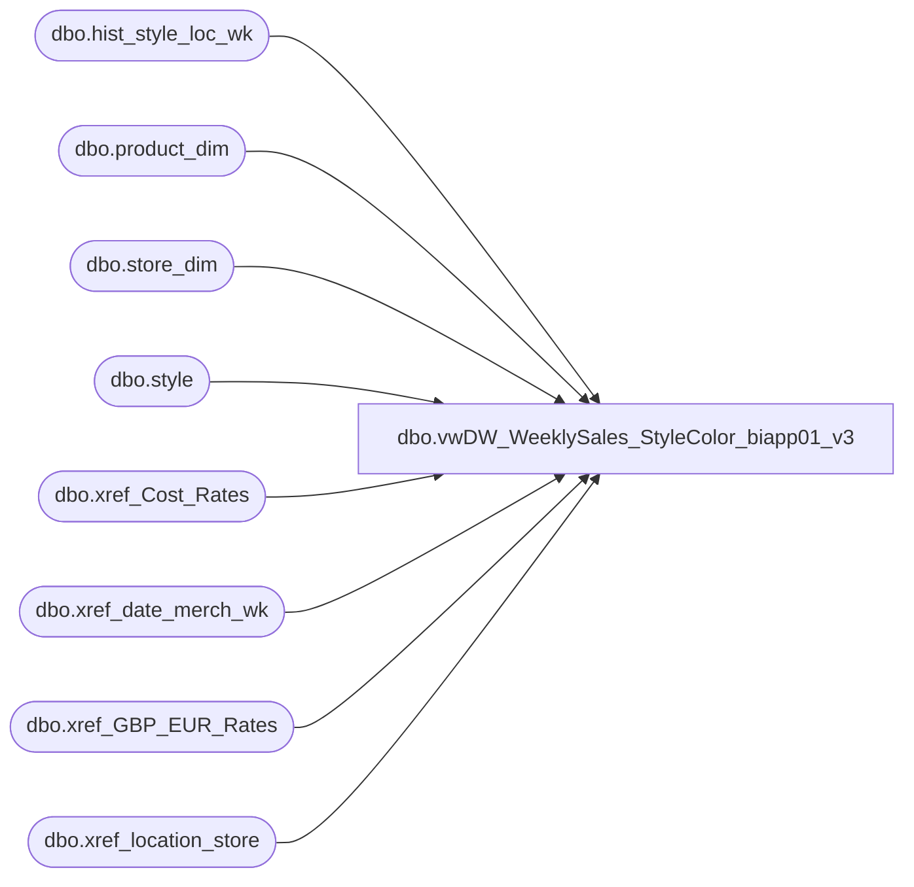

# dbo.vwDW_WeeklySales_StyleColor_biapp01_v3

**Database:** ma_01  
**Server:** bedrockdb02  

## Architecture Diagram



## Table Dependencies

| Referenced Table |
|---|
| dbo.hist_style_loc_wk |
| dbo.product_dim |
| dbo.store_dim |
| dbo.style |
| dbo.xref_Cost_Rates |
| dbo.xref_date_merch_wk |
| dbo.xref_GBP_EUR_Rates |
| dbo.xref_location_store |

## View Code

```sql
/*

vwDW_WeeklySales_StyleColor
	o sales_total_retail – currently this column is coming straight from hist_styleclr_loc_wk and is currently 
		native currency. However, after the Merchandising system upgrade, it would become US Dollars. 
		Therefore, this column should now pull from the sales_total_sellcurr_retail column in
		the same table. However, the column should be aliased to keep its original name (as to not break reports, etc.).
	o In addition, if the data being pulled in the view is for UK, this field should be blanked per user requirements. 
		This can be done by checking the division of the current product.

G Murrish		6/11/2013		Changed lookup of product key to handle the problems with Ireland products
G Murrish		3/1/2013		Changed lookup of product_key to handle the problems with R-B-Z products which go across 
								multiple jurisdictions
G Murrish		2/12/2013		Added currency conversion for Cost. All costs are stored in USD and need to be translated to 
								native currency.
G Murrish		2/7/2014		Added currency conversion for GBP-EUROs. All IE (Jurisdiction = 5 amounts will be shown
								in GBP instead of EUR.
G Murrish		6/20/2014		Added Native Cost Factor for Gross Margin extracts
D Tweedie		08/19/2016		Added sales.promo_pc_total_retail_te
I Wallace		11/06/2025		Added style_id and style_code
*/

CREATE VIEW [dbo].[vwDW_WeeklySales_StyleColor_biapp01_v3]
AS

SELECT -- dimension keys
	--s.style_id, 
	s.style_code, xs.jurisdiction_code,  --sd.country,
	--CAST(ISNULL(xp.product_key, xpsoly.product_key) AS varchar) AS product_key,
	CAST(xs.store_key AS varchar) AS store_key,
	xd.date_key,
	sales.merch_year_wk
	-- facts
	,
	sales.perm_md_retail,
	sales.perm_mu_retail,
	sales.perm_mdc_retail,
	sales.perm_muc_retail,
	sales.promo_pc_total_retail,
	sales.promo_pc_total_retail_te,
	sales.received_units,
	sales.received_retail,
	sales.return_to_vendor_units,
	sales.return_to_vendor_retail,
	sales.distributions_units,
	sales.distributions_retail,
	sales.transfer_in_units,
	sales.transfer_in_retail,
	sales.transfer_out_units,
	sales.transfer_out_retail,
	sales.sales_total_units,
	CAST(sales.sales_total_sellcurr_retail_te / ISNULL(GBPEUR.GBP_Euro_ExchangeRate, 1) AS money) AS sales_total_retail,
	sales.sales_total_retail_te AS sales_total_retail_us_te,
	CAST(sales.sales_total_sellcurr_retail_te / ISNULL(GBPEUR.GBP_Euro_ExchangeRate, 1) AS money) AS sales_total_retail_native_te,
	CAST(sales.sales_total_cost / ISNULL(xchange.rate, 1) / ISNULL(GBPEUR.GBP_Euro_ExchangeRate, 1) AS money) AS sales_total_cost,
	sales.return_units,
	CAST(sales.return_sellcurr_retail_te / ISNULL(GBPEUR.GBP_Euro_ExchangeRate, 1) AS money) AS return_retail,
	sales.return_retail_te AS return_retail_us_te,
	CAST(sales.return_sellcurr_retail_te / ISNULL(GBPEUR.GBP_Euro_ExchangeRate, 1) AS money) AS return_retail_native_te,
	CAST(sales.return_cost / ISNULL(xchange.rate, 1) / ISNULL(GBPEUR.GBP_Euro_ExchangeRate, 1) AS money) AS return_cost,
	sales.shrink_actual_units,
	sales.shrink_actual_retail,
	sales.adjustments_total_units,
	sales.adjustments_total_retail,
	CAST(sales.sales_total_cost / ISNULL(xchange.rate, 1) AS money) AS sales_total_cost_native,
	CAST(sales.return_cost / ISNULL(xchange.rate, 1) AS money) AS return_cost_native
FROM
	dbo.hist_style_loc_wk sales WITH (NOLOCK)
	INNER JOIN dw_mirror.dbo.xref_location_store xs WITH (NOLOCK)
		ON sales.location_id = xs.location_id
	join style s on sales.style_id = s.style_id
	
	 --join dw_mirror.dbo.product_dim p on p.style_code COLLATE SQL_Latin1_General_CP1_CI_AS = s.style_code
     --join dw_mirror.dbo.store_dim sd on xs.store_key  = sd.store_key and p.jurisdiction_code  = sd.country
	join dw_mirror.dbo.store_dim sd on xs.store_key  = sd.store_key


	LEFT JOIN (SELECT
			pd.style_id,
			pd.jurisdiction_id,
			MIN(pd.product_key) AS product_key
		FROM
			dw_mirror.dbo.product_dim pd WITH (NOLOCK)
		GROUP BY	pd.style_id,
					pd.jurisdiction_id) xp
		ON sales.style_id = xp.style_id
		AND xs.jurisdiction_id = xp.jurisdiction_id
	LEFT JOIN (SELECT
			pd.style_id,
			MIN(pd.product_key) AS product_key
		FROM
			dw_mirror.dbo.product_dim pd WITH (NOLOCK)
		GROUP BY pd.style_id) xpsoly
		ON sales.style_id = xpsoly.style_id

	INNER JOIN dw_mirror.dbo.xref_date_merch_wk xd WITH (NOLOCK)
		ON sales.merch_year_wk = xd.merch_year_wk
	LEFT JOIN dw_mirror.dbo.xref_Cost_Rates xchange WITH (NOLOCK)
		ON xchange.jurisdiction_id = xs.jurisdiction_id
		AND xchange.weekKey = sales.merch_year_wk
	LEFT JOIN dw_mirror.dbo.xref_GBP_EUR_Rates GBPEUR WITH (NOLOCK)
		ON xs.jurisdiction_id = GBPEUR.jurisdiction_id
		AND sales.merch_year_wk = GBPEUR.weekKey

-- where s.style_code collate Latin1_General_BIN  = '432189'
--order by store_key asc
```

