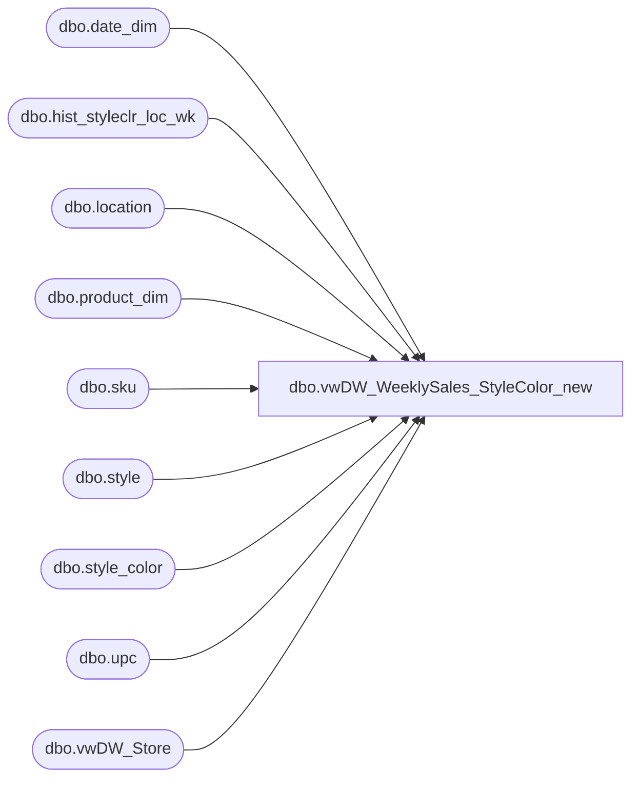

# dbo.vwDW_WeeklySales_StyleColor_new

**Database:** ma_01  
**Server:** bedrockdb02  

## Architecture Diagram



## Table Dependencies

| Referenced Table |
|---|
| dbo.date_dim |
| dbo.hist_styleclr_loc_wk |
| dbo.location |
| dbo.product_dim |
| dbo.sku |
| dbo.style |
| dbo.style_color |
| dbo.upc |
| dbo.vwDW_Store |

## View Code

```sql
/*

vwDW_WeeklySales_StyleColor
	o sales_total_retail – currently this column is coming straight from hist_styleclr_loc_wk and is currently 
		native currency. However, after the Merchandising system upgrade, it would become US Dollars. 
		Therefore, this column should now pull from the sales_total_sellcurr_retail column in
		the same table. However, the column should be aliased to keep its original name (as to not break reports, etc.).
	o In addition, if the data being pulled in the view is for UK, this field should be blanked per user requirements. 
		This can be done by checking the division of the current product.

select top 1 * from vwDW_WeeklySales_StyleColor

select top 1 * from [vwDW_WeeklySales_StyleColor_42]

select top 1 * from dw_mirror.dbo.vwDW_Store

select top 1 * from [vwDW_WeeklySales_StyleColor]
	where isnull(sales_total_retail_old,0) <> isnull(sales_total_retail,0)

select top 1 * from dw_mirror.dbo.product_dim p
	where division = 'Uk'

select division 
	, count(*)
	from dw_mirror.dbo.product_dim p
	group by division

select count(*) from [vwDW_WeeklySales_StyleColor_42]


select count(*) from [vwDW_WeeklySales_StyleColor]


select top 1 * from hist_styleclr_loc_wk
*/


create VIEW [dbo].[vwDW_WeeklySales_StyleColor_new]
AS
SELECT
		-- dimension keys
--		CAST(p.product_key AS varchar) AS product_key

		(select max(product_key)
		from dw_mirror.dbo.product_dim pd, style_color sc 
		where style.style_id = pd.style_id
		and style.style_id = sc.style_id
		and sc.reorder_flag = 1
		and pd.jurisdiction_id = l.jurisdiction_id
		) AS product_key

		,s.store_key
		,d.date_key

		,sales.merch_year_wk

		-- facts
		,sum(sales.perm_md_retail) as perm_md_retail
		,sum(sales.perm_mu_retail) as perm_mu_retail
		,sum(sales.perm_mdc_retail) as perm_mdc_retail
		,sum(sales.perm_muc_retail) as perm_muc_retail
		,sum(sales.promo_pc_total_retail) as promo_pc_total_retail
		,sum(sales.received_units) as received_units
		,sum(sales.received_retail) as received_retail
		,sum(sales.return_to_vendor_units) as return_to_vendor_units
		,sum(sales.return_to_vendor_retail) as return_to_vendor_retail
		,sum(sales.distributions_units) as distributions_units
		,sum(sales.distributions_retail) as distributions_retail
		,sum(sales.transfer_in_units) as transfer_in_units
		,sum(sales.transfer_in_retail) as transfer_in_retail 
		,sum(sales.transfer_out_units) as transfer_out_units
		,sum(sales.transfer_out_retail) as transfer_out_retail
		,sum(sales.sales_total_units) as sales_total_units
		--,case when p.division = 'Uk' then null else sales.sales_total_sellcurr_retail end as sales_total_retail
		,sum(sales.sales_total_sellcurr_retail_te) as sales_total_retail
			, sum(sales.sales_total_retail_te) as sales_total_retail_us_te
			, sum(sales.sales_total_sellcurr_retail_te) as sales_total_retail_native_te
		,sum(sales.sales_total_cost) as sales_total_cost
		,sum(sales.return_units) as return_units
		,sum(sales.return_sellcurr_retail_te) as return_retail
			, sum(sales.return_retail_te) as return_retail_us_te
			, sum(sales.return_sellcurr_retail_te) as return_retail_native_te
		,sum(sales.return_cost) as return_cost
		,sum(sales.shrink_actual_units) as shrink_actual_units
		,sum(sales.shrink_actual_retail) as shrink_actual_retail
		,sum(sales.adjustments_total_units) as adjustments_total_units
		,sum(sales.adjustments_total_retail) as adjustments_total_retail

	FROM dbo.hist_styleclr_loc_wk sales WITH (NOLOCK)
	INNER JOIN dbo.style WITH (NOLOCK) ON style.style_id = sales.style_id
	INNER JOIN dbo.sku WITH (NOLOCK) ON sku.style_id = sales.style_id AND sku.color_id = sales.color_id
	LEFT JOIN dbo.upc  WITH (NOLOCK) ON upc_id =
		(SELECT TOP 1 u2.upc_id
		FROM upc u2 WITH (NOLOCK)
		WHERE u2.sku_id = sku.sku_id
			AND u2.upc_number < '000001000000'
			/*AND u2.upc_number = '000000' + style.style_code*/)
	INNER JOIN dbo.location l WITH (NOLOCK) ON l.location_id = sales.location_id
	INNER JOIN dw_mirror.dbo.vwDW_Store s WITH (NOLOCK) ON s.store_id = CAST(CAST(l.location_code AS int) AS varchar)
--	LEFT JOIN dw_mirror.dbo.product_dim p WITH (NOLOCK) ON p.style_id = sales.style_id -- 6/30/2010 Removed by Keith Lee to consolidate colors
--		AND p.color_id = sales.color_id
--		AND ((upc.upc_number IS NULL AND p.sku IS NULL) OR (p.sku = CAST(upc.upc_number AS int)))
	LEFT JOIN dw_mirror.dbo.date_dim d WITH (NOLOCK) ON d.fiscal_year = CAST(SUBSTRING(CAST(sales.merch_year_wk AS varchar), 1, 4) AS int)
		AND fiscal_week = CAST(SUBSTRING(CAST(sales.merch_year_wk AS varchar), 5, 2) AS int)
		AND day_of_week = 7
group by s.store_key,d.date_key, sales.merch_year_wk,style.style_id,l.location_code,l.jurisdiction_id
```

