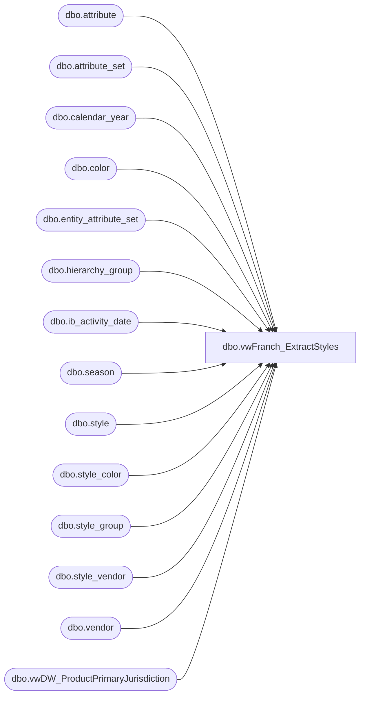

# dbo.vwFranch_ExtractStyles

**Database:** ma_01  
**Server:** bedrockdb02  

## Architecture Diagram



## Table Dependencies

| Referenced Table |
|---|
| dbo.attribute |
| dbo.attribute_set |
| dbo.calendar_year |
| dbo.color |
| dbo.entity_attribute_set |
| dbo.hierarchy_group |
| dbo.ib_activity_date |
| dbo.season |
| dbo.style |
| dbo.style_color |
| dbo.style_group |
| dbo.style_vendor |
| dbo.vendor |
| dbo.vwDW_ProductPrimaryJurisdiction |

## View Code

```sql
/* =============================================================================================================
 Name: [dbo].[vwFranch_ExtractStyles]

 Description: View underlying the extract of information for the Franchisee Style Master

 Dependencies: 

 Revision History
		Name:					Date:			Comments:
		Ben Barud				7/12/2016		Updated WHERE clause for Hierarchy R-B-D to only inlcude styles that have an AVAILB of US
		Dan Tweedie				06/28/2016		Changed current_retail to CAST(isnull(ST.current_retail,0) AS MONEY) instead of CAST(ST.current_retail AS MONEY)
		Kevin Shyr				3/19/2015		Fixed issue where SSIS package failed calling this view.
		Ben Barud				10/18/2013		Added create_date
		Gary Murrish			11/4/2011		Added CurrentCost, first and last on-order dates
		Gary Murrish			10/19/2011		Added RBZ, RBE
		Gary Murrish			7/28/2011		original creation*/
CREATE VIEW [dbo].[vwFranch_ExtractStyles]
AS
SELECT        ST.style_code, ST.short_desc, ST.original_retail, 
CAST(isnull(ST.current_retail,0) AS MONEY) AS current_retail, 
HG.hierarchy_group_code AS subClassCode, V.vendor_code, 
                         SEA.season_code, C.color_code, FACTAS.attribute_set_code AS FactoryCode, CAST(ST.distribution_multiple AS SMALLINT) AS InnerCasePack, 
                         CAST(ST.order_multiple AS SMALLINT) AS MasterCasePack, CAST(ISNULL(licensee.license_code, N'N/A') AS VARCHAR(50)) AS license_code, 
                         CAST(cy.calendar_year_code AS VARCHAR(10)) AS calendar_year_code, 
                         CAST(CASE WHEN HG.hierarchy_group_code LIKE 'R-B-D%' THEN 1 ELSE 2 END AS SMALLINT) AS StyleStatusID, ISNULL(sv.current_cost, 0) AS current_cost, 
                         iad_1.first_on_order_date, iad_1.last_on_order_date, ST.create_date
FROM            dbo.style AS ST WITH (READCOMMITTED) INNER JOIN
                         dbo.style_group AS SG WITH (READCOMMITTED) ON ST.main_style_group_id = SG.style_group_id INNER JOIN
                         dbo.hierarchy_group AS HG WITH (READCOMMITTED) ON HG.hierarchy_group_id = SG.hierarchy_group_id INNER JOIN
                         dbo.vendor AS V WITH (READCOMMITTED) ON V.vendor_id = ST.primary_vendor_id INNER JOIN
                         dbo.season AS SEA WITH (READCOMMITTED) ON SEA.season_id = ST.season_id LEFT OUTER JOIN
                             (SELECT        style_id, MIN(color_id) AS color_id
                               FROM            dbo.style_color AS SCMIN WITH (READCOMMITTED)
                               GROUP BY style_id) AS SC ON SC.style_id = ST.style_id LEFT OUTER JOIN
                         dbo.color AS C WITH (READCOMMITTED) ON C.color_id = SC.color_id LEFT OUTER JOIN
                         dbo.entity_attribute_set AS FACTEAS WITH (READCOMMITTED) ON FACTEAS.parent_id = ST.style_id AND FACTEAS.attribute_id = 122 LEFT OUTER JOIN
                         dbo.attribute_set AS FACTAS WITH (READCOMMITTED) ON FACTEAS.attribute_set_id = FACTAS.attribute_set_id LEFT OUTER JOIN
                             (SELECT        lic_eas.parent_id AS style_id, lic_att.attribute_set_code AS license_code
                               FROM            me_01.dbo.entity_attribute_set AS lic_eas WITH (READCOMMITTED) INNER JOIN
                                                         me_01.dbo.attribute_set AS lic_att WITH (READCOMMITTED) ON lic_eas.attribute_set_id = lic_att.attribute_set_id INNER JOIN
                                                         me_01.dbo.attribute AS lic_a WITH (READCOMMITTED) ON lic_att.attribute_id = lic_a.attribute_id AND lic_a.parent_type = 1 AND 
                                                         lic_a.attribute_code = 'LICNSR' INNER JOIN
                                                             (SELECT        has_eas.parent_id AS style_id
                                                               FROM            me_01.dbo.entity_attribute_set AS has_eas WITH (READCOMMITTED) INNER JOIN
                                                                                         me_01.dbo.attribute_set AS has_attset WITH (READCOMMITTED) ON has_eas.attribute_set_id = has_attset.attribute_set_id INNER JOIN
                                                                                         me_01.dbo.attribute AS has_attr WITH (READCOMMITTED) ON has_attset.attribute_id = has_attr.attribute_id AND 
                                                                                         has_attr.attribute_code = 'LICEN' AND has_attset.attribute_set_code = 'YES' AND has_attr.parent_type = 1) AS hasRoyalty ON 
                                                         hasRoyalty.style_id = lic_eas.parent_id) AS licensee ON ST.style_id = licensee.style_id LEFT OUTER JOIN
                         me_01.dbo.calendar_year AS cy WITH (READCOMMITTED) ON ST.calendar_id = cy.calendar_year_id LEFT OUTER JOIN
                         dbo.style_vendor AS sv WITH (READCOMMITTED) ON sv.style_id = ST.style_id AND sv.vendor_id = ST.primary_vendor_id LEFT OUTER JOIN
                             (SELECT        style_id, MIN(first_on_order_date) AS first_on_order_date, MAX(last_on_order_date) AS last_on_order_date
                               FROM            dbo.ib_activity_date AS iad WITH (READCOMMITTED)
                               GROUP BY style_id) AS iad_1 ON iad_1.style_id = ST.style_id LEFT OUTER JOIN
                         me_01.dbo.vwDW_ProductPrimaryJurisdiction AS vppj ON ST.style_code = vppj.style_code
WHERE        (vppj.attribute_set_code = 'US') AND (ST.style_code NOT IN (124287, 424287, 824287, 924287)) OR
             (vppj.attribute_set_code = 'US') AND (HG.hierarchy_group_code LIKE 'R-B-D%') AND (ST.style_code NOT IN (124287, 424287, 824287, 924287)) OR
             (HG.hierarchy_group_code LIKE 'R-B-E%') AND (ST.style_code NOT IN (124287, 424287, 824287, 924287)) OR
			 (HG.hierarchy_group_code LIKE 'R-B-Z%') AND (ST.style_code NOT IN (124287, 424287, 824287, 924287))


dbo,vwMAStyleDetailsPBI,create view vwMAStyleDetailsPBI

as

SELECT DISTINCT a.style_code as [Style Code], 
	a.long_desc as [Style Long Desc], 
	h.hierarchy_group_code as [Chain Code], 
	h.hierarchy_group_label as [Chain Label], 
	g.hierarchy_group_code as [Division Code], 
	g.hierarchy_group_label as [Division Label], 
	f.hierarchy_group_code as [Department Code], 
	f.hierarchy_group_label as [Department Label], 
	e.hierarchy_group_code as [Class Code], 
	e.hierarchy_group_label as [Class Label], 
	d.hierarchy_group_code as [Sub-Class Code], 
	d.hierarchy_group_label as [Sub-Class Label], 
	b01.attribute_set_code as [MEG'S INVENTOR STATUS BY STYLE], 
	a.order_multiple as [Style Order Multiple], 
	a.distribution_multiple as [Style Distribution Multiple], 
	c02.custom_property_value as [Style Custom Property Value O (KEY STORY)], 
	a.style_id as Field_q, 
	{fn IFNULL(b01.attribute_set_id,-1)} as Field_r 
  FROM ma_01.dbo.style a with (nolock) , 
	ma_01.dbo.attribute_set b01 with (nolock) , 
	ma_01.dbo.view_style_cust_prop_outer c02 with (nolock) , 
	ma_01.dbo.hierarchy_group d with (nolock) , 
	ma_01.dbo.hierarchy_group e with (nolock) , 
	ma_01.dbo.hierarchy_group f with (nolock) , 
	ma_01.dbo.hierarchy_group g with (nolock) , 
	ma_01.dbo.hierarchy_group h with (nolock) , 
	ma_01.dbo.entity_attribute_set i01 with (nolock) , 
	ma_01.dbo.style_parent j with (nolock), 
	ma_01.dbo.style_parent k with (nolock), 
	ma_01.dbo.style_parent l with (nolock), 
	ma_01.dbo.style_parent m with (nolock), 
	ma_01.dbo.style_parent n with (nolock) 
  WHERE a.style_id =i01.parent_id and i01.parent_type = 1 and i01.attribute_id = 72 
    AND b01.attribute_set_id =i01.attribute_set_id   
    AND a.style_id =c02.style_id and c02.custom_property_id = 60  
    AND a.style_id = j.style_id and j.hierarchy_level_id = 10000007 
    AND j.parent_hierarchy_group_id = d.hierarchy_group_id   
    AND a.style_id = k.style_id and k.hierarchy_level_id = 10000006 
    AND k.parent_hierarchy_group_id = e.hierarchy_group_id   
    AND a.style_id = l.style_id and l.hierarchy_level_id = 10000005 
    AND l.parent_hierarchy_group_id = f.hierarchy_group_id   
    AND a.style_id = m.style_id and m.hierarchy_level_id = 10000004 
    AND m.parent_hierarchy_group_id = g.hierarchy_group_id   
    AND a.style_id = n.style_id and n.hierarchy_level_id = 10000003 
    AND n.parent_hierarchy_group_id = h.hierarchy_group_id  
    AND d.hierarchy_level_id = 10000007
```

