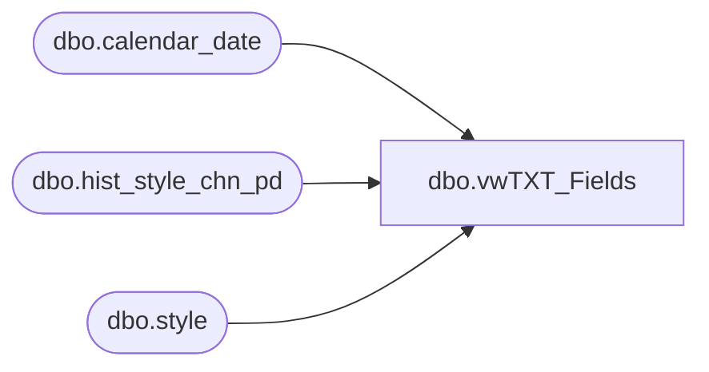

# dbo.vwTXT_Fields

**Database:** ma_01  
**Server:** bedrockdb02  

## Architecture Diagram



## Table Dependencies

| Referenced Table |
|---|
| dbo.calendar_date |
| dbo.hist_style_chn_pd |
| dbo.style |

## View Code

```sql
CREATE view [dbo].[vwTXT_Fields] 
as
SELECT
	s.style_code
	, SUM(ISNULL(sp.Promo_pc_total_retail_te,0))  Promo_pc_total_retail_te 
	, CONCAT('Promo Pc Total Retail TE (Period ', sp.merch_year_pd,')') Promo_pc_total_retail_teColumn
	--, SUM(ISNULL(sl.perm_md_retail_te,0)) perm_md_retail_te 
	, SUM(ISNULL(sp.perm_md_retail_te,0)) perm_md_retail_te 
	, CONCAT('Perm Md Retail TE (Period ', sp.merch_year_pd,')') perm_md_retail_teColumn
	--, SUM(ISNULL(sl.perm_mdc_retail_te,0)) perm_mdc_retail_te
	, SUM(ISNULL(sp.perm_mdc_retail_te,0)) perm_mdc_retail_te
	, CONCAT('Perm Mdc Retail TE (Period ', sp.merch_year_pd,')') perm_mdc_retail_teColumn
	--, SUM(ISNULL(sl.perm_mu_retail_te,0)) perm_mu_retail_te 
	, SUM(ISNULL(sp.perm_mu_retail_te,0)) perm_mu_retail_te 
	, CONCAT('Perm Mu Retail TE (Period ', sp.merch_year_pd,')') perm_mu_retail_teColumn
	--, SUM(ISNULL(sl.perm_muc_retail_te,0)) perm_muc_retail_te
	, SUM(ISNULL(sp.perm_muc_retail_te,0)) perm_muc_retail_te
	, CONCAT('Perm Muc Retail TE (Period ', sp.merch_year_pd,')') perm_muc_retail_teColumn
	,sp.merch_year_pd [fiscal_year_pd]
  FROM me_01.dbo.style s with(nolock)
	LEFT JOIN ma_01.dbo.hist_style_chn_pd sp with(nolock) ON sp.style_id = s.style_id
  WHERE 1=1
	AND LEFT(sp.merch_year_pd,4) IN (SELECT DISTINCT TOP 1 Merch_Year FROM ma_01.dbo.calendar_date WHERE CAST(calendar_date AS date) = CAST(getdate() AS date))
  GROUP BY s.style_code
	, CONCAT('Promo Pc Total Retail TE (Period ', sp.merch_year_pd,')')
	, CONCAT('Perm Md Retail TE (Period ', sp.merch_year_pd,')')
	, CONCAT('Perm Mdc Retail TE (Period ', sp.merch_year_pd,')')
	, CONCAT('Perm Mu Retail TE (Period ', sp.merch_year_pd,')')
	, CONCAT('Perm Muc Retail TE (Period ', sp.merch_year_pd,')')
	,sp.merch_year_pd
```

