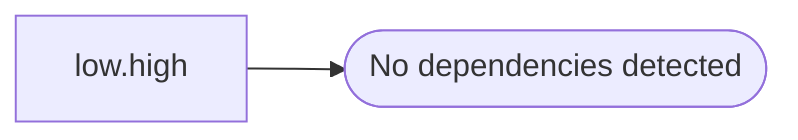

# low.high

**Database:** master  
**Server:** bedrockdb02  

## Architecture Diagram


```mermaid
flowchart LR
    VIEW["low.high"]
    VIEW --> NoRefs(["No dependencies detected"])
```

## Table Dependencies

_No table references detected._

## View Code

```sql
status
```

