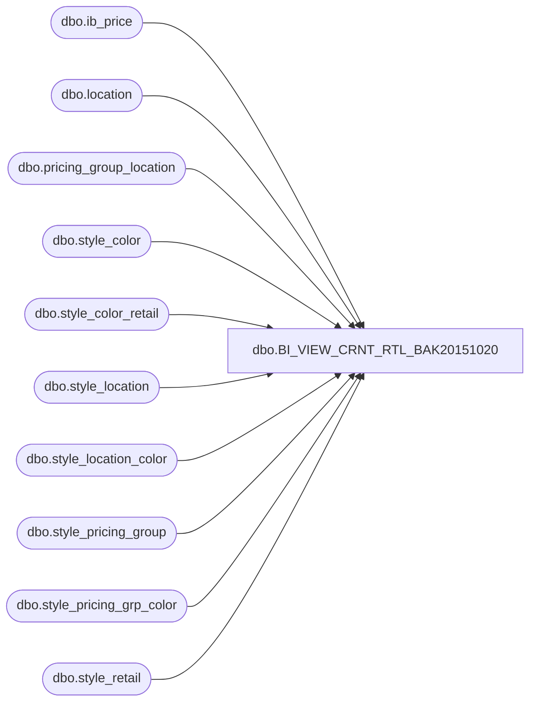

# dbo.BI_VIEW_CRNT_RTL_BAK20151020

**Database:** me_01  
**Server:** bedrockdb02  

## Architecture Diagram



## Table Dependencies

| Referenced Table |
|---|
| dbo.ib_price |
| dbo.location |
| dbo.pricing_group_location |
| dbo.style_color |
| dbo.style_color_retail |
| dbo.style_location |
| dbo.style_location_color |
| dbo.style_pricing_group |
| dbo.style_pricing_grp_color |
| dbo.style_retail |

## View Code

```sql
CREATE view  [dbo].[BI_VIEW_CRNT_RTL_BAK20151020] as 
select r.style_id, r.jurisdiction_id, 
convert(decimal(14,0),l.location_id ) as location_id, 
sc.style_color_id, 
isnull(slc.current_selling_retail, 
       isnull(spgc.current_selling_retail, 
           isnull(scr.current_selling_retail, 
              isnull(sl.current_selling_retail, 
                 isnull(spg.current_selling_retail, r.current_selling_retail))))) as current_local_price,

isnull(slc.current_valuation_retail, 
       isnull(spgc.current_valuation_retail, 
           isnull(scr.current_valuation_retail, 
              isnull(sl.current_valuation_retail, 
                 isnull(spg.current_valuation_retail, r.current_valuation_retail))))) as current_base_price,
isnull(ip1.selling_retail_price,
         isnull(ip2.selling_retail_price,
            isnull(ip3.selling_retail_price,
               isnull(ip4.selling_retail_price,
                 isnull(ip5.selling_retail_price,ip6.selling_retail_price))))) as promo_local_price, 
isnull(ip1.valuation_retail_price,
         isnull(ip2.valuation_retail_price,
            isnull(ip3.valuation_retail_price,
               isnull(ip4.valuation_retail_price,
                 isnull(ip5.valuation_retail_price,ip6.valuation_retail_price))))) as promo_base_price
from style_retail r
join location l
on l.jurisdiction_id = r.jurisdiction_id
join style_color sc
on r.style_id = sc.style_id
left outer join pricing_group_location pgl
on pgl.location_id = l.location_id
left outer join style_location_color slc
on slc.style_id = r.style_id
and slc.jurisdiction_id = r.jurisdiction_id
and slc.location_id = l.location_id
and slc.style_color_id = sc.style_color_id
left outer join style_pricing_grp_color spgc
on spgc.style_id = r.style_id
and spgc.style_color_id = sc.style_color_id
and spgc.jurisdiction_id = r.jurisdiction_id
and spgc.pricing_group_id = pgl.pricing_group_id
left outer join style_color_retail scr
on scr.style_id = r.style_id
and scr.style_color_id = sc.style_color_id
and scr.jurisdiction_id = r.jurisdiction_id
left outer join style_location sl
on sl.style_id = r.style_id
and sl.location_id = l.location_id
and sl.jurisdiction_id = r.jurisdiction_id
left outer join style_pricing_group spg
on spg.style_id = r.style_id
and spg.jurisdiction_id = r.jurisdiction_id
and spg. pricing_group_id = pgl.pricing_group_id 
left outer join ib_price ip1
on ip1.style_id = r.style_id
and ip1.jurisdiction_id = r.jurisdiction_id
and ip1.color_id = sc.color_id
and ip1.location_id = l.location_id
and ip1.temp_price_flag = 1
and ip1.start_date <= getdate()
and ip1.end_date > getdate()
left outer join ib_price ip2
on ip2.style_id = r.style_id
and ip2.jurisdiction_id = r.jurisdiction_id
and ip2.color_id = sc.color_id
and ip2.pricing_group_id = pgl.pricing_group_id
and ip2.location_id is null
and ip2.temp_price_flag = 1
and ip2.start_date <= getdate()
and ip2.end_date > getdate()
left outer join ib_price ip3
on ip3.style_id = r.style_id
and ip3.jurisdiction_id = r.jurisdiction_id
and ip3.color_id = sc.color_id
and ip3.pricing_group_id is null
and ip3.location_id is null
and ip3.temp_price_flag = 1
and ip3.start_date <= getdate()
and ip3.end_date > getdate()
left outer join ib_price ip4
on ip4.style_id = r.style_id
and ip4.jurisdiction_id = r.jurisdiction_id
and ip4.color_id is null
and ip4.pricing_group_id is null
and ip4.location_id = l.location_id
and ip4.temp_price_flag = 1
and ip4.start_date <= getdate()
and ip4.end_date > getdate()
left outer join ib_price ip5
on ip5.style_id = r.style_id
and ip5.jurisdiction_id = r.jurisdiction_id
and ip5.color_id is null
and ip5.pricing_group_id = pgl.pricing_group_id
and ip5.location_id is null
and ip5.temp_price_flag = 1
and ip5.start_date <= getdate()
and ip5.end_date > getdate()
left outer join ib_price ip6
on ip6.style_id = r.style_id
and ip6.jurisdiction_id = r.jurisdiction_id
and ip6.color_id is null
and ip6.pricing_group_id is null
and ip6.location_id is null
and ip6.temp_price_flag = 1
and ip6.start_date <= getdate()
and ip6.end_date > getdate()


dbo,BI_VIEW_DIST_ASN,CREATE view  dbo.BI_VIEW_DIST_ASN AS
SELECT DISTINCT 
 dl.distribution_id,dl.dist_line_id,
 a.advance_shipping_notice_id,
 a.document_no,
 convert(smalldatetime, convert(varchar, a.expected_receipt_date,101)) as expected_receipt_date,
 a.shipment_ref_no
FROM dist_line dl
JOIN advance_shipping_notice a 
ON dl.advance_shipping_notice_id = a.advance_shipping_notice_id

dbo,BI_VIEW_DIST_ATRBT_SET,create view BI_VIEW_DIST_ATRBT_SET
AS
SELECT DISTINCT
  e.distribution_id,
  e.attribute_set_id,
  b.attribute_id
FROM dist_attribute_set e 
JOIN attribute_set b
ON e.attribute_set_id = b.attribute_set_id 

dbo,BI_VIEW_DIST_LCTN,create view BI_VIEW_DIST_LCTN as 
select
distribution_id,
convert(decimal(14,0), location_id) as location_id,
convert(smalldatetime, convert(varchar, expected_receipt_date, 101)) as expected_receipt_date,
suggested_quantity,
instruction,
instruction_value,
dist_volume_grade_id,
dist_sell_thru_grade_id,
dist_grp_instruction_id,
effective_inventory,
hist_effective_inventory,
unit_sales,
hist_unit_sales,
retail_sales,
hist_retail_sales,
on_hand,
hist_on_hand,
number_weeks_sales,
remaining_sales,
prior_dist_flag,
prior_dist_quantity,
desired_quantity,
ots_flag,
eligibility,
total_distributed_detail_qty,
total_suggested_detail_qty,
location_need
from dist_location
dbo,BI_VIEW_DIST_LINE_DTL,create view BI_VIEW_DIST_LINE_DTL AS
SELECT 
dl.distribution_id,
dl.dist_line_id,
sk.style_color_id,
dl.pack_id,
sk.style_id,
ss.size_master_id,
ss.reorder_flag,
ss.ticket_label_override,
dd.sku_id,
convert(decimal(14,0),dd.location_id) as location_id,
dd.eligibility_flag,
dd.suggested_quantity,
dd.quantity,
dd.skipped_reason,
mm.minimum,
mm.maximum,
mm.presentation_stock,
mm.capacity_maximum,
mm.order_point,
mm.incl_pres_stock_with_ord_pt_fl,
mm.on_hand_units,
mm.in_transit_units,
mm.allocated_units,
mm.on_order_units,
mm.original_suggested_quantity,
mm.adjusted_quantity,
mm.short_shipped_quantity ,
sq.available_quantity,
sq.reserve_quantity,
sq.secondary_quantity
FROM dist_line dl
JOIN dist_detail dd
   ON dd.distribution_id = dl.distribution_id
JOIN dist_min_max_profile mm
   ON mm.distribution_id = dd.distribution_id
  AND mm.dist_detail_id = dd.dist_detail_id
JOIN dist_source_sku_qty sq
   ON sq.distribution_id = mm.distribution_id
  AND sq.sku_id = dd.sku_id
JOIN BI_VIEW_SKU sk
  ON sk.sku_id = dd.sku_id  
JOIN style_size ss  
  ON ss.style_size_id = sk.style_size_id

dbo,BI_VIEW_DIST_LINE_STYL_INFO_WL,CREATE view  dbo.BI_VIEW_DIST_LINE_STYL_INFO_WL 
AS
SELECT s.style_id, s.style_code, s.long_desc style_long_description, s.short_desc style_short_description,
s.create_date, s.style_status, 
convert(smallint, s.style_type) as style_type, 
s.consignment_flag, s.depth, 
s.distribution_multiple, s.fashion_flag, s.height, s.inhouse_upc_flag,
s.order_multiple, s.promo_flag, s.replenishable_flag, s.resulting_po_predistrib_type,
s.active_flag style_active_flag, s.plu_desc style_plu_desc, s.reorder_flag,
s.target_selling_from_week, s.target_selling_from_year, s.target_selling_to_week, s.target_selling_to_year, 
s.vendor_upc_flag, s.weight, s.width,
sr.style_retail_id,  sr.compare_at_retail, sr.current_valuation_retail, sr.original_valuation_retail,
sr.original_price_status_id, 
sr.current_price_status_id,  
s.ticket_format_id,
s.season_id, 
s.calendar_year_id,
sv.style_vendor_id,  sv.vendor_style, sv.primary_vendor_flag, sv.current_cost,
sv.currency_id, 
hg.hierarchy_group_id, hg.hierarchy_group_code, hg.hierarchy_group_label, hg.hierarchy_group_short_label,
hg.alternate_hierarchy_group_code, hg.goal_imu_percent, hg.imu_tolerance_percent, hg.active_flag hg_active_flag,
hg.plu_description hg_plu_description, hg.pos_merch_group_key, hg.sl_minimum_cost_percent, hg.sl_maximum_cost_percent,
hg.shrinkage_provision_percent, 
hg.ticket_format_id as hg_ticket_format_id
FROM style s
JOIN (style_retail sr JOIN jurisdiction j ON sr.jurisdiction_id = j.jurisdiction_id
                      AND j.home_jurisdiction_flag =1)
  ON sr.style_id = s.style_id
JOIN style_vendor sv  
  ON sv.style_id = s.style_id
  AND sv.primary_vendor_flag = 1 
JOIN style_group sg
 ON sg.style_id = s.style_id   
 AND sg.main_group_flag =1
JOIN hierarchy_group hg 
 ON hg.hierarchy_group_id = sg.hierarchy_group_id

dbo,BI_VIEW_DIST_LINE_WL,CREATE view  dbo.BI_VIEW_DIST_LINE_WL AS
SELECT dl.distribution_id ,
dl.dist_line_id, 
dl.po_receipt_id,
dl.pack_id, 
dl.style_color_id, 
dl.available_quantity, 
dl.total_distributed_detail_qty, 
dl.total_suggested_detail_qty,
sc.style_id,
sg.hierarchy_group_id,
sc.color_id
FROM  dist_line dl
JOIN style_color sc 
  ON dl.style_color_id =sc.style_color_id
JOIN style_group sg
  ON sc.style_id = sg.style_id
  AND sg.main_group_flag =1
WHERE dl.style_color_id IS NOT NULL
UNION ALL
SELECT dl.distribution_id, 
dl.dist_line_id,
dl.po_receipt_id,
dl.pack_id,
dl.style_color_id, 
dl.available_quantity, 
dl.total_distributed_detail_qty, 
dl.total_suggested_detail_qty,
p.style_id,
sg.hierarchy_group_id,
NULL color_id
FROM  dist_line dl 
JOIN  pack p
  ON dl.pack_id = p.pack_id
JOIN style_group sg
  ON  p.style_id = sg.style_id
  AND sg.main_group_flag =1  
WHERE dl.pack_id IS NOT NULL
dbo,BI_VIEW_DIST_PRR_LINE,create view BI_VIEW_DIST_PRR_LINE
AS
SELECT DISTINCT 
 dpdl.distribution_id, 
 dpdl.prior_distribution_id, 
 dp.distribution_number AS prior_distribution_number, 
 dp.distribution_description AS prior_distribution_description, 
 dl.style_color_id, -- sc.long_desc AS style_color_long_desc,  
 sc.style_id, -- s.style_code,  s.long_desc, s.short_desc, 
 sc.color_id,-- c.color_code, c.color_long_description,  c.color_short_description,  
 h.hierarchy_group_id, --, h.hierarchy_group_code, h.hierarchy_group_short_label, h.hierarchy_group_label, 
 dl.pack_id --, NULL AS pack_code, NULL AS pack_description
FROM dbo.dist_prior_dist_line dpdl 
JOIN  dbo.dist_line dl 
   ON dpdl.prior_distribution_id = dl.distribution_id 
   AND dpdl.prior_dist_line_id = dl.dist_line_id 
   AND dl.style_color_id IS NOT NULL
JOIN dbo.distribution dp 
  ON dpdl.prior_distribution_id = dp.distribution_id 
JOIN  dbo.style_color sc 
  ON dl.style_color_id = sc.style_color_id 
JOIN dbo.style_group sg 
  ON sc.style_id = sg.style_id AND sg.main_group_flag = 1 
JOIN dbo.hierarchy_group h 
  ON sg.hierarchy_group_id = h.hierarchy_group_id
UNION ALL
SELECT DISTINCT 
  dpdl.distribution_id, 
  dpdl.prior_distribution_id, 
  dp.distribution_number AS prior_distribution_number, 
  dp.distribution_description AS prior_distribution_description, 
  dl.style_color_id,   -- NULL AS style_color_long_desc,   
  p.style_id,  --s.style_code,   s.long_desc, s.short_desc,   
  NULL as color_id, --  NULL AS color_code, NULL AS color_long_description, NULL AS color_short_description, 
  h.hierarchy_group_id, -- h.hierarchy_group_code, h.hierarchy_group_short_label, h.hierarchy_group_label, 
  dl.pack_id  -- , p.pack_code, p.pack_description
FROM  dbo.dist_prior_dist_line dpdl 
JOIN dbo.dist_line dl 
  ON dpdl.prior_distribution_id = dl.distribution_id 
  AND dpdl.prior_dist_line_id = dl.dist_line_id 
  AND pack_id IS NOT NULL
JOIN dbo.distribution dp 
  ON dpdl.prior_distribution_id = dp.distribution_id 
JOIN dbo.pack p 
  ON dl.pack_id = p.pack_id 
JOIN dbo.style_group sg 
  ON p.style_id = sg.style_id 
  AND sg.main_group_flag = 1 
JOIN dbo.hierarchy_group h 
  ON sg.hierarchy_group_id = h.hierarchy_group_id


dbo,BI_VIEW_DSTRBTN,CREATE view  dbo.BI_VIEW_DSTRBTN as
select 
distribution_id,
distribution_number,
distribution_description,
convert(smalldatetime, convert(varchar, create_date, 101)) as create_date,
distribution_status,
convert(smalldatetime, convert(varchar, status_date, 101)) as status_date,
document_source,
distribution_method,
convert(smalldatetime, convert(varchar, release_date, 101)) as release_date,
convert(smalldatetime, convert(varchar, expected_receipt_date, 101)) as expected_receipt_date,
position_id,
convert(decimal(14,0),location_id) as location_id,
convert(decimal(14,0),reserve_location_id) as reserve_location_id,
vendor_id,
po_id,
po_shipment_id,
po_receipt_id,
advance_shipping_notice_id,
convert(decimal(14,0),asn_po_location_id) as asn_po_location_id,
apply_eligibility_flag,
retain_for_distribution_flag,
po_quantities_required_flag,
po_generated_flag,
available_quantity_known,
average_sales_basis,
volume_grade_basis,
volume_hierarchy_group_id,
prior_distribution_available,
sales_data_basis,
convert(decimal(12,0), plan_calendar_period_id) as plan_calendar_period_id,
sales_from_calendar_week_id,
sales_to_calendar_week_id,
sell_thru_hierarchy_group_id,
apply_scale,
scale_entry_indicator,
distribution_multiple,
dist_multiple_rounding_pct,
target_pct_need,
plan_hierarchy_group_id,
updatestamp,
previous_status,
number_active_stores,
hist_unit_sales_all_stores,
hist_effect_inv_all_stores,
hist_on_hand_all_stores,
plan_unit_sales_all_stores,
print_for_picking_flag,
allow_size_substitution_flag,
consider_effect_inv_flag,
parent_distribution_id,
case when parent_distribution_id is null then 0
     else 1
end second_level_distribution_flag,     
root_distribution_id,
total_distributed_detail_qty,
total_suggested_detail_qty,
plan_remain_sales_all_stores,
plan_on_hand_all_stores,
update_po_quantity_flag,
weeks_of_supply_loc_need,
incl_effect_inv_loc_need_flag,
apply_max_constraint_flag,
grade_type_for_assortment,
remove_qty_start_from,
add_qty_start_from
from distribution
dbo,BI_VIEW_DSTRBTN_RWRKS,CREATE view  dbo.BI_VIEW_DSTRBTN_RWRKS 
AS
SELECT     
t.to_do_entry_id, 
d.distribution_id, 
convert (smalldatetime, convert(varchar, d.create_date, 101)) as create_date, 
d.distribution_number, d.distribution_description, d.distribution_status, 
convert (smalldatetime, convert(varchar, d.status_date, 101)) as status_date, 
d.position_id, d.document_source,d.distribution_method, 
convert (smalldatetime, convert(varchar, d.release_date, 101)) as release_date, 
convert (smalldatetime, convert(varchar, d.expected_receipt_date, 101)) as expected_receipt_date,
d.po_quantities_required_flag, d.print_for_picking_flag,d.po_generated_flag,d.apply_eligibility_flag,
d.retain_for_distribution_flag, d.vendor_id,
convert(decimal (14,0), d.location_id) as location_id,
convert(decimal (14,0), d.reserve_location_id) as reserve_location_id, 
d.po_id, 
t.request_type
FROM  to_do_entry t 
JOIN distribution d 
  ON t.distribution_id = d.distribution_id 
WHERE t.locked_flag = 0

dbo,BI_VIEW_EMPLY_PSTN,CREATE view  dbo.BI_VIEW_EMPLY_PSTN as select
ep.entity_position_id,
ep.position_id,
er.employee_role_id,
ep.parent_id as employee_id,
p.position_code,  
p.position_label, 
er.role_label, 
ap.position_label as approved_position_label, 
aer.role_label as approved_role_label,
ep.default_position_flag, 
ep.parent_type
from entity_position ep
join position p
on ep.position_id = p.position_id
join employee_role er
on p.employee_role_id = er.employee_role_id
join position ap
on p.approved_by_position_id = ap.position_id
join employee_role aer
on ap.employee_role_id = aer.employee_role_id
WHERE ep.parent_type = 4
dbo,BI_VIEW_FRCST_DTL,create view BI_VIEW_FRCST_DTL as 
select
fd.forecast_id,
forecast_detail_id,
convert(smalldatetime, convert(varchar,f.forecast_run_date,101)) as forecast_run_date,
convert(decimal(14,0), location_id) as location_id,
sku_id,
style_id,
style_color_id,
alternate_history_used,
seasonal_profile_group_id,
forecast_model_id,
service_level,
forecast_error_trace,
service_level_trace,
sales_history_trace,
comp_set_id,
comp_set_used
from forecast_detail fd, forecast f
where fd.forecast_id = f.forecast_id
dbo,BI_VIEW_FRCST_MDL_GRP,create view BI_VIEW_FRCST_MDL_GRP as
select
ff.forecast_model_id,
f.forecast_model_group_id,
f.forecast_model_group_name
from forecast_model_group f, fcast_model_group_model ff
where f.forecast_model_group_id = ff.forecast_model_group_id

dbo,BI_VIEW_FRCST_PRMTR,create view BI_VIEW_FRCST_PRMTR as
select
forecast_parameter_id,
style_id,
hierarchy_group_id,
vendor_id,
convert(decimal(14,0), location_id) as location_id,
eligibility,
forecast_period_type,
week_model_group_id,
period_model_group_id,
no_future_weeks,
no_future_periods,
service_level,
no_past_observations,
no_past_iterations,
seasonal_basic,
season_start_week_code,
season_end_week_code,
start_calendar_week_id,
end_calendar_week_id,
adjustment_factor,
adj_start_calendar_week_id,
adj_end_calendar_week_id,
updatestamp_eligibility,
updatestamp_seasonal_basic,
updatestamp_forecast_level,
updatestamp_forecast_adjust,
updatestamp_date_exception,
updatestamp_service_level,
updatestamp_forecast_error
from forecast_parameter
dbo,BI_VIEW_GL_ACNT_STRCTR_DTL,create view BI_VIEW_GL_ACNT_STRCTR_DTL
as select
gl_account_structure_dtl_id,
gl_account_structure_id,
bookmark,
leading_key,
no_of_characters,
convert(smallint, structure_type) as structure_type,
hierarchy_level_id,
constant_label
from gl_account_structure_dtl
dbo,BI_VIEW_GL_PRD_PRV_PRD,create view BI_VIEW_GL_PRD_PRV_PRD AS 
select g1.gl_period_id,
       g2.gl_period_id as prev_gl_period_id
from gl_period g1
join gl_period g2
on g1.start_date = dateadd(dd,1,g2.end_date)

dbo,BI_VIEW_HRCHY_GRP,create view BI_VIEW_HRCHY_GRP
as select
hierarchy_group_id,
convert(decimal(12,0),hierarchy_group_id) as hierarchy_group_id_dec,
hierarchy_group_code,
hierarchy_group_label,
hierarchy_group_short_label,
alternate_hierarchy_group_code,
hierarchy_id,
parent_group_id,
hierarchy_level_id,
goal_imu_percent,
imu_tolerance_percent,
plu_description,
shrinkage_provision_percent,
ticket_format_id,
leased_flag,
pos_merch_group_key,
sl_minimum_cost_percent,
sl_maximum_cost_percent,
active_flag,
pos_dept_group_key,
plu_dept_group_description
from hierarchy_group
dbo,BI_VIEW_IB_ALCTN,create view BI_VIEW_IB_ALCTN as 
select
ib_allocation_id,
sku_id,
convert(decimal(14,0), location_id) as location_id,
convert(smalldatetime, convert(varchar, transaction_date,101)) as transaction_date,
convert(smalldatetime, convert(varchar, expected_receipt_date,101)) as expected_receipt_date,
transaction_type_code,
allocated_units,
purchase_order_number,
allocation_number
from ib_allocation

dbo,BI_VIEW_IB_COST_FCTR_DSCNT,create view BI_VIEW_IB_COST_FCTR_DSCNT AS
select
ib_cost_factor_discount_id,
sku_id,
convert(decimal(14,0), location_id) as location_id,
convert(smalldatetime, convert(varchar, transaction_date, 101)) as transaction_date,
transaction_type_code,
extended_cost,
document_number,
cost_factor_discount_id,
convert(int, transaction_type_code) as transaction_type_code_int
from ib_cost_factor_discount
dbo,BI_VIEW_IB_INTRSTT,create view BI_VIEW_IB_INTRSTT as
select
ib_intrastat_id,
sku_id,
cost,
units,
transaction_type_code,   
convert(decimal(14,0), location_id) as location_id,
convert(decimal(14,0), other_location_id) as other_location_id,
vendor_id,
convert(smalldatetime, convert(varchar, transaction_date, 101)) as transaction_date,
document_number
from ib_intrastat

dbo,BI_VIEW_IB_INVNTRY,CREATE view  dbo.BI_VIEW_IB_INVNTRY as 
select
ib_inventory_id,
sku_id,
convert(decimal(14,0),location_id) as location_id,
price_status_id,
convert(smalldatetime, convert(varchar, transaction_date,101)) as transaction_date,
transaction_type_code,
inventory_status_id,
convert(decimal(14,0),other_location_id) as other_location_id,
transaction_reason_id,
document_number,
transaction_units,
transaction_cost,
transaction_valuation_retail,
transaction_selling_retail,
convert(tinyint, price_change_type) as price_change_type,
units_affected
from ib_inventory
dbo,BI_VIEW_IB_INVNTRY_TTL,create view BI_VIEW_IB_INVNTRY_TTL as
select
sku_id,
convert(decimal(14,0), location_id )  as location_id,
inventory_status_id,
price_status_id,
total_on_hand_units,
total_on_hand_cost,
total_on_hand_valuation_retail,
total_on_hand_selling_retail
from ib_inventory_total
dbo,BI_VIEW_IB_ON_ORDR,create view BI_VIEW_IB_ON_ORDR as
select
ib_on_order_id,
sku_id,
convert(decimal(14,0),location_id) as location_id,
convert(smalldatetime, convert(varchar,receipt_date,101)) as receipt_date,
transaction_type_code,
price_status_id,
on_order_units,
on_order_cost,
on_order_valuation_retail,
on_order_selling_retail,
document_number,
pack_id
from ib_on_order

dbo,BI_VIEW_IB_ON_ORDR_TTL,create view BI_VIEW_IB_ON_ORDR_TTL as
select 
document_number,
sku_id,
convert(decimal(14,0), location_id ) as location_id,
convert(smalldatetime, convert(varchar, receipt_date,101)) as receipt_date,
price_status_id,
total_on_order_units,
total_on_order_cost,
total_on_order_selling_retail,
pack_id,
total_on_order_val_retail
from ib_on_order_total
dbo,BI_VIEW_IB_PRC,create view BI_VIEW_IB_PRC as
select ib_price_id,
style_id,
color_id,
convert(decimal(14,0),location_id) as location_id,
jurisdiction_id,
pricing_group_id,
temp_price_flag,
convert(smalldatetime, convert(varchar, start_date,101)) as start_date,
convert(smalldatetime, convert(varchar, end_date,101)) as end_date,
valuation_retail_price,
selling_retail_price,
price_status_id,
document_number,
cancel_promo_flag,
effective_date,
price_change_type
from ib_price
dbo,BI_VIEW_IB_TRNSCTNS,create view dbo.BI_VIEW_IB_TRNSCTNS as
select
ib_id,
t.sku_id,
style_id, style_color_id,
convert(decimal(14,0), location_id) as location_id,
convert(smalldatetime, convert(varchar, transaction_date, 101)) as transaction_date,
transaction_type_code,
transaction_units,
transaction_cost,
transaction_valuation_retail,
transaction_selling_retail,
document_number,
price_status_id,
inventory_status_id,
convert(decimal(14,0), other_location_id) as other_location_id,
transaction_reason_id,
price_change_type,
cost_factor_discount_id,
source_type
from view_ib_transactions t
JOIN sku s
on t.sku_id = s.sku_id
dbo,BI_VIEW_IMAT_DSCNT,CREATE view  dbo.BI_VIEW_IMAT_DSCNT as
select
imat_discount_id,
imat_header_id,
convert(smallint,discount_applicability_group) as discount_applicability_group,
item_specific_discount_flag,
sequence_number,
convert(smallint,calculation_method) as calculation_method,
discount_value,
convert(smallint,base_calculation_on) as base_calculation_on,
reflect_in_discount_cost_flag,
reflect_in_net_cost_flag,
subject_to_terms_flag,
discount_id
from imat_discount
dbo,BI_VIEW_IMAT_HDR,CREATE view  dbo.BI_VIEW_IMAT_HDR as
select
imat_header_id,
invoice_number,
convert(smalldatetime, convert(varchar,discount_date,101)) as discount_date,
convert(smalldatetime, convert(varchar,due_date,101)) as due_date,
entry_date_time,
exchange_rate,
gross_amount_payable,
convert(smalldatetime, convert(varchar,invoice_date,101)) as invoice_date,
invoice_item_flag,
convert(smallint, invoice_status_code) as invoice_status_code,
state_no,
match_cost_discount_amount,
match_other_discount_amount,
match_date_time,
match_net_amount,
convert(smallint,match_status_code) as match_status_code,
payment_reference_number,
convert (smallint, payment_status_code) as payment_status_code,
scan_file_name,
terms_discount_amount,
convert (smallint,transaction_type) as transaction_type,
convert(smallint,entry_mode) as entry_mode,
convert(smalldatetime, convert(varchar,release_date,101)) as release_date,
user_id,
currency_id,
CONVERT(INT,gl_distribution_set_id) as gl_distribution_set_id,
invoice_reference_id,
remit_to_vendor_id,
CONVERT(SMALLINT,terms_id) as terms_id,
vendor_id,
last_item_id,
updatestamp,
invoice_adjustment_flag,
jurisdiction_id,
total_tax_amount_calculated,
total_tax_amount_charged,
tax_valid_flag,
manually_matched_flag,
itc_user_set_flag
from imat_header
dbo,BI_VIEW_IMAT_RFRNC,CREATE view  dbo.BI_VIEW_IMAT_RFRNC as
select
imat_reference_id,
imat_header_id,
reference_number,
validity_flag,
convert(int,reference_type_id) as reference_type_id,
convert(decimal(14,0), location_id) as location_id
from imat_reference

dbo,BI_VIEW_IMAT_SBLDGR,CREATE view  dbo.BI_VIEW_IMAT_SBLDGR as
select
imat_subledger_id,
imat_header_id,
convert(smalldatetime, convert(varchar,gl_posting_date,101)) as gl_posting_date,
CONVERT(smallint,entry_type) as entry_type,
discount_applicability_group,
gross_amount,
net_amount,
CONVERT(SMALLINT,gl_effect) as gl_effect,
CONVERT(SMALLINT,posting_status) as posting_status,
gl_account_id,
gl_distribution_type_id,
source_gl_account_no,
non_terms_net_amount,
gross_amount_foreign,
net_amount_foreign,
non_terms_net_amount_foreign,
tax_type_id,
tax_amount,
tax_amount_foreign
from imat_subledger

dbo,BI_VIEW_INV_MOVE_REQ_FROM_LOC,create view BI_VIEW_INV_MOVE_REQ_FROM_LOC
 as select
 inv_move_req_from_loc_id,
inventory_move_request_id,
convert(decimal(14,0), location_id) as location_id,
print_flag
from inv_move_req_from_loc

dbo,BI_VIEW_INVNTRY_CNTRL,create view BI_VIEW_INVNTRY_CNTRL as
select
inventory_control_id,
document_no,
document_status,
state_no,
document_description,
convert(smalldatetime, convert(varchar, create_date,101)) as create_date,
convert(smalldatetime, convert(varchar, count_date,101)) as  count_date,
convert(smalldatetime, convert(varchar, valuation_date,101)) as valuation_date,
update_type,
use_level_flag,
hierarchy_level_id,
grouping_label,
document_source,
external_system_name,
external_doc_no,
convert(smalldatetime, convert(varchar, last_activity_date,101)) as last_activity_date,
updatestamp,
last_item_id
from inventory_control
dbo,BI_VIEW_INVNTRY_CNTRL_LOC,create view BI_VIEW_INVNTRY_CNTRL_LOC as 
select 
inventory_control_loc_id,
inventory_control_id,
convert(decimal(14,0), location_id )as location_id,
inv_control_loc_status,
state_no,
to_be_posted_flag,
convert(smalldatetime, convert(varchar, posted_date,101))as posted_date,
updatestamp,
last_item_id,
last_ib_inventory_id,
last_ib_pack_inventory_id
from inventory_control_loc
dbo,BI_VIEW_INVNTRY_MOVE_RQST,CREATE view  dbo.BI_VIEW_INVNTRY_MOVE_RQST  as select 
inventory_move_request_id,
document_no,
document_description,
document_status,
convert(decimal(14,0),to_location_id) as to_location_id,
transaction_reason_id,
vendor_id,
po_id,
document_type,
return_authorization_no,
convert(smalldatetime,convert(varchar,begin_send_date,101)) as begin_send_date,
convert (smalldatetime, convert(varchar, end_send_date,101)) as end_send_date,
convert(smalldatetime, convert(varchar, create_date, 101)) as create_date,
grouping_label,
document_source,
external_system_name,
external_doc_no,
convert(smalldatetime, convert(varchar, last_activity_date,101)) as last_activity_date,
state_no,
updatestamp,
convert(smalldatetime, (convert( varchar, submit_date, 101))) as submit_date,
last_item_id
from inventory_move_request
dbo,BI_VIEW_JRSDCTN,create view BI_VIEW_JRSDCTN
as select
jurisdiction_id,
jurisdiction_code,
jurisdiction_description,
convert(smallint,jurisdiction_type) as jurisdiction_type,
tax_registration_number1,
tax_registration_number2,
country_id,
pricing_rule_id,
jurisdiction_equivalency_rate,
rate_last_modified,
home_jurisdiction_flag,
default_src_jurisdiction_flag,
last_item_id,
updatestamp,
availability_status
from jurisdiction
dbo,BI_VIEW_LCTN,create view BI_VIEW_LCTN
as select
convert(decimal(14,0), location_id) as location_id,
location_type,
location_code,
location_name,
location_short_name,
register_type_id,
generate_plu_file_flag,
location_status_id,
active_flag,
gl_company_id,
gl_location_number,
jurisdiction_id,
selling_space,
non_selling_space,
target_sales,
occupancy_cost,
language_id,
shrinkage_factor,
warehouse_system_flag,
replenish_flag,
allow_customer_shipment_flag,
allow_customer_pickup_flag,
allow_customer_transfer_flag,
open_date,
comparative_date,
closed_date,
closed_reason,
reopen_date,
remodel_start_date,
remodel_end_date,
open_to_receive_date,
updatestamp,
tkt_override_tkt_price_flag,
tkt_safety_stock_amt,
tkt_safety_stock_percent,
tkt_safety_stock_max_safe_unit,
tkt_days_to_keep_printed_tkts,
tkt_days_to_keep_non_print_tkt,
tkt_override_tkt_upc_val_flag,
tkt_upc_type_order,
polling_reference,
convert(decimal(14,0),reserve_wh_for_alloc_loc_id) as reserve_wh_for_alloc_loc_id,
last_item_id,
tax_registration_number1,
tax_registration_number2,
uses_oim_flag,
auto_receive_shipments_flag,
pos_server_flag,
pos_server_id
from location


dbo,BI_VIEW_LCTN_GRP,create view dbo.BI_VIEW_LCTN_GRP as
select 
location_group_id,
convert(decimal(14,0),location_id) as location_id,
hg.hierarchy_id,  -- from hierarchy_group
lg.hierarchy_group_id,
hg.hierarchy_group_code,  --- lookup from hierarchy_group
hg.hierarchy_group_label, --- lookup
hg.hierarchy_level_id  -- hierarchy group
from location_group lg
join hierarchy_group hg
on lg.hierarchy_group_id = hg.hierarchy_group_id

dbo,BI_VIEW_LCTN_JRSDCTN_CNTRY,create view BI_VIEW_LCTN_JRSDCTN_CNTRY
AS
SELECT DISTINCT
 convert(decimal(14,0), l.location_id) as location_id, 
 c.country_id,
 c.country_code,
 c.country_description
FROM location l
LEFT OUTER JOIN jurisdiction j
ON l.jurisdiction_id = j.jurisdiction_id
LEFT OUTER JOIN country c
on j.country_id = c.country_id
dbo,BI_VIEW_MIN_MAX_PRFL,create view BI_VIEW_MIN_MAX_PRFL as
select
sku_id,
convert(decimal(14,0),location_id) as location_id,
presentation_stock,
capacity_maximum,
minimum,
maximum,
dynamic_minimum,
dynamic_maximum,
convert(smalldatetime, convert(varchar,dynamic_start_date,101)) as dynamic_start_date,
order_point,
incl_pres_stock_with_ord_pt_fl,
source,
convert(smalldatetime, convert(varchar,last_activity_date,101)) as last_activity_date,
updatestamp
from min_max_profile
dbo,BI_VIEW_PACK_STYL,create view BI_VIEW_PACK_STYL as 
select
pack_id,
pack_code,
pack_description,
pack_short_description,
pack_status,
pack_type,
style_id,
vendor_id,
vendor_pack_code,
vendor_upc_flag
active_flag,
multi_color_flag,
bin_location,
document_source
from pack

dbo,BI_VIEW_PO_DTL_REP,CREATE view  dbo.BI_VIEW_PO_DTL_REP AS
SELECT 	pl.po_id,
	pl.po_line_id,
	convert(decimal(14,0),pd.location_id) as location_id,
	pd.expected_receipt_date,
	pd.sku_id,
	CONVERT(SMALLINT,1) AS entity_type,
	pd.prim_size_label,
	pd.prim_seq_no,
	pd.sec_size_label,
	pd.sec_seq_no,
	pd.size_code,
	pd.no_size_flag,
	NULL AS color_code,
	NULL AS color_short_description,
	NULL AS color_long_description,
	pd.ordered_units,
	pd.received_units
FROM po_line pl
LEFT OUTER JOIN (SELECT	pd.po_id,
			pd.po_line_id,
			ploc.location_id,
			ps.expected_receipt_date,
			pd.sku_id,
			sm.prim_size_label,
			sm.prim_seq_no,
			sm.sec_size_label,
			sm.sec_seq_no,
			sm.size_code,
			COALESCE(sm.no_size_flag, 0) AS no_size_flag,
			COALESCE(SUM(CONVERT(DECIMAL(12,0), pd.ordered_units)), 0) AS ordered_units,
			COALESCE(SUM(ioo.received_units), 0) AS received_units
		FROM 	po_detail pd
		INNER JOIN po po2
			ON (pd.po_id = po2.po_id)
		INNER JOIN po_location ploc
			ON (pd.po_id = ploc.po_id 
			AND pd.po_location_id = ploc.po_location_id)
		INNER JOIN po_shipment ps
			ON (pd.po_id = ps.po_id 
			AND pd.po_shipment_id = ps.po_shipment_id)
		INNER JOIN sku
			ON (pd.sku_id = sku.sku_id 
			AND pd.pack_id IS NULL)
		INNER JOIN style_size ssz 
			ON (sku.style_size_id = ssz.style_size_id)
		INNER JOIN size_master sm 
			ON (ssz.size_master_id = sm.size_master_id)
		LEFT OUTER JOIN (SELECT	sku_id, 
					document_number, 
					location_id,
					receipt_date,
					ABS(SUM(CONVERT(DECIMAL(12,0), on_order_units))) AS received_units
				FROM 	ib_on_order
				WHERE 	transaction_type_code = 110 
				AND pack_id IS NULL
				GROUP BY sku_id, 
					document_number,
					location_id,
					receipt_date
				) ioo
			ON (po2.po_no = ioo.document_number 
			AND pd.sku_id = ioo.sku_id
			AND ioo.location_id = ploc.location_id
			AND ioo.receipt_date = ps.expected_receipt_date)
		WHERE	pd.pack_id IS NULL
		GROUP BY pd.po_id, 
			pd.po_line_id,
			ploc.location_id,
			ps.expected_receipt_date,
			pd.sku_id,
			sm.prim_size_label,
			sm.prim_seq_no,
			sm.sec_size_label,
			sm.sec_seq_no,
			sm.size_code,
			COALESCE(sm.no_size_flag, 0)
		) pd
		ON (pl.po_id = pd.po_id 
		AND pl.po_line_id = pd.po_line_id)
WHERE	pl.pack_id IS NULL
UNION ALL
SELECT 	pl.po_id,
		pl.po_line_id,
	convert(decimal(14,0),pd.location_id) as location_id,
		pd.expected_receipt_date,
		pd.sku_id,
	CONVERT(SMALLINT,2) AS entity_type,
		pd.prim_size_label,
		pd.prim_seq_no,
		pd.sec_size_label,
		pd.sec_seq_no,
		pd.size_code,
		pd.no_size_flag,
		pd.color_code,
		pd.color_short_description,
		pd.color_long_description,
		pd.ordered_units,
		pd.received_units
FROM po_line pl
LEFT OUTER JOIN (SELECT	pd.po_id,
						pd.po_line_id,
						ploc.location_id,
						ps.expected_receipt_date,
						psk.sku_id,
						sm.prim_size_label,
						sm.prim_seq_no,
						sm.sec_size_label,
						sm.sec_seq_no,
						sm.size_code,
						COALESCE(sm.no_size_flag, 0) AS no_size_flag,
						c.color_code,
						c.color_short_description,
						c.color_long_description,
						COALESCE(SUM(CONVERT(DECIMAL(12,0), pd.ordered_units) * psk.sku_quantity), 0) AS ordered_units,
						COALESCE(SUM(ioo.received_units), 0) AS received_units
				FROM 	po_detail pd
						INNER JOIN po po2
						ON (pd.po_id = po2.po_id)
						INNER JOIN po_location ploc
						ON (pd.po_id = ploc.po_id 
							AND pd.po_location_id = ploc.po_location_id)
						INNER JOIN po_shipment ps
						ON (pd.po_id = ps.po_id 
							AND pd.po_shipment_id = ps.po_shipment_id)
						INNER JOIN pack_sku psk
						ON (pd.pack_id = psk.pack_id)
						INNER JOIN sku
						ON (psk.sku_id = sku.sku_id)
						INNER JOIN style_size ssz 
						ON (sku.style_size_id = ssz.style_size_id)
						INNER JOIN size_master sm 
						ON (ssz.size_master_id = sm.size_master_id)
						INNER JOIN style_color sc 
						ON (sku.style_color_id = sc.style_color_id)
						INNER JOIN color c 
						ON (sc.color_id = c.color_id)
						LEFT OUTER JOIN (SELECT	sku_id, 
												document_number, 
												location_id,
												receipt_date,
												ABS(SUM(CONVERT(DECIMAL(12,0), on_order_units))) AS received_units
										FROM 	ib_on_order
										WHERE 	transaction_type_code = 110 
												AND pack_id IS NOT NULL
										GROUP BY sku_id, 
												document_number,
												location_id,
												receipt_date
									) ioo
						ON (po2.po_no = ioo.document_number 
							AND psk.sku_id = ioo.sku_id
							AND ioo.location_id = ploc.location_id
							AND ioo.receipt_date = ps.expected_receipt_date)
				WHERE	pd.pack_id IS NOT NULL
				GROUP BY pd.po_id, 
						pd.po_line_id,
						ploc.location_id,
						ps.expected_receipt_date,
						psk.sku_id,
						sm.prim_size_label,
						sm.prim_seq_no,
						sm.sec_size_label,
						sm.sec_seq_no,
						sm.size_code,
						sm.no_size_flag,
						c.color_code,
						c.color_short_description,
						c.color_long_description
						) pd
		ON (pl.po_id = pd.po_id 
		AND pl.po_line_id = pd.po_line_id)
WHERE	pl.pack_id IS NOT NULL


dbo,BI_VIEW_PO_DTL_WL,CREATE view  dbo.BI_VIEW_PO_DTL_WL AS
SELECT 	DISTINCT
	po.po_id,
	CONVERT(smallint, COALESCE(pl.po_line_id, 0)) AS po_line_id,
	convert(smallint, COALESCE(ps.po_shipment_id, 0)) AS po_shipment_id,
	CONVERT(DECIMAL(14,0),COALESCE(ploc.po_location_id, 0)) AS po_location_id,
	u.upc_id,
	u.upc_number,
	u.upc_type
FROM	po
		LEFT OUTER JOIN po_line pl ON (po.po_id = pl.po_id)
		LEFT OUTER JOIN po_shipment ps ON (po.po_id = ps.po_id)
		LEFT OUTER JOIN po_location ploc ON (po.po_id = ploc.po_id)
		LEFT OUTER JOIN po_detail pd ON (pd.po_id = po.po_id AND pd.po_line_id = pl.po_line_id AND pd.po_shipment_id = ps.po_shipment_id AND pd.po_location_id = ploc.po_location_id)
		LEFT OUTER JOIN upc u ON (pd.sku_id = u.sku_id)
WHERE 	pd.sku_id IS NOT NULL 
		OR pl.po_line_id IS NULL 
		OR ps.po_shipment_id IS NULL
		OR ploc.po_location_id IS NULL 
		OR pd.po_detail_id IS NULL
UNION
SELECT 	DISTINCT
	po.po_id,
	CONVERT(smallint, COALESCE(pl.po_line_id, 0)) AS po_line_id,
	convert(smallint, COALESCE(ps.po_shipment_id, 0)) AS po_shipment_id,
	CONVERT(DECIMAL(14,0), COALESCE(ploc.po_location_id, 0)) AS po_location_id,
	upcs.upc_id,
	upcs.upc_number,
	upcs.upc_type
FROM	po
		LEFT OUTER JOIN po_line pl
		ON (po.po_id = pl.po_id)
		LEFT OUTER JOIN po_shipment ps
		ON (po.po_id = ps.po_id)
		LEFT OUTER JOIN po_location ploc
		ON (po.po_id = ploc.po_id)
		LEFT OUTER JOIN po_detail pd
 		ON (pd.po_id = po.po_id AND pd.po_line_id = pl.po_line_id AND pd.po_shipment_id = ps.po_shipment_id AND pd.po_location_id = ploc.po_location_id)
		LEFT OUTER JOIN (SELECT p.pack_id, 
								u.upc_id, 
								u.upc_number,
								u.upc_type
						FROM	pack p
								INNER JOIN upc u
								ON (p.pack_id = u.pack_id)
						UNION
						SELECT	p.pack_id, 
								u.upc_id, 
								u.upc_number,
								u.upc_type
						FROM	pack p
								INNER JOIN pack_sku ps
								ON (p.pack_id = ps.pack_id)
								INNER JOIN upc u
								ON (ps.sku_id = u.sku_id)) upcs
		ON (pd.pack_id = upcs.pack_id)
WHERE 	pd.pack_id IS NOT NULL


dbo,BI_VIEW_PO_LCTN_REP,create view BI_VIEW_PO_LCTN_REP
AS
SELECT 	DISTINCT
	pl.po_id,
	convert(decimal(14,0),pl.po_location_id) as po_location_id,
	CONVERT(decimal(14,0), l.location_id) AS location_id,
	l.location_code,
	l.location_name,
	l.location_short_name,
	l.location_type,
	lg.hierarchy_group_id,
	hg.hierarchy_group_code,
	hg.hierarchy_group_label
FROM po_location pl
LEFT OUTER JOIN location l ON (pl.location_id = l.location_id)
LEFT OUTER JOIN location_group lg ON (lg.location_id = l.location_id)
LEFT OUTER JOIN hierarchy_group hg ON (lg.hierarchy_group_id = hg.hierarchy_group_id)
LEFT OUTER JOIN hierarchy h ON (hg.hierarchy_id = h.hierarchy_id)
WHERE	h.alternate_flag = 0

dbo,BI_VIEW_PO_LINE_LCTN_REP,CREATE view  dbo.BI_VIEW_PO_LINE_LCTN_REP AS
SELECT 	po.po_id,
	CONVERT(smallint,COALESCE(pl.po_line_id, 0)) AS po_line_id,
	pl.line_no,
	convert (decimal (14,0), ploc.location_id) as location_id,
	convert(smalldatetime,convert(varchar,ps.expected_receipt_date,101)) as expected_receipt_date,
	sc.style_id,
        po.vendor_id,
	NULL AS pack_code,
	NULL AS pack_description,
	NULL AS pack_short_description,
	NULL AS vendor_pack_code, 
	sc.color_id,
        pl.first_cost,
	pl.net_final_cost,
	pl.net_cost,
	0 as total_line_loc_pack_ord_units,
	COALESCE(SUM(pd.ordered_units), 0) AS total_line_loc_ordered_units,
	COALESCE(SUM(ioo.received_units), 0) AS total_line_loc_received_units,
	COALESCE(SUM(pd.ordered_units * pl.net_final_cost), 0) AS total_line_loc_ordered_cost,
	COALESCE(SUM(ioo.received_cost), 0) AS total_line_loc_received_cost,
	COALESCE(SUM(pd.ordered_units * pd.unit_retail), 0) AS total_line_loc_ordered_retail,
	COALESCE(SUM(pd.ordered_units * pd.unit_retail_notx), 0) AS total_line_loc_ord_retail_notx,
	COALESCE(SUM(ioo.received_retail), 0) AS total_line_loc_received_retail,
        CONVERT(smallint,1) AS entity_type
FROM 	po
LEFT OUTER JOIN po_line pl 
	ON (po.po_id = pl.po_id)
LEFT OUTER JOIN po_location ploc 
	ON (po.po_id = ploc.po_id)
LEFT OUTER JOIN (SELECT DISTINCT po_id, expected_receipt_date FROM po_shipment) ps
	ON (po.po_id = ps.po_id)
LEFT OUTER JOIN (SELECT pd.po_id, 
				pd.po_line_id,
				pd.po_location_id,
				ps.expected_receipt_date,
				pd.sku_id,
				pd.pack_id,
				CONVERT(DECIMAL(12,0), pd.ordered_units) AS ordered_units,
				CONVERT(DECIMAL(14,2), pdr.unit_retail) AS unit_retail,
				CONVERT(DECIMAL(14,2), ROUND(pdr.unit_retail * pdt.total_exclude_tax_ratio, 2)) AS unit_retail_notx
 	 		FROM 	po_detail pd
			INNER JOIN po_shipment ps
				ON (pd.po_id = ps.po_id
				AND pd.po_shipment_id = ps.po_shipment_id)
			INNER JOIN view_po_sc_detail_retail_rep pdr 
				ON (pd.po_id = pdr.po_id 
 				AND pd.po_detail_id = pdr.po_detail_id)
			INNER JOIN view_po_sc_detail_tax_rep pdt  
				ON (pd.po_id = pdt.po_id  
		  	   	AND pd.po_detail_id = pdt.po_detail_id)
			WHERE	pd.pack_id IS NULL
						) pd
	ON (po.po_id = pd.po_id 
	AND pl.po_id = pd.po_id
	AND pl.po_line_id = pd.po_line_id
	AND ploc.po_id = pd.po_id
	AND ploc.po_location_id = pd.po_location_id
	AND ps.po_id = pd.po_id
	AND ps.expected_receipt_date = pd.expected_receipt_date)
LEFT OUTER JOIN style_color sc 
	ON (sc.style_color_id = pl.style_color_id)
LEFT OUTER JOIN (SELECT	sku_id, 
			document_number, 
			location_id,
			receipt_date,
			ABS(SUM(CONVERT(DECIMAL(12,0), on_order_units))) AS received_units, 
			ABS(SUM(CONVERT(DECIMAL(14,2), on_order_valuation_retail))) AS received_retail, 
			ABS(SUM(CONVERT(DECIMAL(14,2), on_order_cost))) AS received_cost
		FROM 	ib_on_order
		WHERE 	transaction_type_code = 110 
		AND pack_id IS NULL
		GROUP BY sku_id, 
			document_number,
			location_id,
			receipt_date
			) ioo
	ON (po.po_no = ioo.document_number 
	AND pd.sku_id = ioo.sku_id
	AND ioo.location_id = ploc.location_id
	AND ioo.receipt_date = ps.expected_receipt_date)
WHERE 	pl.pack_id IS NULL
AND pd.pack_id IS NULL
GROUP BY po.po_id, 
	pl.po_line_id, 
	pl.line_no,
	pl.pack_id,
	convert (decimal (14,0), ploc.location_id),
	convert(smalldatetime, convert(varchar,ps.expected_receipt_date,101)),
	sc.style_id,		
        po.vendor_id,
	sc.color_id,
	pl.first_cost,
	pl.net_final_cost,
	pl.net_cost
		
UNION ALL
SELECT	po.po_id, 
        convert(smallint, COALESCE(pl.po_line_id, 0)) AS po_line_id,
	pl.line_no,
	convert (decimal (14,0), ploc.location_id) as location_id,
	convert(smalldatetime, convert(varchar,	ps.expected_receipt_date,101)) as expected_receipt_date,
	s.style_id,
        po.vendor_id,
	pack_code,
	pack_description,
	pack_short_description,
	vendor_pack_code, 
	NULL AS color_code, 
	pl.first_cost,
	pl.net_final_cost,
	pl.net_cost,
	COALESCE(SUM(pd.ordered_units), 0) as total_line_loc_pack_ord_units,
	COALESCE(SUM(pd.ordered_units * psk.sku_quantity), 0) AS total_line_loc_ordered_units,
	COALESCE(SUM(ioo.received_units), 0) AS total_line_loc_received_units,
	COALESCE(SUM(pd.ordered_units * psk.sku_quantity * pl.net_final_cost), 0) AS total_line_loc_ordered_cost,		
	COALESCE(SUM(ioo.received_cost), 0) AS total_line_loc_received_cost,
	COALESCE(SUM(pd.ordered_units * pd.unit_retail), 0) AS total_line_loc_ordered_retail,
	COALESCE(SUM(pd.ordered_units * pd.unit_retail_notx), 0) AS total_line_loc_ord_retail_notx,
	COALESCE(SUM(ioo.received_retail), 0) AS total_line_loc_received_retail,
	CONVERT(smallint,2) AS entity_type
FROM 	po
LEFT OUTER JOIN po_line pl 
	ON (po.po_id = pl.po_id)
LEFT OUTER JOIN po_location ploc
	ON (po.po_id = ploc.po_id)
LEFT OUTER JOIN (SELECT DISTINCT po_id, expected_receipt_date FROM po_shipment) ps
	ON (po.po_id = ps.po_id)
LEFT OUTER JOIN (SELECT pd.po_id, 
			pd.po_line_id,
			pd.po_location_id,
			ps.expected_receipt_date,
			pd.pack_id,
			CONVERT(DECIMAL(12,0), pd.ordered_units) AS ordered_units,
			CONVERT(DECIMAL(14,2), pdr.unit_retail) AS unit_retail,
			CONVERT(DECIMAL(14,2), ROUND(pdr.unit_retail * pdt.total_exclude_tax_ratio, 2)) AS unit_retail_notx
		FROM 	po_detail pd
		INNER JOIN po_shipment ps
			ON (pd.po_id = ps.po_id
			AND pd.po_shipment_id = ps.po_shipment_id)
		INNER JOIN view_po_pack_detail_retail_rep pdr 
			ON (pd.po_id = pdr.po_id 
			AND pd.po_detail_id = pdr.po_detail_id)
		INNER JOIN view_po_pack_detail_tax_rep pdt  
			ON (pd.po_id = pdt.po_id  
		        AND pd.po_detail_id = pdt.po_detail_id)
		WHERE	pd.pack_id IS NOT NULL
		) pd
	ON (po.po_id = pd.po_id 
	AND pl.po_id = pd.po_id
	AND pl.po_line_id = pd.po_line_id
	AND ploc.po_id = pd.po_id
	AND ploc.po_location_id = pd.po_location_id
	AND ps.po_id = pd.po_id
	AND ps.expected_receipt_date = pd.expected_receipt_date)
LEFT OUTER JOIN (SELECT	pack_id, 
			SUM(sku_quantity) AS sku_quantity 
		FROM 	pack_sku 
		GROUP BY pack_id
		) psk
	ON (pd.pack_id = psk.pack_id)
LEFT OUTER JOIN pack pk 
	ON (pk.pack_id = pl.pack_id)
LEFT OUTER JOIN style s 
	ON (pk.style_id = s.style_id)
LEFT OUTER JOIN (SELECT pack_id, 
			document_number,
			location_id,
			receipt_date,
			ABS(SUM(CONVERT(DECIMAL(12,0), on_order_units))) AS received_units, 
			ABS(SUM(CONVERT(DECIMAL(14,2), on_order_valuation_retail))) AS received_retail, 
			ABS(SUM(CONVERT(DECIMAL(14,2), on_order_cost))) AS received_cost
		FROM 	ib_on_order
		WHERE 	transaction_type_code = 110 
		AND pack_id IS NOT NULL
		GROUP BY pack_id, 
			document_number,
			location_id,
			receipt_date
		) ioo 
	ON (po.po_no = ioo.document_number 
	AND ioo.pack_id = pd.pack_id
	AND ioo.location_id = ploc.location_id
	AND ioo.receipt_date = ps.expected_receipt_date)
WHERE 	pl.pack_id IS NOT NULL
GROUP BY po.po_id, 
	pl.po_line_id, 
	pl.line_no,
	convert (decimal (14,0), ploc.location_id),
	convert(smalldatetime, convert(varchar,ps.expected_receipt_date,101)),
	s.style_id,
	po.vendor_id,
	pack_code,
	pack_description,
	pack_short_description,
	vendor_pack_code, 
	distribution_multiple, 
	order_multiple,
	pl.first_cost,
	pl.net_final_cost,
	pl.net_cost


dbo,BI_VIEW_PO_LINE_WL,create view BI_VIEW_PO_LINE_WL
AS
SELECT 	DISTINCT 
	po.po_id,
	CONVERT(SMALLINT, COALESCE(pl.po_line_id, 0)) AS po_line_id, 
	pl.line_no,
	sc.style_id,
        po.vendor_id,
        NULL as pack_id,
        sc.color_id,
	h.hierarchy_group_id, 
	pl.first_cost * lu.total_units AS total_line_first_cost,
	pl.net_cost * lu.total_units AS total_line_net_cost,
	pl.net_final_cost * lu.total_units AS total_line_net_final_cost,
	pl.total_ordered_retail
FROM 	po
LEFT OUTER JOIN po_line pl ON (po.po_id = pl.po_id)
LEFT OUTER JOIN style_color sc ON (sc.style_color_id = pl.style_color_id)
LEFT OUTER JOIN style_group sg ON (sc.style_id = sg.style_id AND sg.main_group_flag = 1)
LEFT OUTER JOIN hierarchy_group h ON (sg.hierarchy_group_id = h.hierarchy_group_id)
LEFT OUTER JOIN view_po_line_units_wl lu ON (pl.po_id = lu.po_id AND pl.po_line_id = lu.po_line_id)
WHERE 	pl.style_color_id IS NOT NULL 
	OR (pl.pack_id IS NULL AND pl.style_color_id IS NULL)   
UNION ALL
SELECT	po.po_id, 
	CONVERT(SMALLINT, pl.po_line_id) AS po_line_id,
	pl.line_no,
	p.style_id,
	po. vendor_id,	
	pl.pack_id,
        NULL as color_id,
	h.hierarchy_group_id, 
	pl.first_cost * lu.total_units AS total_line_first_cost,
	pl.net_cost * lu.total_units AS total_line_net_cost,
	pl.net_final_cost * lu.total_units AS total_line_net_final_cost,
	pl.total_ordered_retail
FROM 	po
INNER JOIN po_line pl ON (po.po_id = pl.po_id)
INNER JOIN pack p ON (p.pack_id = pl.pack_id)
LEFT OUTER JOIN style_group sg ON (p.style_id = sg.style_id AND sg.main_group_flag = 1)
LEFT OUTER JOIN hierarchy_group h ON (sg.hierarchy_group_id = h.hierarchy_group_id)
LEFT OUTER JOIN view_po_line_units_wl lu ON (pl.po_id = lu.po_id AND pl.po_line_id = lu.po_line_id)
WHERE 	pl.pack_id IS NOT NULL   --- 252 rows


dbo,BI_VIEW_PO_RCPT,create view BI_VIEW_PO_RCPT as 
select
po_receipt_id,
po_id,
convert(decimal(14,0), location_id )as location_id,
unit_weight_id,
container_type_id,
ship_via_id,
carrier_id,
transaction_reason_id,
advance_shipping_notice_id,
document_no,
document_description,
document_status,
grouping_label,
convert(smalldatetime, convert(varchar,create_date, 101)) as create_date,
convert(smalldatetime, convert(varchar,receive_date, 101)) as receive_date,
performed_by,
weight,
no_of_containers,
packing_list_no,
convert(smalldatetime, convert(varchar,packing_list_date, 101)) as packing_list_date,
pro_bill_no,
freight_amount,
document_source,
external_system_name,
external_doc_no,
state_no,
payment_method,
appointment_no,
priority,
bol_total_cartons,
allocation_replaced_flag,
convert(smalldatetime, convert(varchar,last_activity_date, 101)) as last_activity_date,
updatestamp,
match_status,
last_item_id,
ticket_source,
ticket_status
from po_receipt
dbo,BI_VIEW_PO_SHPMNT_REP,create view BI_VIEW_PO_SHPMNT_REP as
SELECT 	DISTINCT
	ps.po_id,
	ps.po_shipment_id,
	convert(smalldatetime, convert(varchar,ps.expected_receipt_date,101)) as expected_receipt_date,
	ps.estimated_shipment_percent,
	convert(smalldatetime, convert(varchar,psu.user_defined_date,101)) as user_defined_date,
	psu.po_date_type_id
FROM po_shipment ps
LEFT OUTER JOIN po_shipment_udd psu ON (ps.po_id = psu.po_id AND ps.po_shipment_id = psu.po_shipment_id)


dbo,BI_VIEW_PRC_CHNG,CREATE VIEW BI_VIEW_PRC_CHNG as
select
price_change_id,
category_id,
pricing_rule_id,
price_change_no,
price_change_status,
price_change_description,
price_change_duration,
price_change_document_type,
convert(smalldatetime, convert(varchar, effective_from_date,101)) as effective_from_date,
convert(smalldatetime, convert(varchar, effective_to_date,101)) as effective_to_date,
convert(smalldatetime, convert(varchar, terminate_on_date,101)) as terminate_on_date,
convert(smalldatetime, convert(varchar, issue_date,101)) as issue_date,
price_change_type,
price_status_override,
location_grouping,
calculation_method,
calculation_value,
base_calculation_on,
override_price_exceptions,
disable_print_by_location_flag,
approval_status,
convert(smalldatetime, convert(varchar, create_date,101)) as create_date,
convert(smalldatetime, convert(varchar, status_date,101)) as status_date,
convert(smalldatetime, convert(varchar, last_copy_date,101)) as last_copy_date,
convert(smalldatetime, convert(varchar, calculation_date,101)) as calculation_date,
position_id,
total_cost,
price_status_id,
state_no,
total_units,
updatestamp,
last_item_id,
generate_tickets,
jurisdiction_id,
total_valuation_cost,
promotional_event_flag,
submitted_by_id,
total_affected_units
from price_change
dbo,BI_VIEW_PRC_CHNG_DTL,create view BI_VIEW_PRC_CHNG_DTL as 
select
price_change_style_id,
price_change_id,
style_id,
null as pricing_group_id,
null as location_id,
null as color_id,
price_change_type,
calculation_method,
calculation_value,
base_calculation_on,
base_value,
old_price,
new_price,
price_status_id,
0 as color_exception_flag,
0 as location_exception_flag,
0 as loc_col_exception_flag,
0 as pricing_grp_exception_flag,
0 as pricing_grp_col_exception_flag,
average_cost,
total_cost,
total_units,
original_selling_retail,
current_selling_retail,
total_valuation_cost,
new_valuation_price,
current_valuation_retail,
original_valuation_retail
from price_change_style
union
select
sl.price_change_style_id,
sl.price_change_id,
s.style_id,
pricing_group_id,
convert(decimal(14,0),location_id) as location_id,
null as color_id,
sl.price_change_type,
sl.calculation_method,
sl.calculation_value,
sl.base_calculation_on,
sl.base_value,
sl.old_price,
sl.new_price,
sl.price_status_id,
0 as color_exception_flag,
1 as location_exception_flag,
0 as loc_col_exception_flag,
0 as pricing_grp_exception_flag,
0 as pricing_grp_col_exception_flag,
null as average_cost,
sl.total_cost,
sl.total_units,
sl.original_selling_retail,
sl.current_selling_retail,
sl.total_valuation_cost,
sl.new_valuation_price,
sl.current_valuation_retail,
sl.original_valuation_retail
from price_change_style_loc sl
join price_change_style s
on s.price_change_style_id = sl.price_change_style_id
 and s.price_change_id = sl.price_change_id
union
select
scl.price_change_style_id,
scl.price_change_id,
s.style_id,
pricing_group_id,
convert(decimal(14,0),location_id) as location_id,
color_id,
scl.price_change_type,
scl.calculation_method,
scl.calculation_value,
scl.base_calculation_on,
scl.base_value,
scl.old_price,
scl.new_price,
scl.price_status_id,
0 as color_exception_flag,
0 as location_exception_flag,
1 as loc_col_exception_flag,
0 as pricing_grp_exception_flag,
0 as pricing_grp_col_exception_flag,
null as average_cost,
scl.total_cost,
scl.total_units,
scl.original_selling_retail,
scl.current_selling_retail,
scl.total_valuation_cost,
scl.new_valuation_price,
scl.current_valuation_retail,
scl.original_valuation_retail
from price_change_stl_col_loc scl
join price_change_style s
on s.price_change_style_id = scl.price_change_style_id
 and s.price_change_id = scl.price_change_id
union 
select
sp.price_change_style_id,
sp.price_change_id,
s.style_id,
pricing_group_id,
null as location_id,
null as color_id,
sp.price_change_type,
sp.calculation_method,
sp.calculation_value,
sp.base_calculation_on,
sp.base_value,
sp.old_price,
sp.new_price,
sp.price_status_id,
0 as color_exception_flag,
0 as location_exception_flag,
0 as loc_col_exception_flag,
1 as pricing_grp_exception_flag,
0 as pricing_grp_col_exception_flag,
null as average_cost,
sp.total_cost,
sp.total_units,
sp.original_selling_retail,
sp.current_selling_retail,
sp.total_valuation_cost,
sp.new_valuation_price,
sp.current_valuation_retail,
sp.original_valuation_retail
from price_change_style_pg sp
join price_change_style s
on s.price_change_style_id = sp.price_change_style_id
 and s.price_change_id = sp.price_change_id
union 
select
spc.price_change_style_id,
spc.price_change_id,
s.style_id,
pricing_group_id,
null as location_id,
spc.color_id,
spc.price_change_type,
spc.calculation_method,
spc.calculation_value,
spc.base_calculation_on,
spc.base_value,
spc.old_price,
spc.new_price,
spc.price_status_id,
0 as color_exception_flag,
0 as location_exception_flag,
0 as loc_col_exception_flag,
0 as pricing_grp_exception_flag,
1 as pricing_grp_col_exception_flag,
null as average_cost,
spc.total_cost,
spc.total_units,
spc.original_selling_retail,
spc.current_selling_retail,
spc.total_valuation_cost,
spc.new_valuation_price,
spc.current_valuation_retail,
spc.original_valuation_retail
from price_change_stl_pg_col spc
join price_change_style s
on s.price_change_style_id = spc.price_change_style_id
 and s.price_change_id = spc.price_change_id
union 
select
sc.price_change_style_id,
sc.price_change_id,
s.style_id,
null as pricing_group_id,
null as location_id,
sc.color_id,
sc.price_change_type,
sc.calculation_method,
sc.calculation_value,
sc.base_calculation_on,
sc.base_value,
sc.old_price,
sc.new_price,
sc.price_status_id,
1 as color_exception_flag,
0 as location_exception_flag,
0 as loc_col_exception_flag,
0 as pricing_grp_exception_flag,
0 as pricing_grp_col_exception_flag,
null as average_cost,
sc.total_cost,
sc.total_units,
sc.original_selling_retail,
sc.current_selling_retail,
sc.total_valuation_cost,
sc.new_valuation_price,
sc.current_valuation_retail,
sc.original_valuation_retail
from price_change_style_color sc
join price_change_style s
on s.price_change_style_id = sc.price_change_style_id
 and s.price_change_id = sc.price_change_id


dbo,BI_VIEW_PRC_CHNG_LCTN,create view BI_VIEW_PRC_CHNG_LCTN
as select
price_change_location_id,
price_change_id,
printed_status,
convert(decimal(14,0),location_id) as location_id,
pricing_group_id
from price_change_location
dbo,BI_VIEW_PRC_CHNG_LCTN_DTL,CREATE view  dbo.BI_VIEW_PRC_CHNG_LCTN_DTL as 
SELECT 
pcl.price_change_id,
pcs.style_id,
pcl.pricing_group_id,
convert(decimal(14,0),pcl.location_id) as location_id,
NULL as color_id,
COALESCE (pcsl.price_change_type, pcsp.price_change_type, pcs.price_change_type) as price_change_type,
COALESCE (pcsl.calculation_method, pcsp.calculation_method, pcs.calculation_method) as calculation_method,
COALESCE (pcsl.calculation_value, pcsp.calculation_value, pcs.calculation_value) as calculation_value,
COALESCE (pcsl.base_calculation_on, pcsp.base_calculation_on, pcs.base_calculation_on) as base_calculation_on,
COALESCE (pcsl.base_value, pcsp.base_value, pcs.base_value) as base_value,
COALESCE (pcsl.old_price, pcsp.old_price, pcs.old_price) as old_price,
COALESCE (pcsl.new_price, pcsp.new_price, pcs.new_price) as new_price ,
COALESCE (pcsl.price_status_id, pcsp.price_status_id, pcs.price_status_id) as  price_status_id,
COALESCE (pcsl.total_cost, pcsp.total_cost, pcs.total_cost) as total_cost,
COALESCE (pcsl.average_cost, NULL, pcs.average_cost) as average_cost,
COALESCE (pcsl.total_units, pcsp.total_units, pcs.total_units) as total_units,
COALESCE (pcsl.original_selling_retail, pcsp.original_selling_retail, pcs.original_selling_retail) as  original_selling_retail,
COALESCE (pcsl.current_selling_retail, pcsp.current_selling_retail, pcs.current_selling_retail) as current_selling_retail,
COALESCE (pcsl.total_valuation_cost, pcsp.total_valuation_cost,  pcs.total_valuation_cost) as total_valuation_cost,
COALESCE (pcsl.new_valuation_price, pcsp.new_valuation_price, pcs.new_valuation_price) as new_valuation_price,
COALESCE (pcsl.current_valuation_retail, pcsp.current_valuation_retail, pcs.current_valuation_retail) as current_valuation_retail,
COALESCE (pcsl.original_valuation_retail, pcsp.original_valuation_retail, pcs.original_valuation_retail) as original_valuation_retail
FROM price_change_style pcs
JOIN  price_change_location pcl
 ON pcl.price_change_id = pcs.price_change_id
LEFT OUTER JOIN price_change_style_loc pcsl
 ON pcs.price_change_id = pcsl.price_change_id
 AND pcl.location_id = pcsl.location_id
LEFT OUTER JOIN price_change_style_pg pcsp
 ON pcs.price_change_id = pcsp.price_change_id
 AND pcl.pricing_group_id = pcsp.pricing_group_id
UNION
select
scl.price_change_id,
s.style_id,
l.pricing_group_id,
convert(decimal(14,0),scl.location_id) as location_id ,
scl.color_id,
scl.price_change_type,
scl.calculation_method,
scl.calculation_value,
scl.base_calculation_on, 
scl.base_value, 
scl.old_price,
scl.new_price,
scl.price_status_id,
scl.total_cost,
NULL as average_cost,
scl.total_units,
scl.original_selling_retail, 
scl.current_selling_retail, 
scl.total_valuation_cost,
scl.new_valuation_price,
scl.current_valuation_retail,
scl.original_valuation_retail
FROM price_change_stl_col_loc scl
JOIN price_change_style s
 ON scl.price_change_id = s.price_change_id
JOIN price_change_location l
 ON scl.price_change_id = l.price_change_id
 AND scl.location_id = l.location_id
UNION
SELECT 
l.price_change_id,
s.style_id,
l.pricing_group_id,
convert(decimal(14,0),l.location_id) as location_id,
scp.color_id, 
scp.price_change_type, 
scp.calculation_method,
scp.calculation_value,
scp.base_calculation_on,
scp.base_value,
scp.old_price,
scp.new_price,
scp.price_status_id,
scp.total_cost,
NULL as average_cost,
scp.total_units, 
scp.original_selling_retail,
scp.current_selling_retail,
scp.total_valuation_cost,
scp.new_valuation_price,
scp.current_valuation_retail,
scp.original_valuation_retail
FROM price_change_stl_pg_col scp
JOIN price_change_style s
 ON scp.price_change_id = s.price_change_id
JOIN price_change_location l
 ON l.price_change_id = scp.price_change_id
 AND l.pricing_group_id = scp.pricing_group_id
WHERE NOT EXISTS (select 1 from price_change_stl_col_loc scl
                  where scl.location_id = l.location_id
                  and scl.color_id = scp.color_id
                  and scl.price_change_id = scp.price_change_id)
UNION
SELECT 
l.price_change_id,
s.style_id,
l.pricing_group_id,
convert(decimal(14,0),l.location_id) as location_id,
sc.color_id, 
sc.price_change_type, 
sc.calculation_method,
sc.calculation_value,
sc.base_calculation_on,
sc.base_value,
sc.old_price,
sc.new_price,
sc.price_status_id,
sc.total_cost,
NULL as average_cost,
sc.total_units, 
sc.original_selling_retail,
sc.current_selling_retail,
sc.total_valuation_cost,
sc.new_valuation_price,
sc.current_valuation_retail,
sc.original_valuation_retail
FROM price_change_style_color sc
JOIN price_change_style s
 ON sc.price_change_id = s.price_change_id
JOIN price_change_location l
 ON l.price_change_id = sc.price_change_id
WHERE NOT EXISTS (select 1 from price_change_stl_col_loc scl
                where scl.location_id = l.location_id
                and scl.color_id = sc.color_id
                and scl.price_change_id = sc.price_change_id)
AND NOT EXISTS (select 1 from price_change_stl_pg_col spc
                where spc.pricing_group_id = l.pricing_group_id
                and spc.color_id = sc.color_id
                and spc.price_change_id = sc.price_change_id)


dbo,BI_VIEW_PRCNG_GRP_LCTN,create view BI_VIEW_PRCNG_GRP_LCTN
as select
pricing_group_location_id,
pricing_group_id,
convert(decimal(14,0),location_id) as location_id	
from pricing_group_location
dbo,BI_VIEW_PRD_YEAR,create view BI_VIEW_PRD_YEAR
as 
select calendar_period_id, calendar_period_code, min(calendar_year_code)as calendar_year_code, (calendar_year_code*100) + calendar_period_code as year_period_code
from calendar_period p join calendar_year y on p.calendar_year_id = y.calendar_year_id
group by calendar_period_id, calendar_period_code, calendar_year_code

dbo,BI_VIEW_RTV,create view BI_VIEW_RTV as
select 
rtv_id,
container_type_id,
inventory_move_request_id,
po_id,
transaction_reason_id,
unit_weight_id,
convert(decimal(14,0),location_id) as location_id,
vendor_id,
carrier_id,
ship_via_id,
terms_id,
vendor_address_type_id,
document_no,
document_description,
document_status,
grouping_label,
convert(smalldatetime, convert(varchar,create_date,101)) as create_date,	
convert(smalldatetime, convert(varchar,returned_date,101)) as returned_date,	
convert(smalldatetime, convert(varchar,request_date,101)) as request_date,	
no_of_containers,
weight,
fob_description,
insurance_amount_1,
freight_amount_1,
misc_amount_1,
insurance_amount_2,
freight_amount_2,
misc_amount_2,
return_authorization_no,
document_source,
external_system_name,
external_doc_no,
convert(smalldatetime, convert(varchar,last_activity_date,101)) as last_activity_date,	
state_no,
updatestamp,
last_item_id,
print_flag,
match_status,
credit_note_number,
packed_by
from rtv
dbo,BI_VIEW_RTV_DTL,create view BI_VIEW_RTV_DTL as 
select
rtv_detail_id,
rtv_id,
style_id,
style_color_id,
sku_id,
from_stock_status_id,
carton_no,
units_sent,
units_requested,
unit_cost,
convert(smalldatetime, convert(varchar,returned_date,101)) as returned_date
from rtv_detail

dbo,BI_VIEW_SELL_THRU_GRD,create view BI_VIEW_SELL_THRU_GRD as
select
convert(int,sell_thru_grade_id) as sell_thru_grade_id,
hierarchy_group_id,
grade_code,
sell_thru_lower_limit
from sell_thru_grade
dbo,BI_VIEW_SHRNK_ADJSTMNT,create view BI_VIEW_SHRNK_ADJSTMNT as 
select
shrink_adjustment_id,
document_no,
document_status,
grouping_label,
convert(smalldatetime, convert(varchar, create_date, 101))  as create_date,
convert(smalldatetime, convert(varchar, submit_date, 101))  as submit_date,
performed_by,
shrink_type,
document_source,
external_system_name,
external_doc_no,
state_no,
convert(smalldatetime, convert(varchar, last_activity_date, 101))  as last_activity_date,
updatestamp,
last_item_id
from shrink_adjustment
dbo,BI_VIEW_SHRNK_ADJSTMNT_DTL,create view BI_VIEW_SHRNK_ADJSTMNT_DTL as 
select
shrink_adjustment_detail_id,
shrink_adjustment_id,
style_id,
style_color_id,
sku_id,
convert(decimal(14,0), location_id) as location_id,
units_to_adjust
from shrink_adjustment_detail
dbo,BI_VIEW_SKU,create view dbo.BI_VIEW_SKU as 
select 
sk.sku_id, 
sk.style_id, 
sk.style_color_id, 
sk.style_size_id,
st.style_code, 
st.long_desc as style_desc, 
c.color_code, 
sc.long_desc as style_color_desc,
size_code
from sku sk
join style st on sk.style_id = st.style_id
join style_color sc on sk.style_color_id = sc.style_color_id
join color c on sc.color_id = c.color_id
join style_size ss on sk.style_size_id = ss.style_size_id
join size_master sm on sm.size_master_id = ss.size_master_id


dbo,BI_VIEW_SL_CUM_VAL_HSTRY,CREATE view  [dbo].[BI_VIEW_SL_CUM_VAL_HSTRY] as
select 
merch_hierarchy_group_id, c.calendar_period_id,
gl_period_id, 
CASE WHEN cum_val_loc_level_id  = -1 THEN location_hierarchy_group_id ELSE 1 END as match_loc_id,
CASE WHEN cum_val_loc_level_id  <> -1 THEN location_hierarchy_group_id ELSE NULL END as location_hierarchy_group_id,
CASE WHEN cum_val_loc_level_id  = -1 THEN CONVERT(decimal(14,0),location_hierarchy_group_id) ELSE NULL END as location_id,
cum_val_cost,  -- monthly change
cum_val_retail,  -- monthly change
cum_val_cost_local,  -- local monthly change
cum_val_retail_local  -- local monthly change
FROM cum_val_history c
JOIN  parameter_sl_accum_dep on 1=1
JOIN history_period h
  ON c.calendar_period_id = h.calendar_period_id
WHERE ISNULL(initial_val_flag,0) =0
dbo,BI_VIEW_SLS_MRKDWN_ADT,create view BI_VIEW_SLS_MRKDWN_ADT AS
select
sales_markdown_audit_id,
transaction_no,
register,
convert(decimal(14,0), location_id) as location_id,
upc_number,
sku_id,
style_id,
color_id,
convert(smalldatetime, convert(varchar, transaction_date, 101)) as transaction_date,
transaction_line,
transaction_type,
units_affected,
sold_price_valuation,
sold_price_selling,
pos_md_variance_valuation,
pos_md_variance_selling,
pos_md_override_valuation,
pos_md_override_selling,
pos_discount_amount_valuation,
pos_discount_amount_selling,
promo_md_valuation,
promo_md_selling,
tax_amount_valuation,
tax_amount_selling,
exchange_rate_difference
from sales_markdown_audit
dbo,BI_VIEW_SSNL_NDX,create view BI_VIEW_SSNL_NDX as
select
seasonal_profile_group_id,
calendar_week_id,
calendar_year_id,
convert(decimal(14,0),location_id) as location_id,
weekly_sales,
index_value,
suggested_index_value
from seasonal_index

dbo,BI_VIEW_STCK_LDGR_HSTRY,CREATE view  [dbo].[BI_VIEW_STCK_LDGR_HSTRY] 
as
SELECT s.merch_hierarchy_group_id, 
p.parent_hierarchy_group_id as accum_merch_group_id,
h.gl_period_id, 
h.calendar_period_id,
CONVERT(decimal(14,0),s.location_id) as location_id,
CASE WHEN cum_val_loc_level_id=-1 THEN s.location_id ELSE 1 END as accum_loc_group_id,
--actual shrink
SUM(case when s.sl_component_id = 1 then s.history_value else 0 end) as actual_shrink_retail,
SUM(case when s.sl_component_id = 2 then s.history_value else 0 end) as actual_shrink_cost_cim,
SUM(case when s.sl_component_id =22 then s.history_value else 0 end) as actual_shrink_retail_rim,
-- inventory reductions
SUM(case when s.sl_component_id = 3 then s.history_value else 0 end) as inv_reduct_cost_cim,
SUM(case when s.sl_component_id =11 then s.history_value else 0 end) as inv_reduct_retail,
SUM(case when s.sl_component_id =25 then s.history_value else 0 end) as inv_reduct_cost_rim,
-- EOM on hand
SUM(case when s.sl_component_id = 4 then s.history_value else 0 end) as EOM_on_hand_cost_cim,
SUM(case when s.sl_component_id =14 then s.history_value else 0 end) as EOM_on_hand_retail,
SUM(case when s.sl_component_id =27 then s.history_value else 0 end) as EOM_on_hand_cost_rim,
-- BOM on hand
SUM(case when sprev.sl_component_id = 4 then sprev.history_value else 0 end) as BOM_on_hand_cost_cim,
SUM(case when sprev.sl_component_id =14 then sprev.history_value else 0 end) as BOM_on_hand_retail,
SUM(case when sprev.sl_component_id =27 then sprev.history_value else 0 end) as BOM_on_hand_cost_rim,
-- other inventory reductions
SUM(case when s.sl_component_id = 5 then s.history_value else 0 end) as other_inv_red_cost_cim,
SUM(case when s.sl_component_id =15 then s.history_value else 0 end) as other_inv_red_retail,
SUM(case when s.sl_component_id =28 then s.history_value else 0 end) as other_inv_red_cost_rim,
-- sales
SUM(case when s.sl_component_id = 6 then s.history_value else 0 end) as sales_cost_cim,
SUM(case when s.sl_component_id =23 then s.history_value else 0 end) as sales_cost_rim,
SUM(case when s.sl_component_id =19 then s.history_value else 0 end) as sales_retail,
-- distributions
SUM(case when s.sl_component_id = 7 then s.history_value else 0 end) as distributions_cost,
SUM(case when s.sl_component_id = 8 then s.history_value else 0 end) as distributions_retail,
-- employee discounts
SUM(case when s.sl_component_id = 9 then s.history_value else 0 end) as emp_disc_retail,
SUM(case when s.sl_component_id =24 then s.history_value else 0 end) as emp_disc_cost_rim,
--  transfers
SUM(case when s.sl_component_id =20 then s.history_value else 0 end) as transfers_cost,
SUM(case when s.sl_component_id =21 then s.history_value else 0 end) as transfers_retail,
-- purchases
SUM(case when s.sl_component_id =17 then s.history_value else 0 end) as purchases_cost,
SUM(case when s.sl_component_id =18 then s.history_value else 0 end) as purchases_retail,
-- markdowns
SUM(case when s.sl_component_id =12 then s.history_value else 0 end) as markdowns_retail,
SUM(case when s.sl_component_id =26 then s.history_value else 0 end) as markdowns_cost_rim,
-- pos_markdowns
SUM(case when s.sl_component_id =16 then s.history_value else 0 end) as pos_markdowns_retail,
SUM(case when s.sl_component_id =29 then s.history_value else 0 end) as pos_markdowns_cost_rim,
--markups
SUM(case when s.sl_component_id =13 then s.history_value else 0 end) as markups,
-- misc costs
SUM(case when s.sl_component_id =10 then s.history_value else 0 end) as freight_cost,
SUM(case when s.sl_component_id =30 then s.history_value else 0 end) as purchase_adj_cost,

-- local actual shrink
SUM(case when s.sl_component_id = 1 then s.history_value_local else 0 end) as actual_shrink_retail_local,
SUM(case when s.sl_component_id = 2 then s.history_value_local else 0 end) as actual_shrink_cost_cim_local,
SUM(case when s.sl_component_id =22 then s.history_value_local else 0 end) as actual_shrink_retail_rim_local,
-- local inventory reductions
SUM(case when s.sl_component_id = 3 then s.history_value_local else 0 end) as inv_reduct_cost_cim_local,
SUM(case when s.sl_component_id =11 then s.history_value_local else 0 end) as inv_reduct_retail_local,
SUM(case when s.sl_component_id =25 then s.history_value_local else 0 end) as inv_reduct_cost_rim_local,
-- local EOM on hand
SUM(case when s.sl_component_id = 4 then s.history_value_local else 0 end) as EOM_on_hand_cost_cim_local,
SUM(case when s.sl_component_id =14 then s.history_value_local else 0 end) as EOM_on_hand_retail_local,
SUM(case when s.sl_component_id =27 then s.history_value_local else 0 end) as EOM_on_hand_cost_rim_local,
-- local BOM on hand
SUM(case when sprev.sl_component_id = 4 then sprev.history_value else 0 end) as BOM_on_hand_cost_cim_local,
SUM(case when sprev.sl_component_id =14 then sprev.history_value else 0 end) as BOM_on_hand_retail_local,
SUM(case when sprev.sl_component_id =27 then sprev.history_value else 0 end) as BOM_on_hand_cost_rim_local,
-- local other inventory reductions
SUM(case when s.sl_component_id = 5 then s.history_value_local else 0 end) as other_inv_red_cost_cim_local,
SUM(case when s.sl_component_id =15 then s.history_value_local else 0 end) as other_inv_red_retail_local,
SUM(case when s.sl_component_id =28 then s.history_value_local else 0 end) as other_inv_red_cost_rim_local,
-- local sales
SUM(case when s.sl_component_id = 6 then s.history_value_local else 0 end) as sales_cost_cim_local,
SUM(case when s.sl_component_id =23 then s.history_value_local else 0 end) as sales_cost_rim_local,
SUM(case when s.sl_component_id =19 then s.history_value_local else 0 end) as sales_retail_local,
-- local distributions
SUM(case when s.sl_component_id = 7 then s.history_value_local else 0 end) as distributions_cost_local,
SUM(case when s.sl_component_id = 8 then s.history_value_local else 0 end) as distributions_retail_local,
-- local employee discounts
SUM(case when s.sl_component_id = 9 then s.history_value_local else 0 end) as emp_disc_retail_local,
SUM(case when s.sl_component_id =24 then s.history_value_local else 0 end) as emp_disc_cost_rim_local,
-- local  transfers
SUM(case when s.sl_component_id =20 then s.history_value_local else 0 end) as transfers_cost_local,
SUM(case when s.sl_component_id =21 then s.history_value_local else 0 end) as transfers_retail_local,
-- local purchases
SUM(case when s.sl_component_id =17 then s.history_value_local else 0 end) as purchases_cost_local,
SUM(case when s.sl_component_id =18 then s.history_value_local else 0 end) as purchases_retail_local,
-- local markdowns
SUM(case when s.sl_component_id =12 then s.history_value_local else 0 end) as markdowns_retail_local,
SUM(case when s.sl_component_id =26 then s.history_value_local else 0 end) as markdowns_cost_rim_local,
-- local pos_markdowns
SUM(case when s.sl_component_id =16 then s.history_value_local else 0 end) as pos_markdowns_retail_local,
SUM(case when s.sl_component_id =29 then s.history_value_local else 0 end) as pos_markdowns_cost_rim_local,
--markups
SUM(case when s.sl_component_id =13 then s.history_value_local else 0 end) as markups_local,
-- local misc costs
SUM(case when s.sl_component_id =10 then s.history_value_local else 0 end) as freight_cost_local,
SUM(case when s.sl_component_id =30 then s.history_value_local else 0 end) as purchase_adj_cost_local

FROM sl_history s
JOIN parameter_sl_accum_dep ON 1=1
JOIN merch_group_parent p ON s.merch_hierarchy_group_id = p.hierarchy_group_id
  AND cum_val_merch_level_id = p.hierarchy_level_id
JOIN history_period h ON s.history_period_id = h.history_period_id
left outer JOIN history_period hprev ON dateadd(dd,-1,h.start_date) = hprev.end_date
left outer JOIN sl_history sprev ON  s.merch_hierarchy_group_id = sprev.merch_hierarchy_group_id
     AND s.location_id = sprev.location_id and s.sl_component_id = sprev.sl_component_id
     AND sprev.history_period_id = hprev.history_period_id
     AND sprev.sl_component_id in (4,14,27) 
GROUP BY s.merch_hierarchy_group_id,p.parent_hierarchy_group_id,h.gl_period_id, h.calendar_period_id,
         CONVERT(decimal(14,0),s.location_id), CASE WHEN cum_val_loc_level_id=-1 THEN s.location_id ELSE 1 END
dbo,BI_VIEW_STCK_STS_ADJ_DTL,create view BI_VIEW_STCK_STS_ADJ_DTL as
select
stock_status_adj_detail_id,
stock_status_adjustment_id,
sku_id,
convert(decimal(14,0), location_id) as location_id,
style_id,
style_color_id,
from_stock_status_id,
to_stock_status_id,
units_to_adjust
from stock_status_adj_detail
dbo,BI_VIEW_STCK_STS_ADJSTMNT,create view BI_VIEW_STCK_STS_ADJSTMNT as
select
stock_status_adjustment_id,
document_no,
document_status,
convert(smalldatetime, convert(varchar, create_date, 101))  as create_date,
convert(smalldatetime, convert(varchar, submit_date, 101))  as submit_date,
performed_by,
grouping_label,
document_source,
external_system_name,
external_doc_no,
state_no,
convert(smalldatetime, convert(varchar, last_activity_date, 101))  as last_activity_date,
updatestamp,
last_item_id
from stock_status_adjustment

dbo,BI_VIEW_STR_SHPMNT,CREATE view  dbo.BI_VIEW_STR_SHPMNT as
select
store_shipment_id,
convert(decimal(14,0),location_id) as location_id,
convert(decimal(14,0),from_location_id) as  from_location_id,
unit_weight_id,
document_no,
document_status,
state_no,
convert(smalldatetime, convert(varchar,create_date,101)) as create_date,
convert(smalldatetime, convert(varchar,ship_date,101)) as ship_date,
convert(smalldatetime, convert(varchar,receive_date,101)) as receive_date,
performed_by,
weight,
external_system_name,
convert(smalldatetime, convert(varchar,last_activity_date,101)) as last_activity_date,	
updatestamp,
convert(smalldatetime, convert(varchar,expected_receipt_date,101)) as expected_receipt_date,
last_item_id,	
print_flag
from store_shipment


dbo,BI_VIEW_STR_SHPMNT_DTL,create view BI_VIEW_STR_SHPMNT_DTL as
select
store_shipment_detail_id,
store_shipment_id,
sku_id,
style_id,
style_color_id,
carton_no,
units_sent,
units_received,
distribution_no,
convert(decimal(14,0),from_location_id) as from_location_id
from store_shipment_detail
dbo,BI_VIEW_STYL,create view BI_VIEW_STYL
as select
style_id,style_code, convert(smallint, style_type) as  style_type,
color_flag,size_flag,style_status,active_flag,delete_status,
long_desc,short_desc,season_id,calendar_year_id,ticket_format_id,
position_id,size_category_id,last_item_id,weight,height,width,
depth,plu_desc,promo_flag,consignment_flag,inhouse_upc_flag,vendor_upc_flag,
reorder_flag,fashion_flag,replenishable_flag,allow_customer_back_order_flag,
create_date,updatestamp,last_modified,order_multiple,distribution_multiple,
target_selling_from_week,target_selling_to_week,target_selling_from_year,
target_selling_to_year,size_grid_id,image_path,to_be_deleted_date,
resulting_po_predistrib_type,document_source
from style
dbo,BI_VIEW_STYL_GRP,create view BI_VIEW_STYL_GRP
as
select 
style_group_id,
style_id,
hg.hierarchy_id,  -- from hierarchy_group
sg.hierarchy_group_id,
hg.hierarchy_group_code,  --- lookup from hierarchy_group
hg.hierarchy_group_label, --- lookup
hg.hierarchy_level_id,  -- hierarchy group
main_group_flag,
reclass_pending_flag,
reclass_to_group_id,  -- lookup label from hierarchy_group
reclass_move_history_flag
from style_group sg
join hierarchy_group hg
on sg.hierarchy_group_id = hg.hierarchy_group_id

dbo,BI_VIEW_TRNSFR,CREATE view  dbo.BI_VIEW_TRNSFR as select 
transfer_id,
container_type_id,
inventory_move_request_id,
unit_weight_id,
carrier_id,
ship_via_id,
transaction_reason_id,
convert(decimal(14,0),from_location_id) as from_location_id,
convert(decimal(14,0),to_location_id) as to_location_id,
from_loc_address_type_id,
to_loc_address_type_id,
convert(decimal(14,0),warehouse_id) as warehouse_id,
document_no,
document_description,
grouping_label,
performed_by,
convert(smalldatetime, convert(varchar, receive_date, 101)) as receive_date,
convert(smalldatetime,convert(varchar, begin_send_date,101)) as begin_send_date,
convert(smalldatetime, convert(varchar, end_send_date,101)) as end_send_date,
manifest_no,
convert(smalldatetime, convert(varchar, receive_create_date,101)) as receive_create_date,
packed_by,
convert(smalldatetime, convert(varchar, create_date, 101)) as create_date,
convert(smalldatetime, convert(varchar,ship_date, 101)) as ship_date,
bill_of_lading,
weight,
no_of_containers,
document_status,
cross_ref,
routed_by_warehouse_flag,
received_by_warehouse_flag,
shipped_by_warehouse_flag,
document_source,
external_system_name,
external_doc_no,
convert(smalldatetime, convert(varchar, last_activity_date, 101)) as last_activity_date,
state_no,
updatestamp,
last_item_id,
print_flag
 from transfer
 

dbo,BI_VIEW_UNSLCTD_RCPT,CREATE view  dbo.BI_VIEW_UNSLCTD_RCPT as select
unsolicited_receipt_id,
convert(decimal(14,0),location_id) as location_id,
unit_weight_id,
container_type_id,
ship_via_id,
carrier_id,
vendor_id,
terms_id,
transaction_reason_id,
document_no,
document_description,
document_status,
grouping_label,
convert(smalldatetime, convert(varchar, create_date, 101)) as create_date,
convert(smalldatetime, convert(varchar, receive_date, 101 )) as receive_date,
performed_by,
weight,
no_of_containers,
fob_description,
document_source,
external_system_name,
external_doc_no,
convert(smalldatetime, convert(varchar, last_activity_date, 101)) as last_activity_date,
state_no,
updatestamp,
match_status,
last_item_id,
ticket_status
from unsolicited_receipt
```

