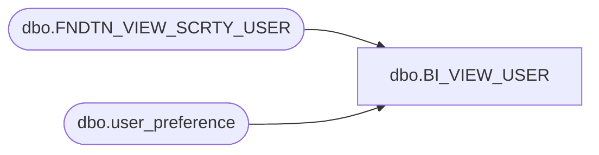

# dbo.BI_VIEW_USER

**Database:** me_01  
**Server:** bedrockdb02  

## Architecture Diagram



## Table Dependencies

| Referenced Table |
|---|
| dbo.FNDTN_VIEW_SCRTY_USER |
| dbo.user_preference |

## View Code

```sql
CREATE view [dbo].[BI_VIEW_USER]
AS 
SELECT
f.USER_ID as user_id,
USER_NAME as user_name,
USER_FULL_NAME as user_full_name,
convert (decimal(14,0), COALESCE(u.location_id, 0)) default_location_id
FROM FNDTN_VIEW_SCRTY_USER f LEFT JOIN user_preference u ON f.USER_ID=u.user_id

dbo,BI_VIEW_USER_DEF_ADJ_DTL,create view BI_VIEW_USER_DEF_ADJ_DTL as 
select 
user_def_adj_detail_id,
user_defined_adjustment_id,
style_id,
style_color_id,
sku_id,
convert(decimal(14,0), location_id) as location_id,
cost_to_adjust,
units_to_adjust,
pack_id,
total_retail_to_adjust,
total_cost_to_adjust,
convert(decimal(14,0), to_location_id) as to_location_id,
total_val_retail_to_adjust
from user_def_adj_detail

dbo,BI_VIEW_USER_DFND_ADJSTMNT,create view BI_VIEW_USER_DFND_ADJSTMNT as 
select
user_defined_adjustment_id,
document_no,
transaction_reason_id,
document_status,
grouping_label,
convert(smalldatetime, convert(varchar, create_date, 101)) as create_date,
convert(smalldatetime, convert(varchar, submit_date, 101)) as submit_date,
performed_by,
document_source,
external_system_name,
external_doc_no,
state_no,
convert(smalldatetime, convert(varchar, last_activity_date, 101)) as last_activity_date,
updatestamp,
last_item_id,
two_sided_pseudo_style_adjust
from user_defined_adjustment
dbo,BI_VIEW_VLM_GRD,create view BI_VIEW_VLM_GRD as
select
convert(int,volume_grade_id) as volume_grade_id,
hierarchy_group_id,
grade_code,
sales_lower_limit,
minimum,
maximum
from volume_grade
dbo,BI_VIEW_VNDR,create view BI_VIEW_VNDR
AS SELECT
vendor_id,
vendor_code,
vendor_name,
alternate_vendor_code,
country_id,
currency_id,
terms_id,
gl_distribution_set_id,
vendor_parameter_set_id,
reference_set_id,
convert(decimal(12,0),remit_to_vendor_id) as remit_to_vendor_id,
imat_able_flag,
import_flag,
requires_vendor_upc_flag,
rtv_option,
rtv_acknowledgement_req_flag,
asn_auto_receive_flag,
fob_description,
ship_via_id,
carrier_id,
active_flag,
vendor_interchange_id_qual,
vendor_interchange_id_code,
retailer_interchange_id_qual,
retailer_interchange_id_code,
send_location_id_qual,
send_location_id_code,
receive_location_id_qual,
edi_able_flag,
edi_850_dtm_cancel_after_flag,
edi_850_dtm_delivery_req_flag,
edi_850_dtm_effective_flag,
edi_850_ctp_msr_flag,
edi_850_ctp_resale_flag,
interchange_control_number,
group_control_number,
updatestamp,
last_item_id,
jurisdiction_id,
allow_customer_shipment_flag,
min_on_order_cost_bulk_xdock,
min_on_order_cost_dropship
from vendor
dbo,BI_VIEW_VNDR_CNTRY,create view BI_VIEW_VNDR_CNTRY
AS
SELECT DISTINCT
 v.vendor_id, 
 v.country_id,
 c.country_code,
 c.country_description
FROM vendor v
LEFT OUTER JOIN country c
on v.country_id = c.country_id

dbo,BI_VIEW_VNDR_PRMTR_SET,create view BI_VIEW_VNDR_PRMTR_SET
as select
vendor_parameter_set_id,
imat_flow_id,
vendor_parameter_set_code,
vendor_parameter_set_desc,
tolerance_amount,
tolerance_percent,
edi_input_terms_override,
manual_input_terms_override,
sys_gen_input_terms_override,
exchange_difference_accounting,
release_accepted_matches_flag,
active_flag,
convert(smallint,import_proc_or_reproc_delay) as import_proc_or_reproc_delay,
convert(smallint,manual_proc_or_reproc_delay) as manual_proc_or_reproc_delay,
import_proc_delay_days,
import_reproc_delay_days,
manual_proc_delay_days,
manual_reproc_delay_days,
updatestamp,
currency_id,
tax_tolerance_amount
from vendor_parameter_set
dbo,BI_VIEW_YTD_CUM_VAL,CREATE view  dbo.BI_VIEW_YTD_CUM_VAL as
SELECT
hierarchy_group_id,
gl_period_id, c.calendar_period_id,
CASE WHEN cum_val_loc_level_id  = -1 THEN location_hierarchy_group_id ELSE 1 END as match_loc_id,
CASE WHEN cum_val_loc_level_id  <> -1 THEN location_hierarchy_group_id ELSE NULL END as location_hierarchy_group_id,
CASE WHEN cum_val_loc_level_id  = -1 THEN CONVERT(decimal(14,0),location_hierarchy_group_id) ELSE NULL END as location_id,
cumulative_cost,
cumulative_retail,
cumulative_cost_local,
cumulative_retail_local
FROM view_cumulative_values c
JOIN  parameter_sl_accum_dep ON 1=1
JOIN history_period h
  ON c.calendar_period_id = h.calendar_period_id
```

