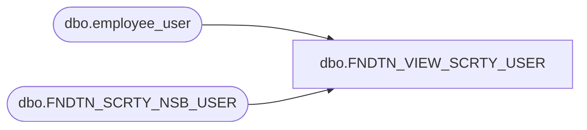

# dbo.FNDTN_VIEW_SCRTY_USER

**Database:** me_01  
**Server:** bedrockdb02  

## Architecture Diagram



## Table Dependencies

| Referenced Table |
|---|
| dbo.employee_user |
| dbo.FNDTN_SCRTY_NSB_USER |

## View Code

```sql
CREATE VIEW FNDTN_VIEW_SCRTY_USER AS
SELECT u.USER_ID, u.USER_NAME, u.USER_FULL_NAME, e.updatestamp, e.last_item_id
    FROM .fn_01.[dbo].[FNDTN_SCRTY_NSB_USER] u left outer join employee_user e on e.user_id = u.USER_ID WHERE u.DLTD=0
```

