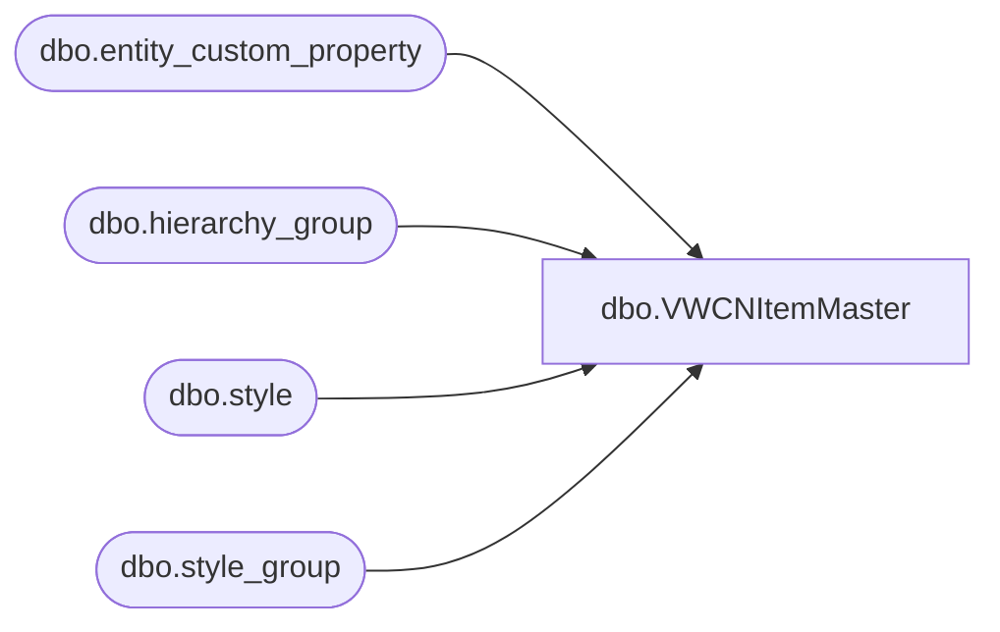

# dbo.VWCNItemMaster

**Database:** me_01  
**Server:** bedrockdb02  

## Architecture Diagram



## Table Dependencies

| Referenced Table |
|---|
| dbo.entity_custom_property |
| dbo.hierarchy_group |
| dbo.style |
| dbo.style_group |

## View Code

```sql
CREATE view [dbo].[VWCNItemMaster]

as 

select  cast(s.style_code as varchar(6)) as style_code,
		cast(isnull(replace(s.short_desc, ',','' ), '') as varchar(100)) as short_desc,
		s.distribution_multiple,
		s.order_multiple
from style s with (nolock)
join style_group sg with (nolock) on s.style_id = sg.style_id
join hierarchy_group hg with (nolock) on sg.hierarchy_group_id = hg.hierarchy_group_id
left join entity_custom_property ecp with (nolock) on s.style_id = ecp.parent_id
	and	ecp.custom_property_id = 2 -- FRCSTM
	and ecp.parent_type = 1
where left(s.style_code, 1) in ('0','8')
and s.active_flag = 1
and substring(hg.hierarchy_group_code,7,2)<>'60' --	EXCLUDES SUPPLIES, THESE ARE SENT FROM DYNAMICS NOW
UNION
select  
		cast( cast('9' as varchar)  + cast(RIGHT(s.style_code,5) as varchar(5)) as varchar(6) ) as style_code,
		cast(isnull(replace(s.short_desc, ',','' ), '') as varchar(100)) as short_desc,
		s.distribution_multiple,
		s.order_multiple
from style s with (nolock)
join style_group sg with (nolock) on s.style_id = sg.style_id
join hierarchy_group hg with (nolock) on sg.hierarchy_group_id = hg.hierarchy_group_id
left join entity_custom_property ecp with (nolock) on s.style_id = ecp.parent_id
	and	ecp.custom_property_id = 2 -- FRCSTM
	and ecp.parent_type = 1
where left(s.style_code, 1) in ('8')
and s.active_flag = 1
and substring(hg.hierarchy_group_code,7,2)<>'60' --	EXCLUDES SUPPLIES, THESE ARE SENT FROM DYNAMICS NOW
UNION --add special requested item 

select  cast(s.style_code as varchar(6)) as style_code,
		cast(isnull(replace(s.short_desc, ',','' ), '') as varchar(100)) as short_desc,
		s.distribution_multiple,
		s.order_multiple
from style s with (nolock)
join style_group sg with (nolock) on s.style_id = sg.style_id
join hierarchy_group hg with (nolock) on sg.hierarchy_group_id = hg.hierarchy_group_id
left join entity_custom_property ecp with (nolock) on s.style_id = ecp.parent_id
	and	ecp.custom_property_id = 2 -- FRCSTM
	and ecp.parent_type = 1
where 1=1
and s.active_flag = 1
and substring(hg.hierarchy_group_code,7,2)<>'60' --	EXCLUDES SUPPLIES, THESE ARE SENT FROM DYNAMICS NOW
and s.style_code='023490'
```

