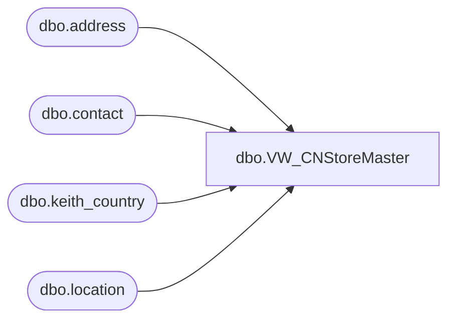

# dbo.VW_CNStoreMaster

**Database:** me_01  
**Server:** bedrockdb02  

## Architecture Diagram



## Table Dependencies

| Referenced Table |
|---|
| dbo.address |
| dbo.contact |
| dbo.keith_country |
| dbo.location |

## View Code

```sql
CREATE view [dbo].[VW_CNStoreMaster]

as 

WITH 
EngAddr (store_nbr, name, addr_line_1, addr_line_2, city, state, zip, cntry)
AS (
	select 	l.location_code as STORE_NBR,
			'BUILD-A-BEAR WORKSHOP #' + l.location_code as NAME,
		case when len(a.address_line2) > 39
		then 
			replace(replace(replace(replace(replace(replace(substring(isnull(UPPER(a.address_line2),UPPER(a.address_line1)),1,39),'CENTER','CTR'),'SOUTH','S'),'NORTH','N'),'EAST','E'),'WEST','W'),'SUITE','STE')
		else
			isnull(UPPER(a.address_line2),UPPER(a.address_line1))
		end  as ADDR_LINE_1,
		case when a.address_line2 is null then
		'' 
		else a.address_line1
		end as ADDR_LINE_2,
		a.address_city as CITY,
		a.address_state as STATE,
		case when c.country_code = 'US' then
		right('00000' + convert(varchar(5),left(a.address_zip_code,5)),5)
		else a.address_zip_code
		end as ZIP,
		c.country_code as CNTRY
	from location l with (nolock)
	inner join address a  with (nolock) on l.location_id = a.parent_id
		and l.location_status_id <> 5
		and	a.parent_type = 2
		and	a.address_type_id = 1
	left outer join keith_country c with (nolock) on a.country_id = c.country_id
	left outer join contact ct with (nolock) on	l.location_id = ct.parent_id
		and l.location_type = 2
		and	ct.parent_type = 2
		and ct.contact_type = 4
	left outer join contact ct2 with (nolock) on l.location_id = ct2.parent_id
		and l.location_type = 2
		and	ct2.parent_type = 2
		and ct2.contact_type = 1
	where c.country_code = 'CN'
	group by l.location_code,a.address_line1,
		a.address_line2,a.address_city,	a.address_state,a.address_zip_code,
		c.country_code
   ),
ChinAddr (store_nbr, name, addr_line_1, addr_line_2, city, state, zip, cntry)
AS (
	select 	l.location_code as STORE_NBR,
			'BUILD-A-BEAR WORKSHOP #' + l.location_code as NAME,
		case when len(a.address_line2) > 39
		then 
			replace(replace(replace(replace(replace(replace(substring(isnull(UPPER(a.address_line2),UPPER(a.address_line1)),1,39),'CENTER','CTR'),'SOUTH','S'),'NORTH','N'),'EAST','E'),'WEST','W'),'SUITE','STE')
		else
			isnull(UPPER(a.address_line2),UPPER(a.address_line1))
		end  as ADDR_LINE_1,
		case when a.address_line2 is null then
		'' 
		else a.address_line1
		end as ADDR_LINE_2,
		a.address_city as CITY,
		a.address_state as STATE,
		case when c.country_code = 'US' then
		right('00000' + convert(varchar(5),left(a.address_zip_code,5)),5)
		else a.address_zip_code
		end as ZIP,
		c.country_code as CNTRY
	from location l with (nolock)
	inner join address a  with (nolock) on l.location_id = a.parent_id
		and l.location_status_id <> 5
		and	a.parent_type = 2
		and	a.address_type_id = 11
	left outer join keith_country c with (nolock) on a.country_id = c.country_id
	left outer join contact ct with (nolock) on	l.location_id = ct.parent_id
		and l.location_type = 2
		and	ct.parent_type = 2
		and ct.contact_type = 4
	left outer join contact ct2 with (nolock) on l.location_id = ct2.parent_id
		and l.location_type = 2
		and	ct2.parent_type = 2
		and ct2.contact_type = 1
	where c.country_code = 'CN'
	group by l.location_code,a.address_line1,
		a.address_line2,a.address_city,	a.address_state,a.address_zip_code,
		c.country_code
   )
select cast(isnull(replace(e.store_nbr, ',', ''), '') as nvarchar) store_nbr, 
	   cast(isnull(replace(e.name, ',', ''), '') as nvarchar) name, 
	   cast(isnull(replace(e.addr_line_1, ',', ''), '') as nvarchar) addr_line_1, 
	   cast(isnull(replace(e.addr_line_2, ',', ''), '') as nvarchar) addr_line_2, 
	   cast(isnull(replace(e.city, ',', ''), '') as nvarchar) city, 
	   cast(isnull(replace(e.state, ',', ''), '') as nvarchar) state, 
	   cast(isnull(replace(e.zip, ',', ''), '') as nvarchar) zip, 
	   cast(isnull(replace(e.cntry, ',', ''), '') as nvarchar) cntry,
	   cast(isnull(replace(c.addr_line_1, ',', ''), '') as nvarchar) addr_line_1CH, 
	   cast(isnull(replace(c.addr_line_2, ',', ''), '') as nvarchar) addr_line_2CH, 
	   cast(isnull(replace(c.city, ',', ''), '') as nvarchar) cityCH, 
	   cast(isnull(replace(c.state, ',', ''), '') as nvarchar) stateCH, 
	   cast(isnull(replace(c.zip, ',', ''), '') as nvarchar) zipCH, 
	   cast(isnull(replace(c.cntry, ',', ''), '') as nvarchar) cntryCH
from EngAddr e
left join ChinAddr c on e.store_nbr = c.store_nbr
```

