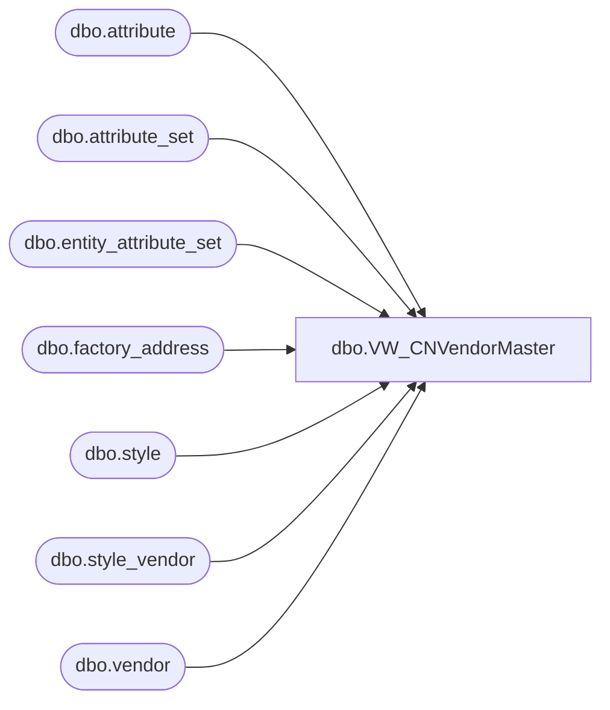

# dbo.VW_CNVendorMaster

**Database:** me_01  
**Server:** bedrockdb02  

## Architecture Diagram



## Table Dependencies

| Referenced Table |
|---|
| dbo.attribute |
| dbo.attribute_set |
| dbo.entity_attribute_set |
| dbo.factory_address |
| dbo.style |
| dbo.style_vendor |
| dbo.vendor |

## View Code

```sql
CREATE view [dbo].[VW_CNVendorMaster]
as

select distinct 
	isnull(replace(v.vendor_name, ',', ''), '') vendor_name, 
	isnull(replace(fa.address_name, ',', ''), '') address_name,
	isnull(replace(fa.port, ',', ''), '') port,
	isnull(replace(fa.address, ',', ''), '') address,
	isnull(replace(fa.city, ',', ''), '') city,
	isnull(replace(fa.province, ',', ''), '') province,
	isnull(replace(fa.country, ',', ''), '') country,
	isnull(replace(fa.phone_number, ',', ''), '') phone_number
from vendor v with (nolock)
join style_vendor sv with (nolock) on v.vendor_id = sv.vendor_id and sv.primary_vendor_flag = 1
join style s with (nolock) on sv.style_id = s.style_id
join entity_attribute_set eas (nolock) on s.style_id = eas.parent_id
join attribute_set att (nolock) on eas.attribute_set_id = att.attribute_set_id
join attribute a (nolock) on att.attribute_id = a.attribute_id and a.parent_type = 1
join factory_address fa with (nolock) on att.attribute_set_code = fa.attribute_set_code
	and v.vendor_code = fa.vendor_code
where left(s.style_code, 1) = '8'
```

