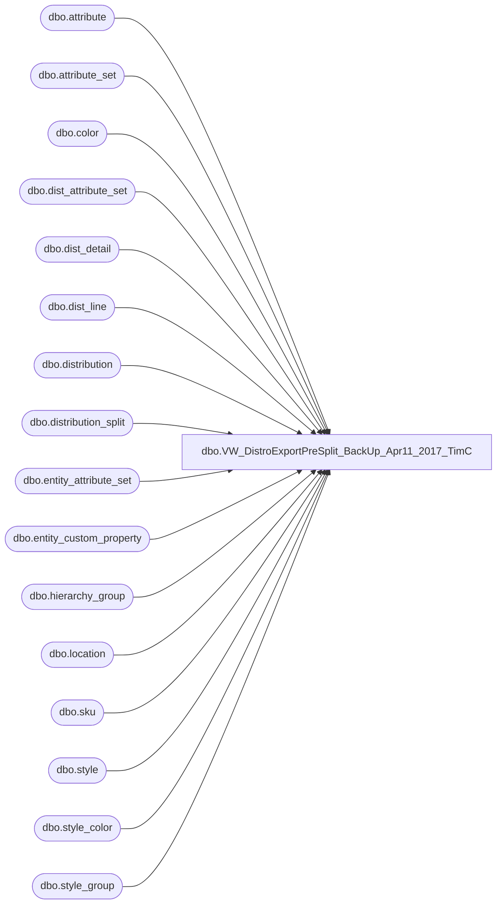

# dbo.VW_DistroExportPreSplit_BackUp_Apr11_2017_TimC

**Database:** me_01  
**Server:** bedrockdb02  

## Architecture Diagram



## Table Dependencies

| Referenced Table |
|---|
| dbo.attribute |
| dbo.attribute_set |
| dbo.color |
| dbo.dist_attribute_set |
| dbo.dist_detail |
| dbo.dist_line |
| dbo.distribution |
| dbo.distribution_split |
| dbo.entity_attribute_set |
| dbo.entity_custom_property |
| dbo.hierarchy_group |
| dbo.location |
| dbo.sku |
| dbo.style |
| dbo.style_color |
| dbo.style_group |

## View Code

```sql
CREATE view [dbo].[VW_DistroExportPreSplit_BackUp_Apr11_2017_TimC]
as 
select	l1.location_code as sourceid,
		l2.location_code as destid,
		s.style_code,
		case when substring(hierarchy_group_code,7,2)='60'
		then 
			dd.quantity -- supplies in cases
		else 
			dd.quantity/s.distribution_multiple -- merch converted to cases
		end as quantity,
		case when das.attribute_set_id is null
			then case when atswc.attribute_set_code ='960' 
				then '54'
			else	'1' -- default to REGULAR TRUCK
		end
		when atswc.attribute_set_code ='960' and ats.attribute_set_code in (1,3,7)
			then '54'
		else ats.attribute_set_code
		end rec_type,
		dd.dist_detail_id AS sequencenbr,  --	'1' AS sequencenbr, -- replaced by <-
		d.distribution_number,
		dl.dist_line_id as ref_field_1,
		d.release_date,
		0 as released
,upper(datename(dw,getdate())) as current_day
,substring(hg.hierarchy_group_code,7,8) as sub_class
,getdate() as exported_date
from 	distribution d with (nolock) 
join location l1 with (nolock) on d.location_id = l1.location_id
join	dist_line dl with (nolock) on d.distribution_id = dl.distribution_id
join	style_color sc with (nolock) on dl.style_color_id = sc.style_color_id
join	style s with (nolock) on sc.style_id = s.style_id
join	style_group sg with (nolock) on s.style_id = sg.style_id
join	hierarchy_group hg with (nolock) on sg.hierarchy_group_id = hg.hierarchy_group_id
join	color c with (nolock) on sc.color_id = c.color_id
join	sku sk with (nolock) on s.style_id = sk.style_id
join	dist_detail dd with (nolock) on sk.sku_id = dd.sku_id
	and		d.distribution_id = dd.distribution_id
join	location l2 with (nolock) on dd.location_id = l2.location_id
join  entity_attribute_set easwc with (nolock) on l2.location_id = easwc.parent_id
	and         easwc.parent_type  = 2
join  attribute_set atswc with (nolock) on easwc.attribute_set_id = atswc.attribute_set_id
join  attribute awc with (nolock) on atswc.attribute_id = awc.attribute_id
	and         awc.attribute_code= 'DC'
left outer join	dist_attribute_set das with (nolock) on d.distribution_id = das.distribution_id
left outer join	entity_custom_property ecp with (nolock) on s.style_id = ecp.parent_id
	and		ecp.parent_type = 1
	and		ecp.custom_property_id = 2
left join distribution_split ds with (nolock) on 
			d.distribution_number = ds.distribution_number
	and		l2.location_code = ds.destid
	and		l1.location_code = ds.sourceid
	and		s.style_code = ds.style_code
left join attribute_set ats with (nolock) on das.attribute_set_id = ats.attribute_set_id
	and		ats.attribute_id = 112
where	d.distribution_status in (6,7) -- 2 = Preliminary 5 = Open 6 = Release 9 = Cancelled
and		l1.location_code in ('0980', '9913','9914','9915','9916','9917','9918','9919','9920','9921','9922','9125')
and		dd.quantity > 0
and		ds.distribution_number is null
and		ds.destid is null
and		sc.reorder_flag = 1
and		(isnull(ats.attribute_set_code,1) >= 50
	or		(isnull(ats.attribute_set_code,1) < 50 and datepart(hh,getdate()) >= 18)
	or			atswc.attribute_set_code ='960')
union all
select	l1.location_code as sourceid,
		l2.location_code as destid,
		s.style_code,
		case when substring(hg.hierarchy_group_code,7,2) =  '60'
		then 
			dd.quantity -- supplies in cases
		else 
			dd.quantity/s.distribution_multiple -- merch converted to cases
		end as quantity,
		case when das.attribute_set_id is not null
			then ats.attribute_set_code			
			else	'1' -- default to REGULAR TRUCK
		end rec_type,
		dd.dist_detail_id AS sequencenbr,  --	'1' AS sequencenbr, -- replaced by <-
		d.distribution_number,
		dl.dist_line_id as ref_field_1,
		d.release_date,
		0 as released
,upper(datename(dw,getdate())) as current_day
,substring(hg.hierarchy_group_code,7,8) as sub_class
,getdate() as exported_date
from 	distribution d with (nolock) 
join location l1 with (nolock) on d.location_id = l1.location_id 
join	dist_line dl with (nolock) on d.distribution_id = dl.distribution_id
join	style_color sc with (nolock) on dl.style_color_id = sc.style_color_id
join	style s with (nolock) on sc.style_id = s.style_id
join	style_group sg with (nolock) on s.style_id = sg.style_id
join	hierarchy_group hg with (nolock) on sg.hierarchy_group_id = hg.hierarchy_group_id
join	color c with (nolock) on sc.color_id = c.color_id
join	sku sk with (nolock) on s.style_id = sk.style_id
join	dist_detail dd with (nolock) on sk.sku_id = dd.sku_id
	and		d.distribution_id = dd.distribution_id 
join	location l2 with (nolock) on dd.location_id = l2.location_id
left outer join	dist_attribute_set das with (nolock) on d.distribution_id = das.distribution_id
left outer join	entity_custom_property ecp with (nolock) on s.style_id = ecp.parent_id
	and		ecp.parent_type = 1
	and		ecp.custom_property_id = 2
left join distribution_split ds with (nolock) on 
			d.distribution_number = ds.distribution_number
	and		l2.location_code = ds.destid
	and		l1.location_code = ds.sourceid
	and		s.style_code = ds.style_code
left join attribute_set ats with (nolock) on das.attribute_set_id = ats.attribute_set_id
	and		ats.attribute_id = 112
where	d.distribution_status in (6,7) -- 2 = Preliminary 5 = Open 6 = Release 9 = Cancelled
and		l1.location_code in ('0960')
and		dd.quantity > 0
and		ds.distribution_number is null
and		ds.destid is null
and		sc.reorder_flag = 1
and		(isnull(ats.attribute_set_code,1) >= 50
	or		(isnull(ats.attribute_set_code,1) < 50 and datepart(hh,getdate()) >= 18))
union all
select	l1.location_code as sourceid,
		l2.location_code as destid,
		s.style_code,
		case when substring(hg.hierarchy_group_code,7,2)= '60'
		then 
			dd.quantity -- supplies in cases
		else 
			dd.quantity/s.distribution_multiple -- merch converted to cases
		end as quantity,
		case when das.attribute_set_id is not null
			then ats.attribute_set_code			
			else	'1' -- default to REGULAR TRUCK
		end rec_type,
		dd.dist_detail_id AS sequencenbr,  --	'1' AS sequencenbr, -- replaced by <-
		d.distribution_number,
		dl.dist_line_id as ref_field_1,
		d.release_date,
		0 as released
,upper(datename(dw,getdate())) as current_day
,substring(hg.hierarchy_group_code,7,8) as sub_class
,getdate() as exported_date
from 	distribution d with (nolock) 
join location l1 with (nolock) on d.location_id = l1.location_id
join	dist_line dl with (nolock) on d.distribution_id = dl.distribution_id
join	style_color sc with (nolock) on dl.style_color_id = sc.style_color_id
join	style s  with (nolock) on sc.style_id = s.style_id
join	style_group sg with (nolock) on s.style_id = sg.style_id
join	hierarchy_group hg with (nolock) on sg.hierarchy_group_id = hg.hierarchy_group_id
join	color c with (nolock) on sc.color_id = c.color_id
join	sku sk with (nolock) on s.style_id = sk.style_id
join	dist_detail dd with (nolock) on sk.sku_id = dd.sku_id
	and		d.distribution_id = dd.distribution_id
join	location l2 with (nolock) on dd.location_id = l2.location_id
left outer join	dist_attribute_set das with (nolock) on d.distribution_id = das.distribution_id
left outer join	entity_custom_property ecp with (nolock) on s.style_id = ecp.parent_id
	and		ecp.parent_type = 1
	and		ecp.custom_property_id = 2
left join distribution_split ds with (nolock) on 
			d.distribution_number = ds.distribution_number
	and		l2.location_code = ds.destid
	and		l1.location_code = ds.sourceid
	and		s.style_code = ds.style_code
left join attribute_set ats with (nolock) on das.attribute_set_id = ats.attribute_set_id
	and		ats.attribute_id = 112
where	d.distribution_status in (6,7) -- 2 = Preliminary 5 = Open 6 = Release 9 = Cancelled
and		l1.location_code in ('2970')
and		dd.quantity > 0
and		ds.distribution_number is null
and		ds.destid is null
and		(isnull(ats.attribute_set_code,1) >= 50
	or		(isnull(ats.attribute_set_code,1) < 50 and datepart(hh,getdate()) >= 18))

union all
select	l1.location_code as sourceid,
		l2.location_code as destid,
		s.style_code,
		case when substring(hg.hierarchy_group_code,7,2)= '60'
		then 
			dd.quantity -- supplies in cases
		else 
			dd.quantity/s.distribution_multiple -- merch converted to cases
		end as quantity,
		case when das.attribute_set_id is not null
			then ats.attribute_set_code			
			else	'1' -- default to REGULAR TRUCK
		end rec_type,
		dd.dist_detail_id AS sequencenbr,  --	'1' AS sequencenbr, -- replaced by <-
		d.distribution_number,
		dl.dist_line_id as ref_field_1,
		d.release_date,
		0 as released
,upper(datename(dw,getdate())) as current_day
,substring(hg.hierarchy_group_code,7,8) as sub_class
,getdate() as exported_date
from 	distribution d with (nolock) 
join location l1 with (nolock) on d.location_id = l1.location_id
join	dist_line dl with (nolock) on d.distribution_id = dl.distribution_id
join	style_color sc with (nolock) on dl.style_color_id = sc.style_color_id
join	style s  with (nolock) on sc.style_id = s.style_id
join	style_group sg with (nolock) on s.style_id = sg.style_id
join	hierarchy_group hg with (nolock) on sg.hierarchy_group_id = hg.hierarchy_group_id
join	color c with (nolock) on sc.color_id = c.color_id
join	sku sk with (nolock) on s.style_id = sk.style_id
join	dist_detail dd with (nolock) on sk.sku_id = dd.sku_id
	and		d.distribution_id = dd.distribution_id
join	location l2 with (nolock) on dd.location_id = l2.location_id
left outer join	dist_attribute_set das with (nolock) on d.distribution_id = das.distribution_id
left outer join	entity_custom_property ecp with (nolock) on s.style_id = ecp.parent_id
	and		ecp.parent_type = 1
	and		ecp.custom_property_id = 2
left join distribution_split ds with (nolock) on d.distribution_number = ds.distribution_number
	and		l2.location_code = ds.destid
left join attribute_set ats with (nolock) on das.attribute_set_id = ats.attribute_set_id
	and		ats.attribute_id = 112
where	d.distribution_status in (6,7) -- 2 = Preliminary 5 = Open 6 = Release 9 = Cancelled
and		l1.location_code in ('3970')
and		dd.quantity > 0
and		ds.distribution_number is null
and		ds.destid is null
and		(isnull(ats.attribute_set_code,1) >= 50
or		isnull(ats.attribute_set_code,1) < 50 and datepart(hh,getdate()) >= 15)  -- Typically 15 aka 3 pm
```

