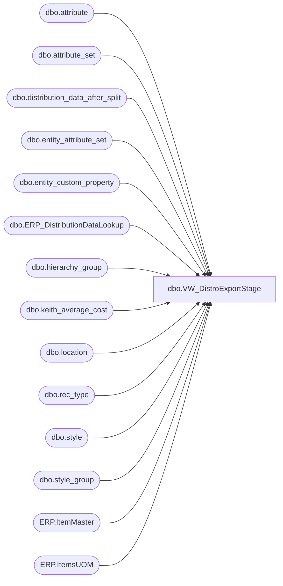

# dbo.VW_DistroExportStage

**Database:** me_01  
**Server:** bedrockdb02  

## Architecture Diagram



## Table Dependencies

| Referenced Table |
|---|
| dbo.attribute |
| dbo.attribute_set |
| dbo.distribution_data_after_split |
| dbo.entity_attribute_set |
| dbo.entity_custom_property |
| dbo.ERP_DistributionDataLookup |
| dbo.hierarchy_group |
| dbo.keith_average_cost |
| dbo.location |
| dbo.rec_type |
| dbo.style |
| dbo.style_group |
| ERP.ItemMaster |
| ERP.ItemsUOM |

## View Code

```sql
CREATE view [dbo].[VW_DistroExportStage]
as

with 
InventoryUnit as
(
	select 
		im.Entity,
		im.ItemNumber,
		right(im.ItemNumber,6) as StyleCode,
		im.InventoryUnitSymbol,
		cast(uom.Factor as int) as Factor 
	from [stl-ssis-p-01].IntegrationStaging.ERP.ItemMaster im 
	join [stl-ssis-p-01].IntegrationStaging.ERP.ItemsUOM uom 
		on im.Entity = uom.Entity 
		and im.PRODUCTNUMBER = uom.PRODUCTNUMBER
		and im.INVENTORYUNITSYMBOL = uom.FROMUNITSYMBOL
		and uom.TOUNITSYMBOL = 'wmea'
	where im.entity = 1100
	and left(im.ItemNumber, 1) in ('M', 'S')
),
WestCoastStores as
(
	select 
		l.location_code
	from location l with (nolock)
	join entity_attribute_set easwc with (nolock) on l.location_id = easwc.parent_id and easwc.parent_type  = 2
	join attribute_set atswc with (nolock) on easwc.attribute_set_id = atswc.attribute_set_id
	join attribute awc with (nolock) on atswc.attribute_id = awc.attribute_id and awc.attribute_code= 'DC'
	where atswc.attribute_set_code = '960'
)
select	ddas.Id, 
		ddas.SourceID, 
		right('0000' + convert(varchar(4),ddas.destid),4) + 
        case 
                when rt.reasoncode = 'SSD' then 'B'
                when rt.reasoncode = 'STD' then 'C'
		   when rt.reasoncode = '8'   then 'D'
		    when rt.reasoncode = '9'   then 'E'
		    when rt.reasoncode = '12'  then 'F'
		    when rt.reasoncode = '13'  then 'G'
                else ''
		end as destid,
		ddas.style_code, 
	case when substring(hg.hierarchy_group_code,7,2) ='60'
		then	ecp.custom_property_value * ddas.quantity
		else	ddas.quantity * s.distribution_multiple
		end as quantity, 
	case when ddas.destid in ('0247','0305') and ddas.rec_type = 1
		then '80'
		when atswc.attribute_set_code ='960' and ddas.rec_type in (1,3,7)
		then '54'
		else ddas.rec_type
		end as rec_type,
	ddas.sequencenbr, 
	case when (ddas.destid in ('0247','0305') and ddas.rec_type = 1) or (atswc.attribute_set_code ='960' and ddas.rec_type in (1,3,7))
		then 'R2'
		when rt.priority in (1,5) then '101'
		when rt.priority in (2,6) then 'R2'
		when rt.priority in (4) and ddas.rec_type in (62, 63) then '091' --this is the FedEx International (Economy or Priority) label type
	else '001' 
	end cartonlabeltype, 	
	ddas.distribution_number, 
	case when ddas.destid in ('0247','0305') and ddas.rec_type = 1
		then 'F80'
		when atswc.attribute_set_code ='960' and ddas.rec_type in (1,3,7)
		then '54'
		else rt.reasoncode
	end as reasoncode,
	case when ddas.destid in ('0247','0305') and ddas.rec_type = 1
		then '6'
		when atswc.attribute_set_code ='960' and ddas.rec_type in (1,3,7)
		then '2'
	else isnull(rt.priority, 0) 
	end priority,
	case when rt.priority in (1,2) then '0'
		else ''
	end TpeFreightTerms,
	case when ddas.destid in ('0247','0305') and ddas.rec_type = 1
	 	then '80'
	else NULL
	end as CartonBreakAttribute,
	ddas.ref_field_1,
	kac.average_cost
from distribution_data_after_split ddas with (nolock)
inner join rec_type rt with (nolock) on	ddas.rec_type = rt.rectype
inner join location l with (nolock) on left(ddas.destid,4) = l.location_code
join  entity_attribute_set easwc with (nolock) on l.location_id = easwc.parent_id and easwc.parent_type  = 2
join  attribute_set atswc with (nolock) on easwc.attribute_set_id = atswc.attribute_set_id
join  attribute awc with (nolock) on atswc.attribute_id = awc.attribute_id and awc.attribute_code= 'DC'
inner join style s with (nolock) on ddas.style_code = s.style_code
inner join style_group sg with (nolock) on s.style_id = sg.style_id
inner join hierarchy_group hg with (nolock) on sg.hierarchy_group_id = hg.hierarchy_group_id
left outer join	entity_custom_property ecp with (nolock) on	s.style_id = ecp.parent_id
	and ecp.custom_property_id = 2
	and	ecp.parent_type = 1
inner join keith_average_cost kac with (nolock) on s.style_code = kac.style_code
where
	(
		(ddas.sourceid = '0980' and	ddas.destid not in  ('0013', '1513') and ddas.released is null)
		or
		(ddas.sourceid = '0980' and (ddas.destid in  ('0013', '1513') and substring(hg.hierarchy_group_code,7,2) ='60') and	ddas.released is null)
	)
AND NOT EXISTS (select ddl.OrderID from ERP_DistributionDataLookup ddl with (nolock) where ddl.OrderID = ddas.distribution_number)
UNION
select	ddas.Id, 
		ddas.SourceID, 
        case 
			when ddas.destid in (select location_code from location with (nolock))
			then right('0000' + convert(varchar(4),ddas.destid),4) + 
				case 
					when rt.reasoncode = 'SSD' then 'B'
					when rt.reasoncode = 'STD' then 'C'
					when rt.reasoncode = '8'   then 'D'
					when rt.reasoncode = '9'   then 'E'
					when rt.reasoncode = '12'  then 'F'
					when rt.reasoncode = '13'  then 'G'
					else ''
				end
			else ddas.destid
		end as destid,
		ddas.style_code, 
	ddas.quantity * isnull(uom.Factor,1) as quantity, --converts from staged unit to wm eaches
	case when ddas.destid in ('0247','0305') and ddas.rec_type = 1
		then '80'
		when wc.location_code is not null and ddas.rec_type in (1,3,7)
		then '54'
		else ddas.rec_type
	end as rec_type,
	case 
            when rt.reasoncode = 'SSD' then ddas.sequencenbr + 100
            when rt.reasoncode = 'STD' then ddas.sequencenbr + 200
			when rt.reasoncode = '8'   then ddas.sequencenbr + 300
		    when rt.reasoncode = '9'   then ddas.sequencenbr + 400
		    when rt.reasoncode = '12'  then ddas.sequencenbr + 500
		    when rt.reasoncode = '13'  then ddas.sequencenbr + 600
                else ddas.sequencenbr
	end as sequencenbr, 
	case when (ddas.destid in ('0247','0305') and ddas.rec_type = 1) or (wc.location_code is not null and ddas.rec_type in (1,3,7))
		then 'R2'
		when rt.priority in (1,5) then '101'
		when rt.priority in (2,6) then 'R2'
		when rt.priority in (4) and ddas.rec_type in (62, 63) then '091' --this is the FedEx International (Economy or Priority) label type
	else '001' 
	end cartonlabeltype,
	ddas.distribution_number, 
	case when ddas.destid in ('0247','0305') and ddas.rec_type = 1
		then 'F80'
		when wc.location_code is not null and ddas.rec_type in (1,3,7)
		then '54'
		else rt.reasoncode
	end as reasoncode,
	case when ddas.destid in ('0247','0305') and ddas.rec_type = 1
		then '6'
		when wc.location_code is not null and ddas.rec_type in (1,3,7)
		then '2'
	else isnull(rt.priority, 0) 
	end priority,
	case when rt.priority in (1,2) then '0'
		else ''
	end TpeFreightTerms,
	case when ddas.destid in ('0247','0305') and ddas.rec_type = 1
	 	then '80'
	else NULL
	end as CartonBreakAttribute,
	ddas.ref_field_1,
	cast(round(ddl.SalePrice,2) as numeric(9,2)) as average_cost
from distribution_data_after_split ddas with (nolock)
inner join rec_type rt with (nolock) on	ddas.rec_type = rt.rectype
left join WestCoastStores wc on ddas.destid = wc.location_code
join ERP_DistributionDataLookup ddl with (nolock) 
	on ddas.distribution_number = ddl.OrderID
	and ddas.style_code = ddl.ItemNumber
	and ddas.sequencenbr = ddl.SequenceNumber
	and case 
		when ddas.sourceid in ('0980', '0960') then '1100'
		when ddas.sourceid in ('2970') then '2110'
		else '3001'
	end = ddl.Entity
left join InventoryUnit uom on 
	case 
		when ddas.sourceid in ('0980', '0960') then '1100'
		when ddas.sourceid in ('2970') then '2110'
		else '3001'
	end = uom.Entity
	and ddas.style_code = uom.StyleCode 
where
	(
		(ddas.sourceid = '0980' and	ddas.destid not in  ('0013', '1513') and  ddas.released is null)
		or
		(ddas.sourceid = '0980' and (ddas.destid in  ('0013', '1513') and ddl.MerchOrSupply = 'Supply') and	ddas.released is null)
	)
```

