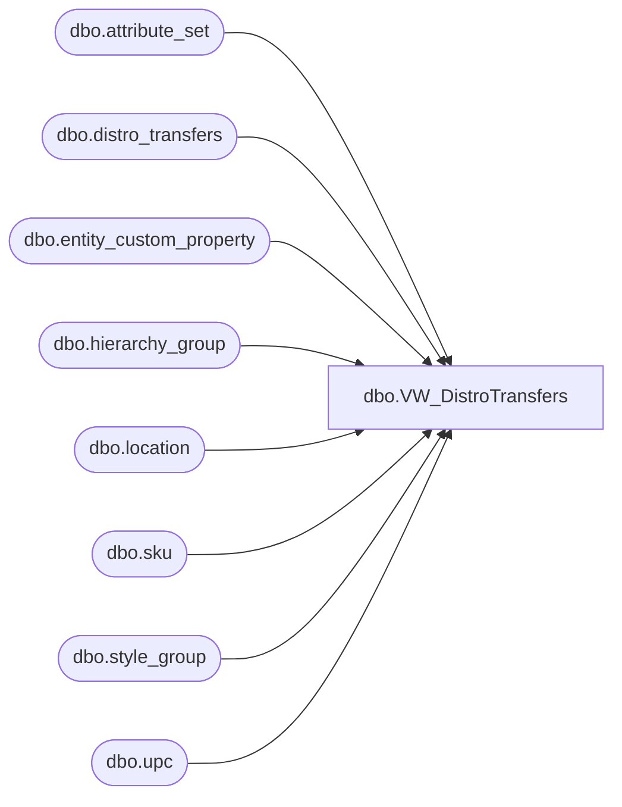

# dbo.VW_DistroTransfers

**Database:** me_01  
**Server:** bedrockdb02  

## Architecture Diagram



## Table Dependencies

| Referenced Table |
|---|
| dbo.attribute_set |
| dbo.distro_transfers |
| dbo.entity_custom_property |
| dbo.hierarchy_group |
| dbo.location |
| dbo.sku |
| dbo.style_group |
| dbo.upc |

## View Code

```sql
CREATE view [dbo].[VW_DistroTransfers]
as 
SELECT	replace(dt.documentnumber, 'DMT', '') as distribution_id,
		cast(dt.id as int) as distro_transfers_id,
		dt.groupinglabel as distribution_description,
		u.sku_id,
case when substring(hg.hierarchy_group_code,7,2) = '60'
			then dt.quantity/ecp.custom_property_value
		else dt.quantity
		end as quantity, 	
		l1.location_id as warehouse,
		l2.location_id as store,
		case when l2.location_id = 30 and ats.attribute_set_id in (select attribute_set_id from attribute_set where attribute_id = 112 and attribute_set_code in ('1001', '1003', '51', '52', '53', '55')) -- 5/13/2009 if Puerto Rico Store and using old invalid rec types for priority shipments, then use '1003'
			then 11200019 -- REC TYPE 1003
		when l2.location_id = 30 and ats.attribute_set_id in (select attribute_set_id from attribute_set where attribute_id = 112 and attribute_set_code in ('1004', '54')) -- 5/13/2009 if Puerto Rico Store and using old invalid rec types for ground shipments, then use '1002' 
			then 11200020 -- REC TYPE 1002
		else ats.attribute_set_id
		end as attribute_set_id
FROM distro_transfers dt with (nolock)
join upc u with (nolock) on right('000000000000' + convert(varchar(12),dt.upc_number),12) = u.upc_number
join location l1 with (nolock) on right('0000' + convert(varchar(4),dt.sourceid),4) = l1.location_code
	and l1.location_type = 4
join location l2 with (nolock) on right('0000' + convert(varchar(4),dt.destid),4) = l2.location_code
	and l2.location_type in (2,4)
join attribute_set ats with (nolock) on cast(dt.rec_type as varchar(10)) = ats.attribute_set_code
	and ats.attribute_id = 112
join sku sk with (nolock) on u.sku_id = sk.sku_id
join style_group sg with (nolock) on sk.style_id = sg.style_id
join hierarchy_group hg with (nolock) on sg.hierarchy_group_id = hg.hierarchy_group_id
left join entity_custom_property ecp (nolock) on sg.style_id = ecp.parent_id
	and ecp.custom_property_id = 2
	and ecp.parent_type = 1
where dt.sourceid in (960,980,975,2970,9913,9914,9915,9916,9917,9918,9919,9920,9921,9922,3970,3980,8502,8505) -- includes only the main warehouses
and	dt.rec_type not in (33, 34, 35, 36, 37) --excludes costco distros
and dt.exported_date is null
```

