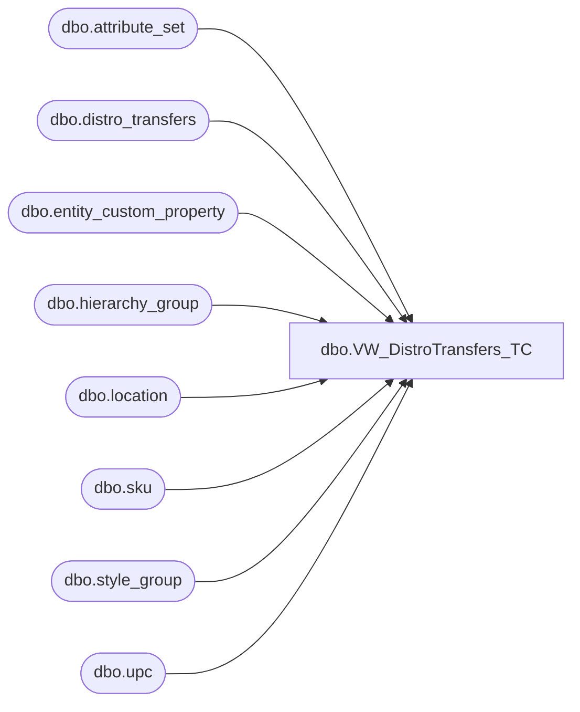

# dbo.VW_DistroTransfers_TC

**Database:** me_01  
**Server:** bedrockdb02  

## Architecture Diagram



## Table Dependencies

| Referenced Table |
|---|
| dbo.attribute_set |
| dbo.distro_transfers |
| dbo.entity_custom_property |
| dbo.hierarchy_group |
| dbo.location |
| dbo.sku |
| dbo.style_group |
| dbo.upc |

## View Code

```sql
CREATE view [dbo].[VW_DistroTransfers_TC]
as 
SELECT	replace(dt.documentnumber, 'DMT', '') as distribution_id,
		cast(dt.id as int) as distro_transfers_id,
		dt.groupinglabel as distribution_description,
		u.sku_id,
case when substring(hg.hierarchy_group_code,7,2) = '60'
			then dt.quantity/ecp.custom_property_value
		else dt.quantity
		end as quantity, 	
		l1.location_id as warehouse,
		l2.location_id as store,
		case when l2.location_id = 30 and ats.attribute_set_id in (select attribute_set_id from attribute_set where attribute_id = 112 and attribute_set_code in ('1001', '1003', '51', '52', '53', '55')) -- 5/13/2009 if Puerto Rico Store and using old invalid rec types for priority shipments, then use '1003'
			then 11200019 -- REC TYPE 1003
		when l2.location_id = 30 and ats.attribute_set_id in (select attribute_set_id from attribute_set where attribute_id = 112 and attribute_set_code in ('1004', '54')) -- 5/13/2009 if Puerto Rico Store and using old invalid rec types for ground shipments, then use '1002' 
			then 11200020 -- REC TYPE 1002
		else ats.attribute_set_id
		end as attribute_set_id
FROM distro_transfers dt with (nolock)
join upc u with (nolock) on right('000000000000' + convert(varchar(12),dt.upc_number),12) = u.upc_number
join location l1 with (nolock) on right('0000' + convert(varchar(4),dt.sourceid),4) = l1.location_code
	and l1.location_type = 4
join location l2 with (nolock) on right('0000' + convert(varchar(4),dt.destid),4) = l2.location_code
	and l2.location_type in (2,4)
join attribute_set ats with (nolock) on cast(dt.rec_type as varchar(10)) = ats.attribute_set_code
	and ats.attribute_id = 112
join sku sk with (nolock) on u.sku_id = sk.sku_id
join style_group sg with (nolock) on sk.style_id = sg.style_id
join hierarchy_group hg with (nolock) on sg.hierarchy_group_id = hg.hierarchy_group_id
left join entity_custom_property ecp (nolock) on sg.style_id = ecp.parent_id
	and ecp.custom_property_id = 2
	and ecp.parent_type = 1
where dt.sourceid in (960,980,975,2970,9913,9914,9915,9916,9917,9918,9919,9920,9921,9922,3970,3980,8502,8505) -- includes only the main warehouses
and	dt.rec_type not in (33, 34, 35, 36, 37) --excludes costco distros
and dt.id in ('5278886','5278887','5278888','5278889','5278890','5278891','5278892','5278893','5278894','5278895','5278896','5278897','5278898','5278899','5278900','5278901','5278902','5278903','5278904','5278905','5278906','5278907','5278908','5278909','5278910','5278911','5278912','5278913','5278914','5278915','5278916','5278917','5278918','5278919','5278920','5278921','5278922','5278923','5278924','5278925','5278926','5278927','5278928','5278929','5278930','5278931','5278932','5278933','5278934','5278935','5278936','5278937','5278938','5278939','5278940','5278941','5278942','5278943','5278944','5278945','5278946','5278947','5278948','5278949','5278950','5278951','5278952','5278953','5278954','5278955','5278956','5278957','5278958','5278959','5278960','5278961','5278962','5278963','5278964','5278965','5278966','5278967','5278968','5278969','5278970','5278971','5278972','5278973','5278974','5278975','5278976','5278977','5278978','5278979','5278980','5278981','5278982','5278983','5278984','5278985','5278986','5278987','5278988','5278989','5278990','5278991','5278992','5278993','5278994','5278995','5278996','5278997','5278998','5278999','5279000','5279001','5279002','5279003','5279004','5279005','5279006','5279007','5279008','5279009','5279010','5279011','5279012','5279013','5279014','5279015','5279016','5279017','5279018','5279019','5279020','5279021','5279022','5279023','5279024','5279025','5279026','5279027','5279028','5279029','5279030','5279031','5279032','5279033','5279034','5279035','5279036','5279037','5279038','5279039','5279040','5279041','5279042','5279043','5279044','5279045','5279046','5279047','5279048','5279049','5279050','5279051','5279052','5279053','5279054','5279055','5279056','5279057','5279058','5279059','5279060','5279061','5279062','5279063','5279064','5279065','5279066','5279067','5279068','5279069','5279070','5279071','5279072','5279073','5279074','5279075','5279076','5279077','5279078','5279079','5279080','5279081','5279082','5279083','5279084','5279085','5279086','5279087','5279088','5279089','5279090','5279091','5279092','5279093','5279094','5279095','5279096','5279097','5279098','5279099','5279100','5279101','5279102','5279103','5279104','5279105','5279106','5279107','5279108','5279109','5279110','5279111','5279112','5279113','5279114','5279115','5279116','5279117','5279118','5279119','5279120','5279121','5279122','5279123','5279124','5279125','5279126','5279127','5279128','5279129','5279130','5279131','5279132','5279133','5279134','5279135','5279136','5279137','5279138','5279139','5279140','5279141','5279142','5279143','5279144','5279145','5279146','5279147','5279148','5279149','5279150','5279151','5279152','5279153','5279154','5279155','5279156','5279157','5279158','5279159','5279160','5279161','5279162','5279163','5279164','5279165','5279166','5279167','5279168','5279169','5279170','5279171','5279172','5279173','5279174','5279175','5279176','5279177','5279178','5279179','5279180','5279181','5279182','5279183','5279184','5279185','5279186','5279187','5279188','5279189','5279190','5279191','5279192','5279193','5279194','5279195','5279196','5279197','5279198','5279199','5279200','5279201','5279202','5279203','5279204','5279205','5279206','5279207','5279208','5279209','5279210','5279211','5279212','5279213','5279214','5279215','5279216','5279217','5279218','5279219','5279220','5279221','5279222','5279223','5279224','5279225','5279226','5279227','5279228','5279229','5279230','5279231','5279232','5279233','5279234','5279235','5279236','5279237','5279238','5279239','5279240','5279241','5279242','5279243','5279244','5279245','5279246','5279247','5279248','5279249','5279250','5279251','5279252','5279253','5279254','5279255','5279256','5279257','5279258','5279259','5279260','5279261','5279262','5279263','5279264','5279265','5279266','5279267','5279268','5279269','5279270','5279271','5279272','5279273','5279274','5279275','5279276','5279277','5279278','5279279','5279280','5279281','5279282','5279283','5279284','5279285','5279286','5279287','5279288','5279289','5279290','5279291','5279292','5279293','5279294','5279295','5279296','5279297','5279298','5279299','5279300','5279301','5279302','5279303','5279304','5279305','5279306','5279307','5279308','5279309','5279310','5279311','5279312','5279313','5279314','5279315','5279316','5279317','5279318','5279319','5279320','5279321','5279322','5279323','5279324','5279325','5279326','5279327','5279328','5279329','5279330','5279331','5279332','5279333','5279334','5279335','5279336','5279337','5279338','5279339','5279340','5279341','5279342','5279343','5279344','5279345','5279346','5279347','5279348','5279349','5279350','5279351','5279352','5279353','5279354','5279355','5279356','5279357','5279358','5279359','5279360','5279361','5279362','5279363','5279364','5279365','5279366','5279367','5279368','5279369','5279370','5279371','5279372','5279373','5279374','5279375','5279376','5279377','5279378','5279379','5279380','5279381','5279382','5279383','5279384','5279385','5279386','5279387','5279388','5279389','5279390','5279391','5279392','5279393','5279394','5279395','5279396','5279397','5279398','5279399','5279400','5279401','5279402','5279403','5279404','5279405','5279406','5279407','5279408','5279409','5279410','5279411','5279412','5279413','5279414','5279415','5279416','5279417','5279418','5279419','5279420','5279421','5279422','5279423','5279424','5279425','5279426','5279427','5279428','5279429','5279430','5279431','5279432','5279433','5279434','5279435','5279436','5279437','5279438','5279439','5279440','5279441','5279442','5279443','5279444','5279445','5279446','5279447','5279448','5279449','5279450','5279451','5279452','5279453','5279454','5279455','5279456','5279457','5279458','5279459','5279460','5279461','5279462','5279463','5279464','5279465','5279466','5279467','5279468','5279469','5279470','5279471','5279472','5279473','5279474','5279475','5279476','5279477','5279478','5279479','5279480','5279481','5279482')
--and dt.exported_date is null
```

