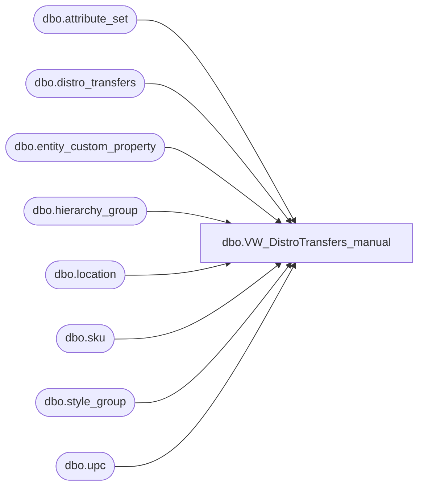

# dbo.VW_DistroTransfers_manual

**Database:** me_01  
**Server:** bedrockdb02  

## Architecture Diagram



## Table Dependencies

| Referenced Table |
|---|
| dbo.attribute_set |
| dbo.distro_transfers |
| dbo.entity_custom_property |
| dbo.hierarchy_group |
| dbo.location |
| dbo.sku |
| dbo.style_group |
| dbo.upc |

## View Code

```sql
CREATE view [dbo].[VW_DistroTransfers_manual]
as 
SELECT	replace(dt.documentnumber, 'DMT', '') as distribution_id,
		cast(dt.id as int) as distro_transfers_id,
		dt.groupinglabel as distribution_description,
		u.sku_id,
case when substring(hg.hierarchy_group_code,7,2) = '60'
			then dt.quantity/ecp.custom_property_value
		else dt.quantity
		end as quantity, 	
		l1.location_id as warehouse,
		l2.location_id as store,
		case when l2.location_id = 30 and ats.attribute_set_id in (select attribute_set_id from attribute_set where attribute_id = 112 and attribute_set_code in ('1001', '1003', '51', '52', '53', '55')) -- 5/13/2009 if Puerto Rico Store and using old invalid rec types for priority shipments, then use '1003'
			then 11200019 -- REC TYPE 1003
		when l2.location_id = 30 and ats.attribute_set_id in (select attribute_set_id from attribute_set where attribute_id = 112 and attribute_set_code in ('1004', '54')) -- 5/13/2009 if Puerto Rico Store and using old invalid rec types for ground shipments, then use '1002' 
			then 11200020 -- REC TYPE 1002
		else ats.attribute_set_id
		end as attribute_set_id
FROM distro_transfers dt with (nolock)
join upc u with (nolock) on right('000000000000' + convert(varchar(12),dt.upc_number),12) = u.upc_number
join location l1 with (nolock) on right('0000' + convert(varchar(4),dt.sourceid),4) = l1.location_code
	and l1.location_type = 4
join location l2 with (nolock) on right('0000' + convert(varchar(4),dt.destid),4) = l2.location_code
	and l2.location_type in (2,4)
join attribute_set ats with (nolock) on cast(dt.rec_type as varchar(10)) = ats.attribute_set_code
	and ats.attribute_id = 112
join sku sk with (nolock) on u.sku_id = sk.sku_id
join style_group sg with (nolock) on sk.style_id = sg.style_id
join hierarchy_group hg with (nolock) on sg.hierarchy_group_id = hg.hierarchy_group_id
left join entity_custom_property ecp (nolock) on sg.style_id = ecp.parent_id
	and ecp.custom_property_id = 2
	and ecp.parent_type = 1
where dt.sourceid in (960,980,975,2970,9913,9914,9915,9916,9917,9918,9919,9920,9921,9922,3970,3980,8502,8505) -- includes only the main warehouses
and	dt.rec_type not in (33, 34, 35, 36, 37) --excludes costco distros
--and dt.exported_date is null
and dt.id in ('4075249','4075250','4075243','4075244','4075245','4075246','4075247','4075248','4075251','4075252','4075253','4075254','4075255','4075256','4075257','4075258','4075259','4075260','4075284','4075287','4075288','4075289','4075261','4075262','4075263','4075264','4075265','4075266','4075267','4075268','4075269','4075270','4075271','4075272','4075273','4075274','4075275','4075276','4075277','4075278','4075279','4075280','4075281','4075282','4075283','4075285','4075286','4075290','4075303','4075304','4075305','4075291','4075292','4075293','4075294','4075295','4075296','4075297','4075298','4075299','4075300','4075301','4075302','4075306','4075307','4075308','4075309','4075310','4075330','4075353','4075356','4075362','4075366','4075343','4075370','4075355','4075357','4075358','4075360','4075361','4075363','4075372','4075364','4075365','4075367','4075331','4075332','4075368','4075333','4075334','4075335','4075336','4075369','4075337','4075338','4075339','4075340','4075341','4075342','4075344','4075345','4075346','4075347','4075348','4075349','4075350','4075351','4075352','4075354','4075371','4075359','4075392','4075401','4075373','4075380','4075385','4075386','4075400','4075402','4075403','4075404','4075405','4075374','4075375','4075376','4075377','4075378','4075379','4075381','4075382','4075383','4075384','4075387','4075388','4075389','4075390','4075391','4075393','4075394','4075395','4075396','4075397','4075398','4075399','4075455','4075460','4075406','4075415','4075429','4075433','4075435','4075437','4075450','4075451','4075452','4075453','4075454','4075458','4075459','4075461','4075462','4075463','4075464','4075407','4075408','4075409','4075410','4075411','4075412','4075413','4075414','4075416','4075417','4075418','4075419','4075420','4075421','4075422','4075423','4075424','4075425','4075426','4075427','4075428','4075430','4075431','4075432','4075434','4075436','4075438','4075439','4075440','4075441','4075442','4075443','4075444','4075445','4075446','4075447','4075448','4075449','4075456','4075457','4075470','4075465','4075468','4075472','4075466','4075467','4075469','4075471','4075473','4075525','4075540','4075545','4075491','4075495','4075498','4075509','4075530','4075531','4075532','4075538','4075539','4075541','4075542','4075543','4075544','4075546','4075547','4075474','4075475','4075476','4075477','4075478','4075479','4075480','4075481','4075482','4075483','4075484','4075485','4075486','4075487','4075488','4075489','4075490','4075492','4075493','4075494','4075496','4075497','4075499','4075500','4075501','4075502','4075503','4075504','4075505','4075506','4075507','4075508','4075510','4075511','4075512','4075513','4075514','4075515','4075516','4075517','4075518','4075519','4075520','4075521','4075522','4075523','4075524','4075526','4075527','4075528','4075529','4075533','4075534','4075535','4075536','4075537','4075548','4075554','4075560','4075556','4075549','4075559','4075550','4075551','4075552','4075553','4075555','4075557','4075558','4075145','4075146','4075148','4075149','4075311','4075312','4075313','4075314','4075315','4075316','4075317','4075318','4075319','4075320','4075321','4075322','4075323','4075324','4075325','4075326','4075327','4075328','4075329','4075161','4075162','4075163','4075164','4075165','4075166','4075167','4075168','4075169','4075170','4075171','4075172','4075173','4075174','4075175','4075176','4075177','4075178','4075179','4075180','4075181','4075182','4075183','4075184','4075185','4075186','4075187','4075188','4075189','4075234','4075190','4075191','4075192','4075193','4075194','4075195','4075196','4075197','4075198','4075199','4075200','4075201','4075202','4075203','4075204','4075205','4075206','4075207','4075208','4075209','4075210','4075211','4075212','4075213','4075214','4075215','4075216','4075217','4075218','4075219','4075220','4075221','4075222','4075223','4075224','4075225','4075226','4075227','4075228','4075229','4075230','4075231','4075232','4075233','4075235','4075236','4075237','4075238','4075239','4075240','4075241','4075242')
-- Insert IDs from Distro_Transfers table into in statement above to test
```

