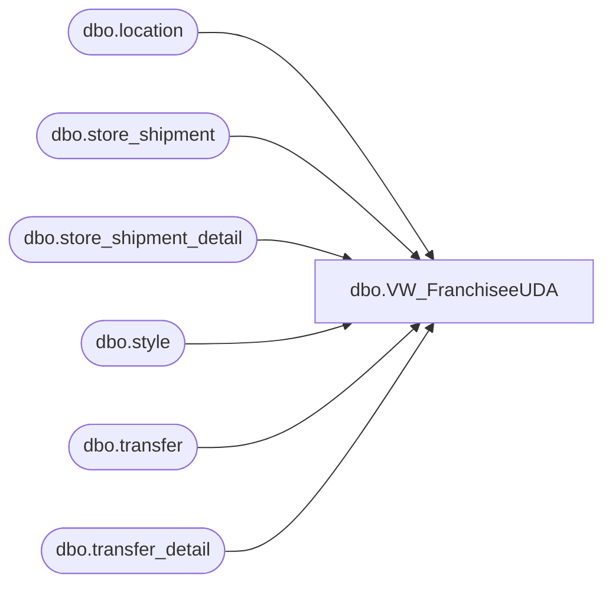

# dbo.VW_FranchiseeUDA

**Database:** me_01  
**Server:** bedrockdb02  

## Architecture Diagram



## Table Dependencies

| Referenced Table |
|---|
| dbo.location |
| dbo.store_shipment |
| dbo.store_shipment_detail |
| dbo.style |
| dbo.transfer |
| dbo.transfer_detail |

## View Code

```sql
CREATE view [dbo].[VW_FranchiseeUDA]

as 

select	('000000' + s.style_code) UPC,
		s.short_desc,
		tl.location_code,
		fl.location_code from_locn,
		sum(td.units_sent * -1) units
from 	transfer t with (nolock)
join	transfer_detail td with (nolock) on t.transfer_id = td.transfer_id
join	style s with (nolock) on td.style_id = s.style_id
join	location fl with (nolock) on t.from_location_id = fl.location_id
join	location tl with (nolock) on t.to_location_id = tl.location_id
where	(tl.location_code in ('9980','9950', '9975','9970','9985') or tl.location_code between '8000' and '8999') -- Added US to CN Transfer Location 9985 3/16/2016
and		t.document_status = 3
and		tl.location_code not in ('8502','8505') --  Excluding China Franchisee Warehouses 2/12/2018
group by s.style_code, tl.location_code, fl.location_code, s.short_desc
union
select	('000000' + s.style_code) UPC,
		s.short_desc,
		tl.location_code,
		fl.location_code from_locn,
		sum(ssd.units_sent * -1) units
from 	store_shipment ss with (nolock) 
join	store_shipment_detail ssd with (nolock) on ss.store_shipment_id = ssd.store_shipment_id
join	style s with (nolock) on ssd.style_id = s.style_id
join	location fl with (nolock) on ss.from_location_id = fl.location_id
join	location tl with (nolock) on ss.location_id = tl.location_id
where (tl.location_code in ('9980','9950', '9975','9970','9985') or tl.location_code between '8000' and '8999') -- Added US to CN Transfer Location 9985 3/16/2016
and		ss.document_status = 3
and		tl.location_code not in ('8502','8505') --  Excluding China Franchisee Warehouses 2/12/2018
group by s.style_code, tl.location_code, fl.location_code, s.short_desc
```

