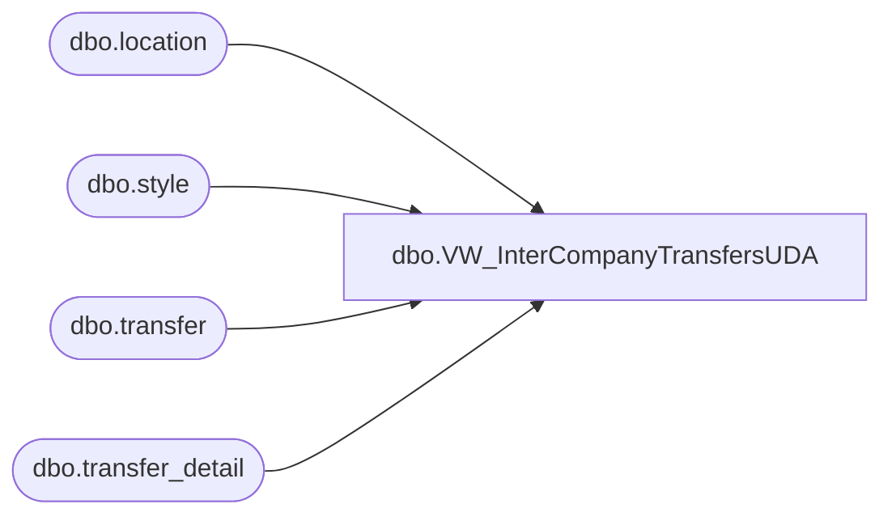

# dbo.VW_InterCompanyTransfersUDA

**Database:** me_01  
**Server:** bedrockdb02  

## Architecture Diagram



## Table Dependencies

| Referenced Table |
|---|
| dbo.location |
| dbo.style |
| dbo.transfer |
| dbo.transfer_detail |

## View Code

```sql
CREATE view [dbo].[VW_InterCompanyTransfersUDA]

as 

select	('000000' + s.style_code) UPC,
		s.short_desc,
		tl.location_code,
		fl.location_code from_locn,
		sum(td.units_sent * -1) units
from 	transfer t with (nolock)
join	transfer_detail td with (nolock) on t.transfer_id = td.transfer_id
join	style s with (nolock) on td.style_id = s.style_id
join	location fl with (nolock) on t.from_location_id = fl.location_id
join	location tl with (nolock) on t.to_location_id = tl.location_id
where td.carton_no is not null
and		t.document_status = 3
and		tl.location_code in ('9960', '9965' ,'9970', '9975', '9980', '9985')
group by s.style_code, tl.location_code, fl.location_code, s.short_desc


dbo,vw_NameMeStyles,/*
A view of Active Products for each NameMe products.xml update
*/
CREATE VIEW dbo.vw_NameMeStyles
AS
SELECT     TOP (100) PERCENT s.style_code AS STYLE_CD, s.short_desc AS SHORT_DESCR, s.long_desc AS LONG_DESCR, u.upc_number AS UPC, 
                      ecpan.custom_property_value AS ANIMAL_NM, ecpw.custom_property_value AS WEIGHT, ecph.custom_property_value AS HEIGHT, 
                      CASE WHEN ecpid.custom_property_value IS NULL THEN '1/1/2500' WHEN ecpid.custom_property_value LIKE '%JANUARY%' THEN '1/1/' + CAST(DATEPART(YEAR, 
                      GETDATE()) AS VARCHAR) WHEN ecpid.custom_property_value LIKE '%FEBRUARY%' THEN '2/1/' + CAST(DATEPART(YEAR, GETDATE()) AS VARCHAR) 
                      WHEN ecpid.custom_property_value LIKE '%MARCH%' THEN '3/1/' + CAST(DATEPART(YEAR, GETDATE()) AS VARCHAR) 
                      WHEN ecpid.custom_property_value LIKE '%APRIL%' THEN '4/1/' + CAST(DATEPART(YEAR, GETDATE()) AS VARCHAR) 
                      WHEN ecpid.custom_property_value LIKE '%MAY%' THEN '5/1/' + CAST(DATEPART(YEAR, GETDATE()) AS VARCHAR) 
                      WHEN ecpid.custom_property_value LIKE '%JUNE%' THEN '6/1/' + CAST(DATEPART(YEAR, GETDATE()) AS VARCHAR) 
                      WHEN ecpid.custom_property_value LIKE '%JULY%' THEN '7/1/' + CAST(DATEPART(YEAR, GETDATE()) AS VARCHAR) 
                      WHEN ecpid.custom_property_value LIKE '%AUGUST%' THEN '8/1/' + CAST(DATEPART(YEAR, GETDATE()) AS VARCHAR) 
                      WHEN ecpid.custom_property_value LIKE '%SEPTEMBER%' THEN '9/1/' + CAST(DATEPART(YEAR, GETDATE()) AS VARCHAR) 
                      WHEN ecpid.custom_property_value LIKE '%OCTOBER%' THEN '10/1/' + CAST(DATEPART(YEAR, GETDATE()) AS VARCHAR) 
                      WHEN ecpid.custom_property_value LIKE '%NOVEMBER%' THEN '11/1/' + CAST(DATEPART(YEAR, GETDATE()) AS VARCHAR) 
                      WHEN ecpid.custom_property_value LIKE '%DECEMBER%' THEN '12/1/' + CAST(DATEPART(YEAR, GETDATE()) AS VARCHAR) 
                      WHEN ISDATE(ecpid.custom_property_value) = 1 THEN ecpid.custom_property_value ELSE CONVERT(VARCHAR(10), GETDATE(), 101) END AS INSTORE_DT, 
                      attat.attribute_set_label AS ANIMAL_TYPE, attec.attribute_set_label AS EYE_COLOR, c.color_long_description AS FUR_COLOR, 
                      hg.hierarchy_group_code AS HIERARCHY_GROUP_CD
FROM         dbo.style AS s INNER JOIN
                      dbo.style_group AS sg ON s.style_id = sg.style_id INNER JOIN
                      dbo.hierarchy_group AS hg ON sg.hierarchy_group_id = hg.hierarchy_group_id LEFT OUTER JOIN
                      dbo.entity_custom_property AS ecpan ON s.style_id = ecpan.parent_id AND ecpan.custom_property_id = 43 LEFT OUTER JOIN
                      dbo.entity_custom_property AS ecpw ON s.style_id = ecpw.parent_id AND ecpw.custom_property_id = 44 LEFT OUTER JOIN
                      dbo.entity_custom_property AS ecph ON s.style_id = ecph.parent_id AND ecph.custom_property_id = 45 LEFT OUTER JOIN
                      dbo.entity_custom_property AS ecpid ON s.style_id = ecpid.parent_id AND ecpid.custom_property_id = 5 LEFT OUTER JOIN
                      dbo.entity_attribute_set AS easat ON s.style_id = easat.parent_id AND easat.attribute_id = 335 LEFT OUTER JOIN
                      dbo.attribute_set AS attat ON easat.attribute_set_id = attat.attribute_set_id LEFT OUTER JOIN
                      dbo.entity_attribute_set AS easec ON s.style_id = easec.parent_id AND easec.attribute_id = 333 LEFT OUTER JOIN
                      dbo.attribute_set AS attec ON easec.attribute_set_id = attec.attribute_set_id LEFT OUTER JOIN
                      dbo.style_color AS sc ON s.style_id = sc.style_id AND sc.reorder_flag = 1 LEFT OUTER JOIN
                      dbo.color AS c ON sc.color_id = c.color_id LEFT OUTER JOIN
                      dbo.sku AS sk ON s.style_id = sk.style_id AND sc.style_color_id = sk.style_color_id INNER JOIN
                      dbo.upc AS u ON sk.sku_id = u.sku_id AND u.upc_number < '000001000000' AND u.upc_number IS NOT NULL LEFT OUTER JOIN
                          (SELECT     b.style_code
                            FROM          dbo.style AS a INNER JOIN
                                                   dbo.style AS b ON RIGHT(a.style_code, 5) = RIGHT(b.style_code, 5) AND a.style_code < b.style_code
                            WHERE      (LEFT(a.style_code, 1) = '0') AND (LEFT(b.style_code, 1) = '1' OR
                                                   LEFT(b.style_code, 1) = '4')) AS dup1 ON s.style_code = dup1.style_code LEFT OUTER JOIN
                          (SELECT     b.style_code
                            FROM          dbo.style AS a INNER JOIN
                                                   dbo.style AS b ON RIGHT(a.style_code, 5) = RIGHT(b.style_code, 5) AND a.style_code < b.style_code
                            WHERE      (LEFT(a.style_code, 1) = '1') AND (LEFT(b.style_code, 1) = '4')) AS dup2 ON s.style_code = dup2.style_code
WHERE     (hg.hierarchy_group_code LIKE 'R-%-%-25%' OR
                      hg.hierarchy_group_code LIKE 'R-%-%-30%') AND (sc.reorder_flag = 1) AND (dup1.style_code IS NULL) AND (dup2.style_code IS NULL)
ORDER BY STYLE_CD
```

