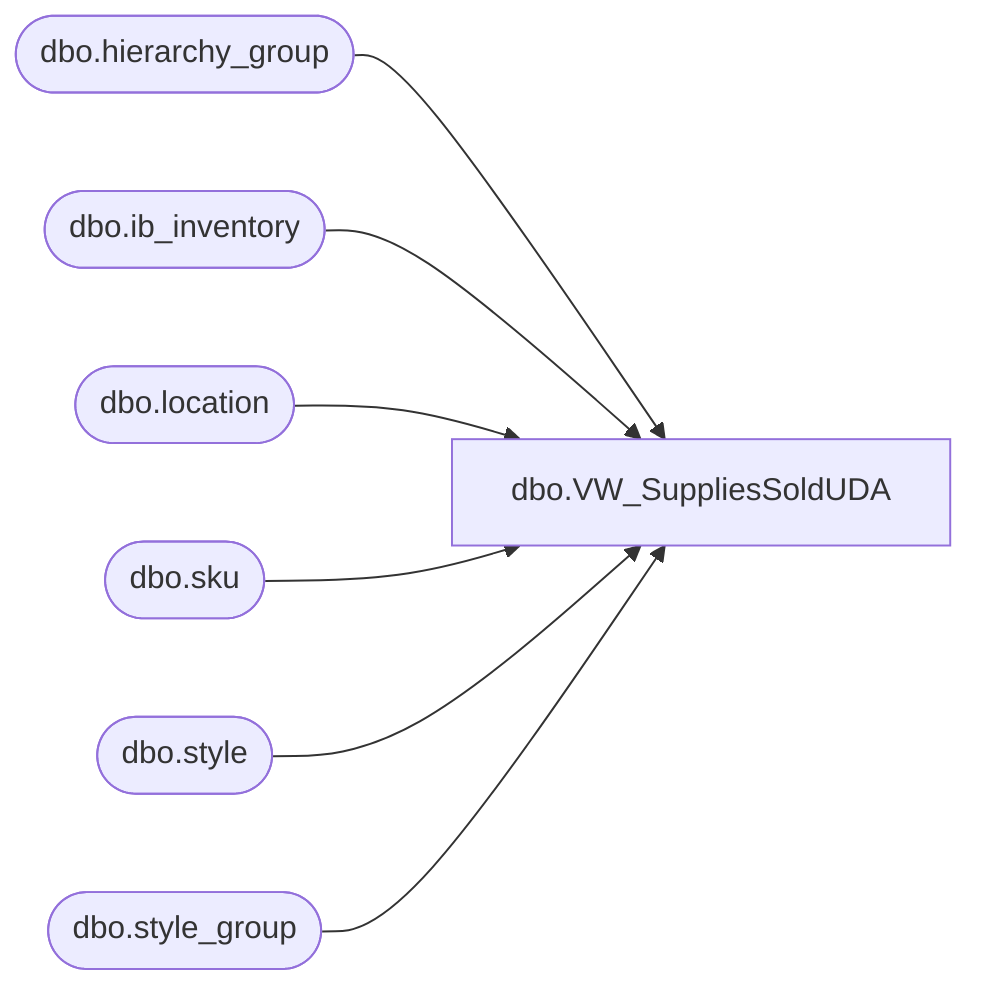

# dbo.VW_SuppliesSoldUDA

**Database:** me_01  
**Server:** bedrockdb02  

## Architecture Diagram



## Table Dependencies

| Referenced Table |
|---|
| dbo.hierarchy_group |
| dbo.ib_inventory |
| dbo.location |
| dbo.sku |
| dbo.style |
| dbo.style_group |

## View Code

```sql
CREATE view [dbo].[VW_SuppliesSoldUDA]

as


select	('000000' + s.style_code) UPC,
		l.location_code,
		sum(transaction_units) * -1 Units,
		sum(transaction_cost)/sum(transaction_units) Cost,
		sum(transaction_cost_local)/sum(transaction_units) LocationCost
from style s with (nolock)
join sku sk with (nolock) ON s.style_id = sk.style_id
join ib_inventory ii with (nolock) ON sk.sku_id = ii.sku_id
join style_group sg with (nolock) ON s.style_id = sg.style_id
join hierarchy_group hg with (nolock) ON sg.hierarchy_group_id = hg.hierarchy_group_id
join location l  with (nolock) ON ii.location_id = l.location_id
where l.location_code <> '0470' -- added as per Jessica S 1/19/2010
--and		ii.transaction_type_code = 600
and ii.transaction_type_code in (600,610) --600=sale, 610=customerReturn
and		substring(hg.hierarchy_group_code,7,2)='60'
and		ii.transaction_date between getdate()-7 and getdate()
group by s.style_code, s.short_desc,l.location_code
having sum(transaction_units) <> 0 and sum(transaction_cost) <> 0
```

