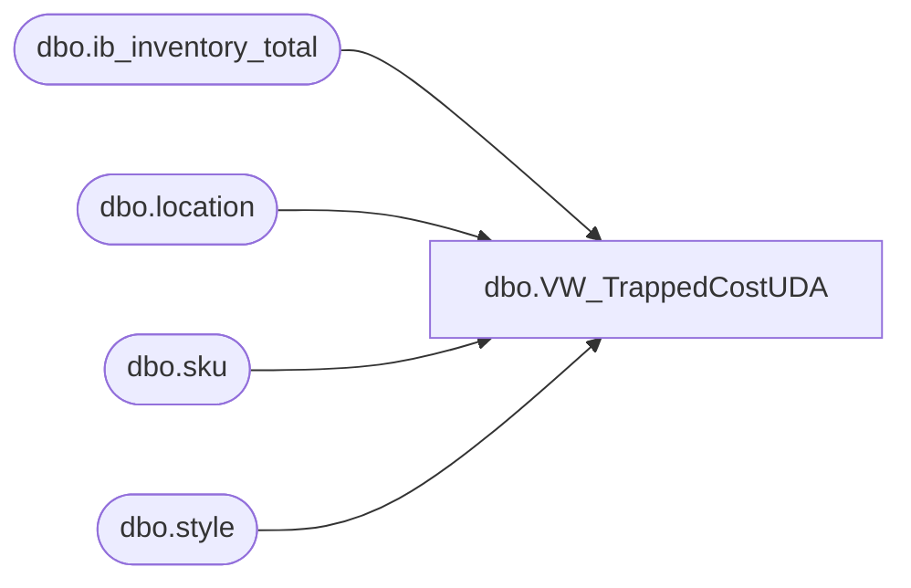

# dbo.VW_TrappedCostUDA

**Database:** me_01  
**Server:** bedrockdb02  

## Architecture Diagram



## Table Dependencies

| Referenced Table |
|---|
| dbo.ib_inventory_total |
| dbo.location |
| dbo.sku |
| dbo.style |

## View Code

```sql
CREATE view [dbo].[VW_TrappedCostUDA]

as 

select	('000000' + s.style_code) UPC, 
		l.location_code, 
		'' as units,
		sum(total_on_hand_cost) * -1 as Cost,
		sum(total_on_hand_cost_local) * -1 as LocalCost
from ib_inventory_total iit with (nolock)
join sku sk with (nolock) on iit.sku_id = sk.sku_id
join style s with (nolock) on sk.style_id = s.style_id
join location l with (nolock) on iit.location_id = l.location_id
where s.active_flag = 1
AND l.active_flag = 1 --Added by Lizzy T 09/30/2019 because Pipeline does not allow UDAs for Inactive Locations
group by s.style_code, l.location_code
having sum(total_on_hand_units) = 0 and sum(total_on_hand_cost) <> 0
```

