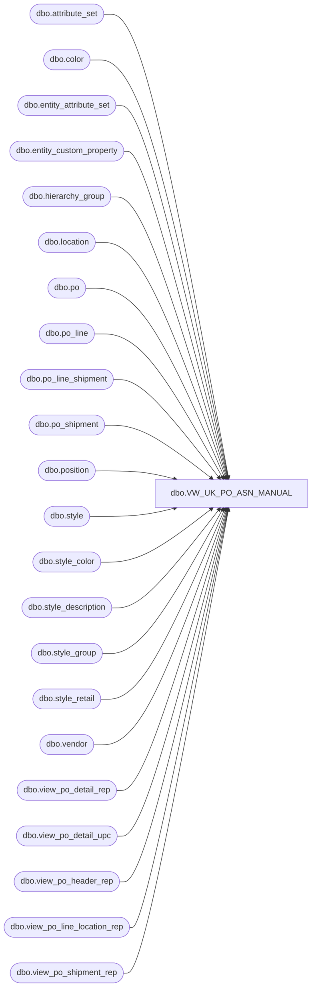

# dbo.VW_UK_PO_ASN_MANUAL

**Database:** me_01  
**Server:** bedrockdb02  

## Architecture Diagram



## Table Dependencies

| Referenced Table |
|---|
| dbo.attribute_set |
| dbo.color |
| dbo.entity_attribute_set |
| dbo.entity_custom_property |
| dbo.hierarchy_group |
| dbo.location |
| dbo.po |
| dbo.po_line |
| dbo.po_line_shipment |
| dbo.po_shipment |
| dbo.position |
| dbo.style |
| dbo.style_color |
| dbo.style_description |
| dbo.style_group |
| dbo.style_retail |
| dbo.vendor |
| dbo.view_po_detail_rep |
| dbo.view_po_detail_upc |
| dbo.view_po_header_rep |
| dbo.view_po_line_location_rep |
| dbo.view_po_shipment_rep |

## View Code

```sql
CREATE view [dbo].[VW_UK_PO_ASN_MANUAL] -- Change View Name Here

as

WITH view1 (po_id, po_line_id, line_no, expected_receipt_date, color_code, location_code, location_name, style_code, long_desc, total_line_loc_ordered_units) 
	as (	
		select po_id, 
			   po_line_id, 
			   line_no, 
			   expected_receipt_date, 
			   color_code, 
			   location_code,
			   location_name,
			   style_code, 
			   long_desc,
			   total_line_loc_ordered_units
		from view_po_line_location_rep with (nolock)  
		where po_id in (select po_id from po where po_status IN (4,7) and approval_status in (3,7)) 
		and location_code in ('2970')
	   ),
	view2 (po_id, po_line_id, line_no, po_line_shipment_id, po_shipment_id, expected_receipt_date, color_code)
	as (
		select po.po_id, 
			   pl.po_line_id, 
			   pl.line_no, 
			   pls.po_line_shipment_id, 
			   ps.po_shipment_id,
			   ps.expected_receipt_date, 
			   c.color_code
		from po (nolock)
		join po_line pl (nolock) on po.po_id = pl.po_id
		join po_shipment ps (nolock) on po.po_id = ps.po_id
		join po_line_shipment pls (nolock) on pls.po_id = po.po_id and pls.po_shipment_id = ps.po_shipment_id and pls.po_line_id = pl.po_line_id
		join style_color sc (nolock) on sc.style_color_id = pl.style_color_id
		join color c (nolock) on c.color_id = sc.color_id
		where po.po_id in (select po_id from po (nolock) where po_status IN (4,7) and approval_status in (3,7)) 	
	   ),
	view3 (po_id, po_line_id, line_no, po_line_shipment_id, po_shipment_id, expected_receipt_date, color_code, location_code, location_name, style_code, long_desc, total_line_loc_ordered_units)
	as (
		select a.po_id, 
			   a.po_line_id, 
			   a.line_no, 
			   b.po_line_shipment_id, 
			   b.po_shipment_id, 
			   a.expected_receipt_date, 
			   a.color_code, 
			   a.location_code, 
			   a.location_name, 
			   a.style_code, 
			   a.long_desc,
			   a.total_line_loc_ordered_units
		from view1 a
		join view2 b on b.po_id = a.po_id
			and b.po_line_id = a.po_line_id
			and b.line_no = a.line_no
			and b.expected_receipt_date = a.expected_receipt_date
			and b.color_code = a.color_code
	   ),
	view4 (po_id, po_line_id, expected_receipt_date, sku_id, location_id, ordered_units)
	as (
		Select po_id, 
			   po_line_id, 
			   expected_receipt_date, 
			   sku_id, 
			   location_id, 
			   ordered_units 
		from view_po_detail_rep (nolock)
		where po_id in (select po_id from po where po_status IN (4,7)and approval_status in (3,7))
	   ),
	Summary (PurchaseOrder, SupplierName, ShipToCode, ShipToName, FactoryName, FactoryCode, StyleCode, StyleDescription, Units, ExpectedReceiptDate, EstimatedCartons)
	as (
		SELECT 
			d.po_no as PurchaseOrder,  
			a.vendor_name as SupplierName, 
			e.location_code as ShipToCode,
			e.location_name as ShipToName,
			replace(isnull((select attribute_set_label from attribute_set where attribute_set_id = easfact.attribute_set_id),''), ',', '') as FactoryName,
			replace(isnull((select attribute_set_code from attribute_set where attribute_set_id = easfact.attribute_set_id),''), ',', '') as FactoryCode,
			e.style_code as StyleCode,
			e.long_desc as StyleDescription,
			case when substring(hg.hierarchy_group_code,7,2)='60'
				then cast( (j.ordered_units * ecp.custom_property_value) as int)
			else j.ordered_units end as Units,
			convert(varchar, f.expected_receipt_date, 101) as ExpectedReceiptDate,
			--case when substring(hg.hierarchy_group_code,7,2)='60'
			--		then	cast( (j.ordered_units / ecp.custom_property_value) as int)
			--	else	cast( (j.ordered_units / s.ORDER_multiple) as int)
			--	end as EstimatedCartons
			case when substring(hg.hierarchy_group_code,7,2)='60'
					then	j.ordered_units
				else	cast( (j.ordered_units / s.ORDER_multiple) as int)
				end as EstimatedCartons
		FROM view_po_header_rep d (nolock)
		join vendor a (nolock) on a.vendor_id = d.vendor_id 
		join view3 e (nolock) on d.po_id = e.po_id
		join view4 j (nolock) on j.po_line_id=e.po_line_id 
			and e.expected_receipt_date = j.expected_receipt_date
		join view_po_shipment_rep f (nolock) on d.po_id = f.po_id
			and f.po_id = j.po_id
			and f.expected_receipt_date = j.expected_receipt_date
			and f.date_type_code = 100 
			and e.po_shipment_id = f.po_shipment_id
		join view_po_shipment_rep ff (nolock) on ff.po_id = j.po_id
			and ff.expected_receipt_date = j.expected_receipt_date 
			and ff.date_type_code = 200
			and e.po_shipment_id = ff.po_shipment_id 
		join view_po_detail_upc i (nolock) on j.sku_id = i.sku_id
		join location l1 (nolock) on j.location_id=l1.location_id
		join style s (nolock) on e.style_code = s.style_code
		join position p (nolock) on d.position_id=p.position_id
		join style_retail srus (nolock) on s.style_id=srus.style_id
			and srus.jurisdiction_id=1
		join style_group sg (nolock) on s.style_id = sg.style_id
		join hierarchy_group hg (nolock) on sg.hierarchy_group_id = hg.hierarchy_group_id
		LEFT JOIN entity_custom_property cp (nolock) on s.style_id=cp.parent_id
													and isnull(cp.custom_property_id,2)=2
		LEFT JOIN style_description sd (nolock) on s.style_id=sd.style_id
												and ISnull(sd.language_id,100002)=100002 
		LEFT JOIN style_retail sruk (nolock) on s.style_id=sruk.style_id
											and isnull(sruk.jurisdiction_id,2)=2
		LEFT JOIN style_retail srcd (nolock) on s.style_id=srcd.style_id
											and isnull(srcd.jurisdiction_id,3)=3
		LEFT JOIN style_retail sreu (nolock) on s.style_id=sreu.style_id
											and isnull(sreu.jurisdiction_id,2)=2
		LEFT JOIN entity_attribute_set easfact (nolock) on s.style_id=easfact.parent_id
														and easfact.attribute_id = 122 
		LEFT JOIN entity_custom_property cp_ht_us (nolock) on s.style_id = cp_ht_us.parent_id
															and cp_ht_us.custom_property_id = 4
		LEFT JOIN entity_custom_property cp_ht_ca (nolock) on s.style_id = cp_ht_ca.parent_id
															and cp_ht_ca.custom_property_id = 23
		LEFT JOIN entity_custom_property cp_ht_uk (nolock) on s.style_id = cp_ht_uk.parent_id
															and cp_ht_uk.custom_property_id = 24
		LEFT JOIN entity_custom_property ecp (nolock) on s.style_id = ecp.parent_id
														and ecp.custom_property_id = 2
														and ecp.parent_type = 1
		WHERE j.ordered_units <> 0
		and l1.location_code in ('2970')
		and d.po_no in ('1069118')
		--and datediff(dd, f.expected_receipt_date, getdate()+14) = 0 -- Will need to change to +14 days in PROD\GO LIve 

		)
select cast((cast(PurchaseOrder as varchar) + FactoryCode) as nvarchar) ASN,
	   cast(PurchaseOrder as nvarchar) PurchaseOrder,
	   cast(isnull(replace(SupplierName, ',', '') , '') as nvarchar) SupplierName,  
	   --'2970' as ShipToCode,
	   --'China Non-Bonded Warehouse' as ShipToName,
	   cast(isnull(replace(ShipToCode, ',', '') , '') as nvarchar) ShipToCode,  
	   cast(isnull(replace(ShipToName, ',', '') , '') as nvarchar) ShipToName,  
	   cast(isnull(replace(FactoryName, ',', '') , '') as nvarchar) FactoryName,  
	   cast(isnull(replace(StyleCode, ',', '') , '') as nvarchar) StyleCode,  
	   cast(isnull(replace(StyleDescription, ',', '') , '') as nvarchar) StyleDescription,  
	   case
		when cast(isnull(replace(Units, ',', '') , '') as nvarchar) = '0'
			then '1'
			else cast(isnull(replace(Units, ',', '') , '') as nvarchar) 
	   end as Units,  
	   cast(isnull(replace(ExpectedReceiptDate, ',', '') , '') as nvarchar) ExpectedReceiptDate,  
	   case
		when cast(isnull(replace(EstimatedCartons, ',', '') , '') as nvarchar) = '0'
			then '1'
			else cast(isnull(replace(EstimatedCartons, ',', '') , '') as nvarchar)
		end as EstimatedCartons
from Summary
```

