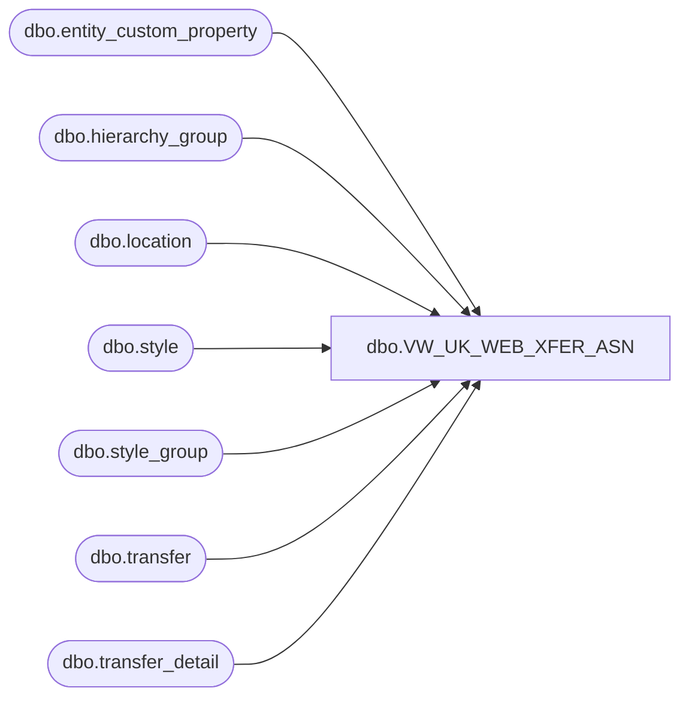

# dbo.VW_UK_WEB_XFER_ASN

**Database:** me_01  
**Server:** bedrockdb02  

## Architecture Diagram



## Table Dependencies

| Referenced Table |
|---|
| dbo.entity_custom_property |
| dbo.hierarchy_group |
| dbo.location |
| dbo.style |
| dbo.style_group |
| dbo.transfer |
| dbo.transfer_detail |

## View Code

```sql
CREATE view [dbo].[VW_UK_WEB_XFER_ASN] -- Change View Name Here

as

select 
		t.document_no + 'NONE' as 'XferAsnNbr', 
		t.document_no as TransferNbr, 
		'Build-a-Bear Workshop' as SupplierName, 
		l2.location_code as 'ShipToCode', 
		l2.location_name as 'ShipToName',
		'NO FACTORY ASSIGNED' as FactoryName,
		s.style_code as 'StyleCode',
		s.short_desc as 'StyleDesc',
		sum(td.units_sent) as 'Units',
		convert(varchar, t.ship_date, 101) as ShipDate
from transfer t
left join transfer_detail td on t.transfer_id=td.transfer_id
left join location l on l.location_id=t.from_location_id
left join location l2 on l2.location_id=t.to_location_id
left join style s on s.style_id=td.style_id
join style_group sg on s.style_id = sg.style_id
join hierarchy_group hg on sg.hierarchy_group_id = hg.hierarchy_group_id
left join entity_custom_property ecp on s.style_id = ecp.parent_id and ecp.custom_property_id = 2
where t.document_status = '3'
and l2.location_code = '2013'
and datediff(dd,t.ship_date,getdate()) = 0 -- Will need to change after testing 
group by t.document_no, t.document_no, l.location_code,l.location_name, l2.location_code, l2.location_name, s.style_code, s.short_desc, t.ship_date
```

