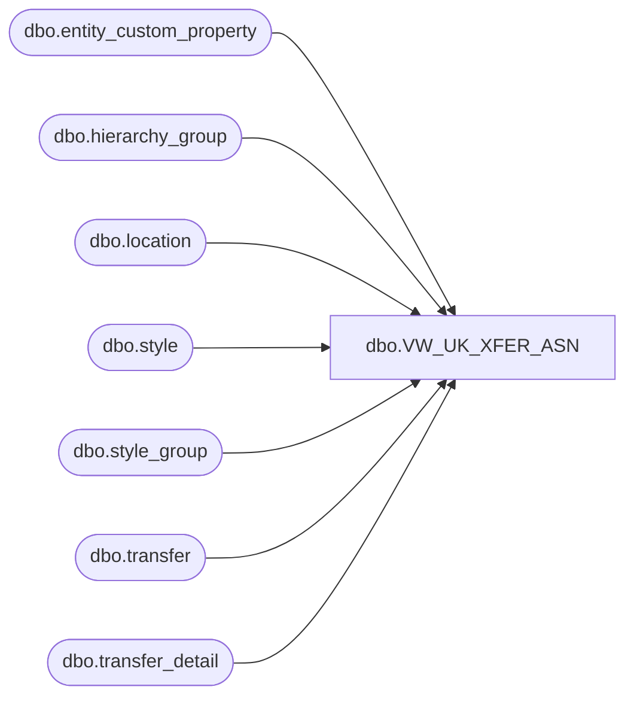

# dbo.VW_UK_XFER_ASN

**Database:** me_01  
**Server:** bedrockdb02  

## Architecture Diagram



## Table Dependencies

| Referenced Table |
|---|
| dbo.entity_custom_property |
| dbo.hierarchy_group |
| dbo.location |
| dbo.style |
| dbo.style_group |
| dbo.transfer |
| dbo.transfer_detail |

## View Code

```sql
CREATE view [dbo].[VW_UK_XFER_ASN] -- Change View Name Here

as
select 
		t.document_no + 'NONE' as 'XferAsnNbr', 
		t.document_no as TransferNbr, 
		'Build-a-Bear Workshop' as SupplierName, 
		l2.location_code as 'ShipToCode', 
		l2.location_name as 'ShipToName',
		'NO FACTORY ASSIGNED' as FactoryName,
		s.style_code as 'StyleCode',
		s.short_desc as 'StyleDesc',
		sum(td.units_sent) as 'Units',
		convert(varchar, t.ship_date, 101) as ShipDate
from transfer t
left join transfer_detail td on t.transfer_id=td.transfer_id
left join location l on l.location_id=t.from_location_id
left join location l2 on l2.location_id=t.to_location_id
left join style s on s.style_id=td.style_id
join style_group sg on s.style_id = sg.style_id
join hierarchy_group hg on sg.hierarchy_group_id = hg.hierarchy_group_id
left join entity_custom_property ecp on s.style_id = ecp.parent_id and ecp.custom_property_id = 2
where t.document_status = '3'
and l2.location_code = '2970'
and datediff(dd,t.ship_date,getdate()) = 0 -- Will need to change after testing 
group by t.document_no, t.document_no, l.location_code,l.location_name, l2.location_code, l2.location_name, s.style_code, s.short_desc, t.ship_date


dbo,VW_UKItemMaster,create view VW_UKItemMaster

as 

select  s.style_code,
		replace(s.short_desc, ',','' ) as short_desc,
		case when substring(hg.hierarchy_group_code,7,2)='60'
			then	ecp.custom_property_value
			else	s.distribution_multiple
		end as distribution_multiple
from style s with (nolock)
join style_group sg with (nolock) on s.style_id = sg.style_id
join hierarchy_group hg with (nolock) on sg.hierarchy_group_id = hg.hierarchy_group_id
left join entity_custom_property ecp with (nolock) on s.style_id = ecp.parent_id
	and	ecp.custom_property_id = 2 -- FRCSTM
	and ecp.parent_type = 1
where s.style_code between '400000' and '499999'
and s.active_flag = 1

dbo,VW_WCItemMaster,create view VW_WCItemMaster 

as 

select 	left(convert(varchar, getdate(), 120), 10) as UpdateDate,
		'BABW' as UpdateUserID,
		'wcItemLoad' as UpdatePID,
		'A' as ActionCode,
		'IN' as Direction,
		'NEW' as InterfaceStatus,
		s.style_code as SKU,
		'01' as Facility,
		'01' as Class,
		'' as InternalUse1,
		'' as InternalUse2,
		'' as InternalUse3,
		replace(s.short_desc,'"','') as Description1,
		'' as Description2,
		'EA' as UnitDesc,
		'' as BulkDesc,
		'' as BulkQty,
		'' as InternalUse4,
		'' as InternalUse5,
		'' as InternalUse6,
		'0' as Length,
		'0' as Width,
		'0' as Height,
		'0' as Cube,
		'0' as Weight,
		'N' as SerialTrack,
		'N' as LotTrack,
		'N' as ExpDateTrack,
		'N' as MfgDateTrack,
		'' as HighQty,
		'' as TieQty,
		'N' as ShippableUnit,
		'Y' as AgeControl,
		'' as InternalUse7,
		'N' as InternalUse8,
		'0' as InternalUse9,
		'' as NMFCode,
		'' as InternalUse10,
		'' as InternalUse11,
		'' as InternalUse12,
		'1856' as InternalUse13, 
		'' as AltPartNbr
from	style s (nolock)
join	style_group sg (nolock) on	s.style_id = sg.style_id
join	hierarchy_group hg (nolock) on	sg.hierarchy_group_id = hg.hierarchy_group_id
left outer join entity_custom_property ecp2 (nolock) on s.style_id = ecp2.parent_id
		and	ecp2.custom_property_id = 2 -- FRCSTM
		and	ecp2.parent_type = 1
where left(s.style_code, 1) not in ('1', '4') --excludes CA and UK style codes
and datediff(dd, s.last_modified, getdate()) = 0
```

