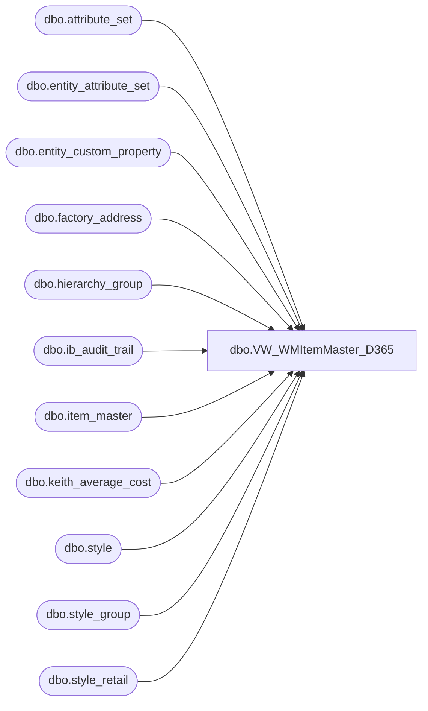

# dbo.VW_WMItemMaster_D365

**Database:** me_01  
**Server:** bedrockdb02  

## Architecture Diagram



## Table Dependencies

| Referenced Table |
|---|
| dbo.attribute_set |
| dbo.entity_attribute_set |
| dbo.entity_custom_property |
| dbo.factory_address |
| dbo.hierarchy_group |
| dbo.ib_audit_trail |
| dbo.item_master |
| dbo.keith_average_cost |
| dbo.style |
| dbo.style_group |
| dbo.style_retail |

## View Code

```sql
CREATE view [dbo].[VW_WMItemMaster_D365]
as

select m.*
from

	(select '001' as CO,
		'001' as DIV,
		s.style_code as STYLE,
		replace(replace(replace(s.short_desc,'"',' ') ,'[',' '), ',', '') as SKU_DESC,
		'' as CARTON_TYPE,
		case when cast(kac.average_cost as decimal(10,2)) = 0.00 or cast(kac.average_cost as decimal(10,2)) is null
			then 0.01
		else		
		cast(kac.average_cost as decimal(10,2))
		end as UNIT_PRICE,
		cast(kac.average_cost as decimal(10,2)) as RETAIL_PRICE, 
		case when substring(hg.hierarchy_group_code,7,2)='60'
		then
			isnull(ecp2.custom_property_value,1)
		else	s.distribution_multiple 
		end as STD_PACK_QTY,
		case when substring(hg.hierarchy_group_code,7,2)='60'
		then	1
		else 	s.order_multiple 
		end as STD_CASE_QTY,
		0 as MAX_CASE_QTY,
		0 as STD_CASE_LEN,
		0 as STD_CASE_WIDTH,
		0 as STD_CASE_HT,
		1 as UNIT_WT,
		1 as UNIT_VOL,
		0 as STD_PACK_WT,
		0 as STD_PACK_VOL,
		0 as STD_CASE_WT,
		0 as STD_CASE_VOL,
		0 as CRITCL_DIM_1,
		0 as CRITCL_DIM_2,
		0 as CRITCL_DIM_3,
		0 as STAT_CODE,
		s.style_code as SKU_BRCD,
		0 as STD_PACK_WIDTH,
		0 as STD_PACK_LEN,
		0 as STD_PACK_HT,
		0 as UNIT_WIDTH,
		0 as UNIT_LEN,
		0 as UNIT_HT,
		'999' as SKU_PROFILE_ID,
		'EAR99' as ECCN_NBR,
		'NLR' as EXP_LICN_NBR,
		case when substring(hg.hierarchy_group_code,7,2)='60'
		then substring(isnull(ecp3.custom_property_value,'NONE ASSIGN'),1,12)
		else substring(isnull(att.attribute_set_label,'NONE ASSIGN'),1,12)
		end as COMMODITY_CODE,
			--case when substring(hg.hierarchy_group_code,7,2)='60'
			--then	'SUPPLIES'
			--else	isnull(att.attribute_set_code, 'NONE ASSIGN') 
			--end as COMMODITY_LEVEL_DESC,
		im.nmfc_code,
		im.frt_class,
		isnull(im.commodity_level_desc, 'NONE ASSIGN') as COMMODITY_LEVEL_DESC,
		'980' as WHSE,
		case when substring(hg.hierarchy_group_code,7,2)='60'
		then	'SUP'
		else 	'MER' 
		end as STORE_DEPT,
		case when fa.country = 'P.R. of China'
			then 'CN'
		when fa.country = 'Vietnam'
			then 'VN'
		when fa.country = 'Indonesia'
			then 'ID'
		else fa.country	
		end as ORGN_CERT_CODE,
			im.sku_desc WM_SKU_DESC,
			im.unit_price WM_UNIT_PRICE,
			im.retail_price WM_RETAIL_PRICE,
			im.std_pack_qty WM_STD_PACK_QTY,
			im.std_case_qty WM_STD_CASE_QTY,
			im.COMMODITY_CODE WM_COMMODITY_CODE,
			im.store_dept WM_STORE_DEPT,
			im.ORGN_CERT_CODE WM_ORGN_CERT_CODE
	from	style s with (nolock)
	join	style_retail sr with (nolock) on s.style_id = sr.style_id
	join	style_group sg with (nolock) on s.style_id = sg.style_id
	join	hierarchy_group hg with (nolock) on sg.hierarchy_group_id = hg.hierarchy_group_id
	left outer join entity_custom_property ecp2 with (nolock) on s.style_id = ecp2.parent_id
		and		ecp2.custom_property_id = 2 -- FRCSTM
		and		ecp2.parent_type = 1
	left outer join entity_attribute_set eas with (nolock) on s.style_id = eas.parent_id
		and		eas.attribute_id = 152
	left join attribute_set att with (nolock) on eas.attribute_set_id = att.attribute_set_id
	left join keith_average_cost kac with (nolock) on s.style_code = kac.style_code
	left join entity_attribute_set eas_FACTRY with (nolock) on s.style_id = eas_FACTRY.parent_id
		and		eas_FACTRY.attribute_id = 122 
	left join attribute_set att_FACTRY with (nolock) on eas_FACTRY.attribute_set_id = att_FACTRY.attribute_set_id
	left join factory_address fa with (nolock) on att_FACTRY.attribute_set_code = fa.attribute_set_code
	left outer join entity_custom_property ecp3 with (nolock) on s.style_id = ecp3.parent_id
		and		ecp3.custom_property_id = 4 -- HTSCD
		and		ecp3.parent_type = 1
	left join wmdb01.wmprod.dbo.item_master im on s.style_code = im.style
	where sr.jurisdiction_id = 1 --HOME
	and s.active_flag = 1
	and left(s.style_code, 1) not in ('1', '4')
	and substring(hg.hierarchy_group_code,7,2) <> '60' -- Added 6/28/2018 for upcoming D365 integrations, Merch will no longer be the item master source for supply styles
	UNION
	select 	'001' as CO,
		'001' as DIV,
		s.style_code as STYLE,
		replace(replace(replace(s.short_desc,'"',' ') ,'[',' '), ',', '') as SKU_DESC,
		'' as CARTON_TYPE,
		case when cast(kac.average_cost as decimal(10,2)) = 0.00 or cast(kac.average_cost as decimal(10,2)) is null
			then 0.01
		else		
		cast(kac.average_cost as decimal(10,2))
		end as UNIT_PRICE,
		cast(kac.average_cost as decimal(10,2)) as RETAIL_PRICE, -- changed to avg cost from sr.current_selling_retail 6/16/2009
		case when substring(hg.hierarchy_group_code,7,2)='60'
		then
			isnull(ecp2.custom_property_value,1)
		else	s.distribution_multiple 
		end as STD_PACK_QTY,
		case when substring(hg.hierarchy_group_code,7,2)='60'
		then	1
		else 	s.order_multiple 
		end as STD_CASE_QTY,
		0 as MAX_CASE_QTY,
		0 as STD_CASE_LEN,
		0 as STD_CASE_WIDTH,
		0 as STD_CASE_HT,
		1 as UNIT_WT,
		1 as UNIT_VOL,
		0 as STD_PACK_WT,
		0 as STD_PACK_VOL,
		0 as STD_CASE_WT,
		0 as STD_CASE_VOL,
		0 as CRITCL_DIM_1,
		0 as CRITCL_DIM_2,
		0 as CRITCL_DIM_3,
		0 as STAT_CODE,
		s.style_code as SKU_BRCD,
		0 as STD_PACK_WIDTH,
		0 as STD_PACK_LEN,
		0 as STD_PACK_HT,
		0 as UNIT_WIDTH,
		0 as UNIT_LEN,
		0 as UNIT_HT,
		'999' as SKU_PROFILE_ID,
		'EAR99' as ECCN_NBR,
		'NLR' as EXP_LICN_NBR,
		case when substring(hg.hierarchy_group_code,7,2)='60'
		then substring(isnull(ecp3.custom_property_value,'NONE ASSIGN'),1,12)
		else substring(isnull(att.attribute_set_label,'NONE ASSIGN'),1,12)
		end as COMMODITY_CODE,
			--case when substring(hg.hierarchy_group_code,7,2)='60'
			--then	'SUPPLIES'
			--else	isnull(att.attribute_set_code, 'NONE ASSIGN') 
			--end as COMMODITY_LEVEL_DESC,
		im.nmfc_code,
		im.frt_class,
		isnull(im.commodity_level_desc, 'NONE ASSIGN') as COMMODITY_LEVEL_DESC,
		'980' as WHSE,
		case when substring(hg.hierarchy_group_code,7,2)='60'
		then	'SUP'
		else 	'MER' 
		end as STORE_DEPT,
		case when fa.country = 'P.R. of China'
			then 'CN'
		when fa.country = 'Vietnam'
			then 'VN'
		when fa.country = 'Indonesia'
			then 'ID'
		else fa.country	
		end as ORGN_CERT_CODE,
			im.sku_desc WM_SKU_DESC,
			im.unit_price WM_UNIT_PRICE,
			im.retail_price WM_RETAIL_PRICE,
			im.std_pack_qty WM_STD_PACK_QTY,
			im.std_case_qty WM_STD_CASE_QTY,
			im.COMMODITY_CODE WM_COMMODITY_CODE,
			im.store_dept WM_STORE_DEPT,
			im.ORGN_CERT_CODE WM_ORGN_CERT_CODE
	from	style s with (nolock) 
	join	style_retail sr with (nolock) on s.style_id = sr.style_id
	join	style_group sg with (nolock) on	s.style_id = sg.style_id
	join	hierarchy_group hg with (nolock) on	sg.hierarchy_group_id = hg.hierarchy_group_id
	left outer join entity_custom_property ecp2 with (nolock) on s.style_id = ecp2.parent_id
		and		ecp2.custom_property_id = 2 -- FRCSTM
		and		ecp2.parent_type = 1
	left outer join entity_attribute_set eas with (nolock) on s.style_id = eas.parent_id
		and		eas.attribute_id = 154
	left join attribute_set att with (nolock) on eas.attribute_set_id = att.attribute_set_id
	left join keith_average_cost kac with (nolock) on s.style_code = kac.style_code
	left join entity_attribute_set eas_FACTRY with (nolock) on s.style_id = eas_FACTRY.parent_id
		and		eas_FACTRY.attribute_id = 122
	left join attribute_set att_FACTRY with (nolock) on	eas_FACTRY.attribute_set_id = att_FACTRY.attribute_set_id
	left join factory_address fa with (nolock) on att_FACTRY.attribute_set_code = fa.attribute_set_code
	left outer join entity_custom_property ecp3 with (nolock) on s.style_id = ecp3.parent_id
		and		ecp3.custom_property_id = 23 -- CANHTS
		and		ecp3.parent_type = 1
	left join wmdb01.wmprod.dbo.item_master im on s.style_code = im.style
	where	sr.jurisdiction_id = 1 --HOME
	and s.active_flag = 1
	and left(s.style_code, 1) = '1'
	and substring(hg.hierarchy_group_code,7,2) <> '60' -- Added 6/28/2018 for upcoming D365 integrations, Merch will no longer be the item master source for supply styles
	UNION
	select 	'001' as CO,
		'001' as DIV,
		s.style_code as STYLE,
		replace(replace(replace(s.short_desc,'"',' ') ,'[',' '), ',', '') as SKU_DESC,
		'' as CARTON_TYPE,
		case when cast(kac.average_cost as decimal(10,2)) = 0.00 or cast(kac.average_cost as decimal(10,2)) is null
			then 0.01
		else		
		cast(kac.average_cost as decimal(10,2))
		end as UNIT_PRICE,
		cast(kac.average_cost as decimal(10,2)) as RETAIL_PRICE, -- changed to avg cost from sr.current_selling_retail 6/16/2009
		case when substring(hg.hierarchy_group_code,7,2)='60'
		then
			isnull(ecp2.custom_property_value,1)
		else	s.distribution_multiple 
		end as STD_PACK_QTY,
		case when substring(hg.hierarchy_group_code,7,2)='60'
		then	1
		else 	s.order_multiple 
		end as STD_CASE_QTY,	
		0 as MAX_CASE_QTY,
		0 as STD_CASE_LEN,
		0 as STD_CASE_WIDTH,
		0 as STD_CASE_HT,
		1 as UNIT_WT,
		1 as UNIT_VOL,
		0 as STD_PACK_WT,
		0 as STD_PACK_VOL,
		0 as STD_CASE_WT,
		0 as STD_CASE_VOL,
		0 as CRITCL_DIM_1,
		0 as CRITCL_DIM_2,
		0 as CRITCL_DIM_3,
		0 as STAT_CODE,
		s.style_code as SKU_BRCD,
		0 as STD_PACK_WIDTH,
		0 as STD_PACK_LEN,
		0 as STD_PACK_HT,
		0 as UNIT_WIDTH,
		0 as UNIT_LEN,
		0 as UNIT_HT,
		'999' as SKU_PROFILE_ID,
		'EAR99' as ECCN_NBR,
		'NLR' as EXP_LICN_NBR,
		case when substring(hg.hierarchy_group_code,7,2)='60'
		then substring(isnull(ecp3.custom_property_value,'NONE ASSIGN'),1,12)
		else substring(isnull(att.attribute_set_label,'NONE ASSIGN'),1,12)
		end as COMMODITY_CODE,
				--case when substring(hg.hierarchy_group_code,7,2)='60'
			--then	'SUPPLIES'
			--else	isnull(att.attribute_set_code, 'NONE ASSIGN') 
			--end as COMMODITY_LEVEL_DESC,
		im.nmfc_code,
		im.frt_class,
		isnull(im.commodity_level_desc, 'NONE ASSIGN') as COMMODITY_LEVEL_DESC,
		'980' as WHSE,
		case when substring(hg.hierarchy_group_code,7,2)='60'
		then	'SUP'
		else 	'MER' 
		end as STORE_DEPT,
		case when fa.country = 'P.R. of China'
			then 'CN'
		when fa.country = 'Vietnam'
			then 'VN'
		when fa.country = 'Indonesia'
			then 'ID'
		else fa.country	
		end as ORGN_CERT_CODE,
			im.sku_desc WM_SKU_DESC,
			im.unit_price WM_UNIT_PRICE,
			im.retail_price WM_RETAIL_PRICE,
			im.std_pack_qty WM_STD_PACK_QTY,
			im.std_case_qty WM_STD_CASE_QTY,
			im.COMMODITY_CODE WM_COMMODITY_CODE,
			im.store_dept WM_STORE_DEPT,
			im.ORGN_CERT_CODE WM_ORGN_CERT_CODE
	from	style s with (nolock) 
	join	style_retail sr with (nolock) on s.style_id = sr.style_id
	join	style_group sg with (nolock) on s.style_id = sg.style_id
	join	hierarchy_group hg with (nolock) on sg.hierarchy_group_id = hg.hierarchy_group_id
	left outer join entity_custom_property ecp2 with (nolock) on s.style_id = ecp2.parent_id
		and		ecp2.custom_property_id = 2 -- FRCSTM
		and		ecp2.parent_type = 1
	left outer join entity_attribute_set eas with (nolock) on s.style_id = eas.parent_id
		and		eas.attribute_id = 156
	left join attribute_set att with (nolock) on eas.attribute_set_id = att.attribute_set_id
	left join keith_average_cost kac with (nolock) on s.style_code = kac.style_code
	left join entity_attribute_set eas_FACTRY with (nolock) on s.style_id = eas_FACTRY.parent_id
		and		eas_FACTRY.attribute_id = 122
	left join attribute_set att_FACTRY with (nolock) on eas_FACTRY.attribute_set_id = att_FACTRY.attribute_set_id
	left join factory_address fa with (nolock) on att_FACTRY.attribute_set_code = fa.attribute_set_code
	left outer join entity_custom_property ecp3 with (nolock) on s.style_id = ecp3.parent_id
		and		ecp3.custom_property_id = 24 -- UKHTS
		and		ecp3.parent_type = 1
	left join wmdb01.wmprod.dbo.item_master im on s.style_code = im.style
	where sr.jurisdiction_id = 1 --HOME
	and s.active_flag = 1
	and substring(hg.hierarchy_group_code,7,2) <> '60' -- Added 6/28/2018 for upcoming D365 integrations, Merch will no longer be the item master source for supply styles
	and left(s.style_code, 1) = '4') as M
where m.style in 
	(select distinct iat.application_identifier style
		from ib_audit_trail iat with (nolock)
		join style s with (nolock) on iat.application_identifier = s.style_code
		where datediff(dd, entry_date, getdate()) = 0)
or m.style not in (select style from wmdb01.wmprod.dbo.item_master)
or isnull(m.WM_SKU_DESC, '0') <> isnull(m.SKU_DESC, '0')
or isnull(m.WM_UNIT_PRICE, '0') <> isnull(m.UNIT_PRICE, '0')
or isnull(m.WM_RETAIL_PRICE, '0') <> isnull(m.RETAIL_PRICE, '0')
or isnull(m.WM_STD_PACK_QTY, '0') <> isnull(cast(m.STD_PACK_QTY as numeric(9,2)), '0')
or isnull(m.WM_STD_CASE_QTY, '0') <> isnull(cast(m.STD_CASE_QTY as numeric(9,2)), '0')
or isnull(m.WM_COMMODITY_CODE, '0') <> isnull(m.COMMODITY_CODE, '0')
or isnull(m.WM_STORE_DEPT, '0') <> isnull(m.STORE_DEPT, '0')
or isnull(m.WM_ORGN_CERT_CODE, '0') <> isnull(m.ORGN_CERT_CODE, '0')
```

