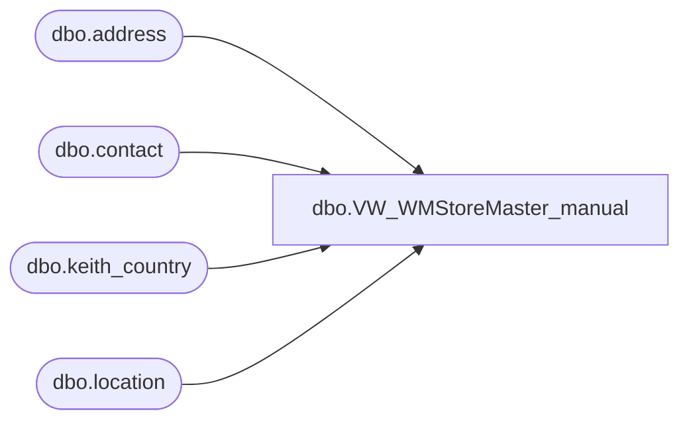

# dbo.VW_WMStoreMaster_manual

**Database:** me_01  
**Server:** bedrockdb02  

## Architecture Diagram



## Table Dependencies

| Referenced Table |
|---|
| dbo.address |
| dbo.contact |
| dbo.keith_country |
| dbo.location |

## View Code

```sql
CREATE view [dbo].[VW_WMStoreMaster_manual]

as 

select 	'980' as WHSE,
	l.location_code as STORE_NBR,
	case 
		when l.location_code between '1500' and '1599'
			then 'RIDEMAKERZ #' + l.location_code
		when l.location_code = '9421' 
			then 'Cooper Brothers Trucking' -- new 07/31 dt
		when l.location_code in ('0387','0388','0389','0390','0391') -- Changed 11/21/2017 at Request of Santiago Beltran 
			then 'Bass Pro Shop/Build-A-Bear #' + l.location_code
		else
			'BUILD-A-BEAR WORKSHOP #' + l.location_code
	end as NAME,
	case when len(a.address_line2) > 39
	then 
		replace(replace(replace(replace(replace(replace(substring(isnull(UPPER(a.address_line2),UPPER(a.address_line1)),1,39),'CENTER','CTR'),'SOUTH','S'),'NORTH','N'),'EAST','E'),'WEST','W'),'SUITE','STE')
	else
		isnull(UPPER(a.address_line2),UPPER(a.address_line1))
	end  as ADDR_LINE_1,
	case when a.address_line2 is null then
	'' 
	else a.address_line1
	end as ADDR_LINE_2,
	NULL as ADDR_LINE_3,
	a.address_city as CITY,
	a.address_state as STATE,
	case when c.country_code = 'US' then
	right('00000' + convert(varchar(5),left(a.address_zip_code,5)),5)
	else a.address_zip_code
	end as ZIP,
	c.country_code as CNTRY,
	NULL as CONTACT,
	isnull(max (substring (ct.contact_number,1,15)),'000-000-0000') as PHONE,
	max(ct2.contact_number) as FAX,
	a.address_email as EMAIL,
	'001' as DFLT_CO,
	'001' AS DFLT_DIV,
	0 as STAT_CODE,
	l.open_date as OPEN_DATE,
	l.closed_date as CLOSED_DATE,
	NULL as HOLD_DATE,
	NULL as GRP,
	NULL as CHAIN,
	NULL as ZONE,
	NULL as TERRITORY,
	NULL as REGION,
	NULL as DISTRICT,
	NULL as SHIP_MON,
	NULL as SHIP_TUE,
	NULL as SHIP_WED,
	NULL as SHIP_THU,
	NULL as SHIP_FRI,
	NULL as SHIP_SAT,
	NULL as SHIP_SU,
	NULL as ACCEPT_IRREG,
	NULL as WAVE_LABEL_TYPE,
	NULL as PKG_SLIP_TYPE,
	NULL as PRINT_CODE,
	'001' as CARTON_CNT_TYPE,
	NULL as STORE_TYPE,
	NULL as SHIP_VIA,
	NULL as RTE_NBR,
	NULL as RTE_ATTR,
	NULL as RTE_TO,
	NULL as RTE_TYPE_1,
	NULL as RTE_TYPE_2,
	NULL as RTE_ZIP,
	NULL as SPL_INSTR_CODE_1,
	NULL as SPL_INSTR_CODE_2,
	NULL as SPL_INSTR_CODE_3,
	NULL as SPL_INSTR_CODE_4,
	NULL as SPL_INSTR_CODE_5,
	NULL as SPL_INSTR_CODE_6,
	NULL as SPL_INSTR_CODE_7,
	NULL as SPL_INSTR_CODE_8,
	NULL as SPL_INSTR_CODE_9,
	NULL as SPL_INSTR_CODE_10,
	NULL as ASSIGN_MERCH_TYPE,
	NULL as ASSIGN_MERCH_GROUP,
	NULL as ASSIGN_STORE_DEPT,
	0 as PROC_STAT_CODE,
	0 as ERROR_SEQ_NBR,
	'' as CARTON_LABEL_TYPE,
	51 as CARTON_CUBNG_INDIC,
	' ' as MAX_CTN,
	' ' as MAX_PLT,
	NULL as BUSN_UNIT_CODE,
	'N' as USE_INBD_LPN_AS_OUT_BD_LPN	,
	getdate() as CREATE_DATE_TIME,
	getdate() as MOD_DATE_TIME,
	'MERCH' as USER_ID	
from location l with (nolock)
inner join address a  with (nolock) on l.location_id = a.parent_id
	and l.location_status_id <> 5
	and	a.parent_type = 2
	and	address_type_id = 1
left outer join keith_country c with (nolock) on a.country_id = c.country_id
left outer join contact ct with (nolock) on	l.location_id = ct.parent_id
	and l.location_type = 2
	and	ct.parent_type = 2
	and ct.contact_type = 4
left outer join contact ct2 with (nolock) on l.location_id = ct2.parent_id
	and l.location_type = 2
	and	ct2.parent_type = 2
	and ct2.contact_type = 1
where l.location_code in ('0461','0426')
group by l.location_code,a.address_line1,
	a.address_line2,a.address_city,	a.address_state,a.address_zip_code,
	c.country_code,	a.address_email,l.open_date,l.closed_date
```

