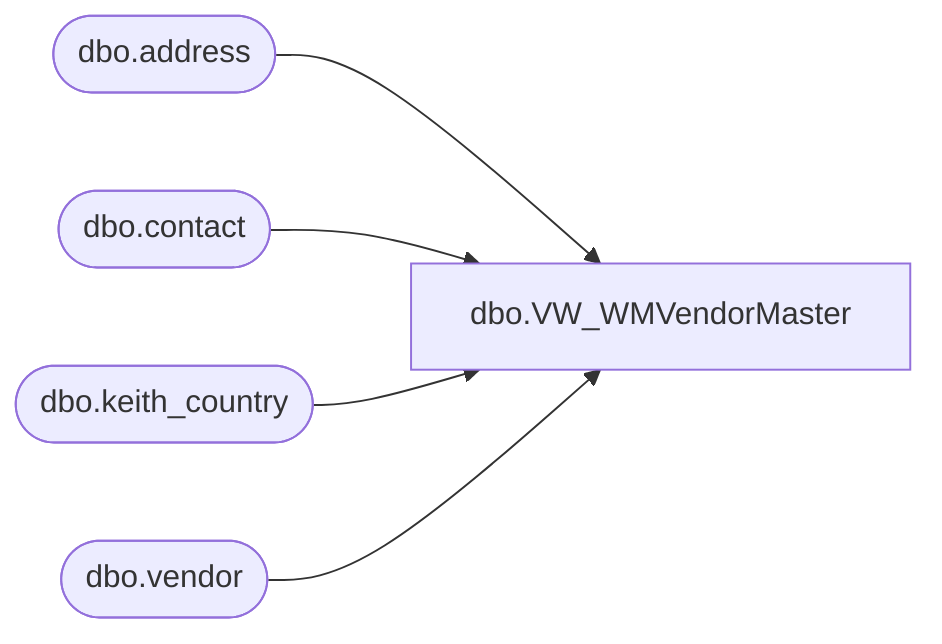

# dbo.VW_WMVendorMaster

**Database:** me_01  
**Server:** bedrockdb02  

## Architecture Diagram



## Table Dependencies

| Referenced Table |
|---|
| dbo.address |
| dbo.contact |
| dbo.keith_country |
| dbo.vendor |

## View Code

```sql
CREATE view [dbo].[VW_WMVendorMaster]

as

select distinct	v.vendor_code as VENDOR_ID,
	substring (v.vendor_name,1,35) as VENDOR_NAME,	
	a.address_line1 as ADDR_1,
	a.address_line2 as ADDR_2,
	a.address_city as CITY,
	a.address_state as STATE,
	a.address_zip_code as ZIP,
	c.country_code as CNTRY,
	isnull (substring ((ct.contact_number),1,15),'000 000-0000') as TEL_NBR,
	0 as STAT_CODE,
	10 as DFLT_BATCH_STAT
from vendor v with (nolock)
left outer join address a with (nolock) on v.vendor_id = a.parent_id
	and a.parent_type = 3
	and	address_type_id = 1
left outer join keith_country c with (nolock) on v.country_id = c.country_id
left outer join contact ct  with (nolock) on v.vendor_id = ct.parent_id
	and	ct.parent_type = 3
	and ct.contact_type = 4
```

