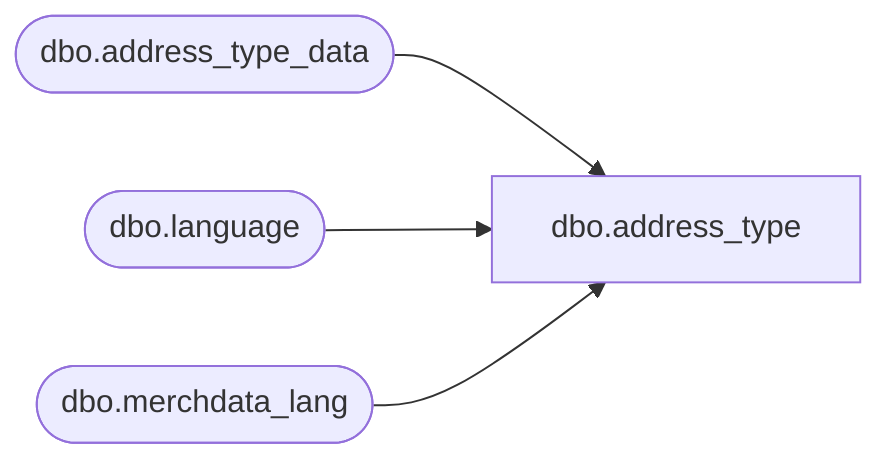

# dbo.address_type

**Database:** me_01  
**Server:** bedrockdb02  

## Architecture Diagram



## Table Dependencies

| Referenced Table |
|---|
| dbo.address_type_data |
| dbo.language |
| dbo.merchdata_lang |

## View Code

```sql
CREATE VIEW [dbo].[address_type]
AS
SELECT a.address_type_id,
       COALESCE(mdl.[description], a.address_type_description) as address_type_description,
       a.active_flag,
       a.updatestamp,
       a.user_defined_flag
  FROM [dbo].[address_type_data] a
  LEFT OUTER JOIN
      (SELECT * FROM [dbo].[merchdata_lang] mdl2
        WHERE mdl2.language_id = (SELECT [dbo].[language].language_id
                                    FROM [dbo].[language]
                                   WHERE [dbo].[language].default_desc_language_flag = 1)
          AND mdl2.parent_type=N'address_type'
      ) mdl
    ON (mdl.parent_id=a.address_type_id);
dbo,address_type_lang,Create view [dbo].[address_type_lang] as

SELECT	a.address_type_id,
		COALESCE(mdl.[description], a.address_type_description) as address_type_description,
		a.active_flag,
		mdl.language_id,
		l.locale_identifier
FROM	[dbo].[address_type_data] a
		Cross join		[dbo].[language] l 
		LEFT outer JOIN	[dbo].[merchdata_lang] mdl 
on		mdl.parent_type='address_type' 
		and mdl.parent_id=a.address_type_id 
		and mdl.language_id=l.language_id;
```

