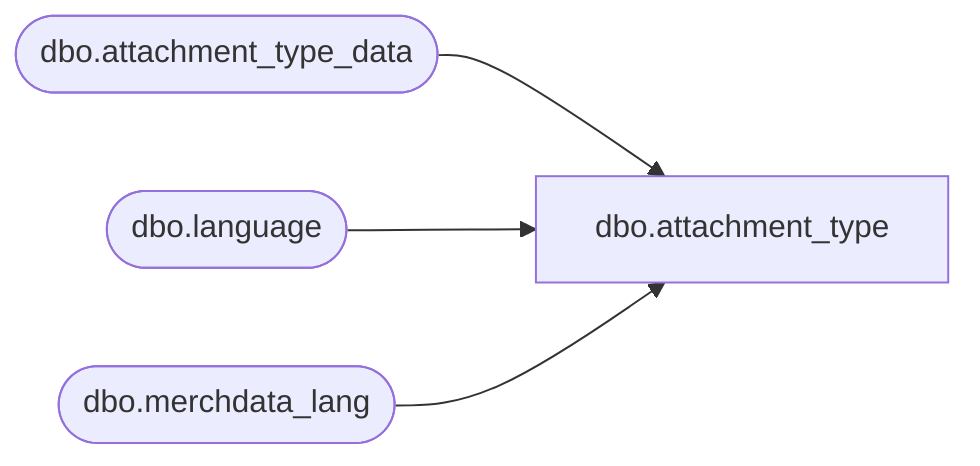

# dbo.attachment_type

**Database:** me_01  
**Server:** bedrockdb02  

## Architecture Diagram



## Table Dependencies

| Referenced Table |
|---|
| dbo.attachment_type_data |
| dbo.language |
| dbo.merchdata_lang |

## View Code

```sql
CREATE VIEW [dbo].[attachment_type]
AS
SELECT a.attachment_type_id,
       COALESCE(mdl.[code], a.attachment_type_code) as attachment_type_code,
       COALESCE(mdl.[description], a.attachment_type_desc) as attachment_type_desc,
       a.active_flag
  FROM [dbo].[attachment_type_data] a
  LEFT OUTER JOIN
      (SELECT * FROM [dbo].[merchdata_lang] mdl2
        WHERE mdl2.language_id = (SELECT [dbo].[language].language_id
                                    FROM [dbo].[language]
                                   WHERE [dbo].[language].default_desc_language_flag = 1)
          AND mdl2.parent_type=N'attachment_type'
       ) mdl
    ON (mdl.parent_id=a.attachment_type_id);
dbo,BI_VIEW_ADVNC_SHPNG_NTC,create view BI_VIEW_ADVNC_SHPNG_NTC as
select
advance_shipping_notice_id,
vendor_id,
unit_weight_id,
container_type_id,
carrier_id,
ship_via_id,
document_no,
convert(smalldatetime, convert(varchar,expected_receipt_date, 101)) as expected_receipt_date,
pro_bill_no,
convert(smalldatetime, convert(varchar,create_date, 101)) as create_date,
convert(smalldatetime, convert(varchar,ship_date, 101)) as ship_date,
bill_of_lading,
weight,
no_of_containers,
shipment_ref_no,
convert(smalldatetime, convert(varchar,last_activity_date, 101)) as last_activity_date,
updatestamp,
last_item_id
from advance_shipping_notice
dbo,BI_VIEW_ASN_PO_LCTN,create view BI_VIEW_ASN_PO_LCTN as
select
asn_po_location_id,
advance_shipping_notice_id,
po_id,
convert(decimal(14,0),location_id) as location_id,
blanket_po_id,
ticket_source,
ticket_status
from asn_po_location
dbo,BI_VIEW_ASN_PO_LCTN_DTL,create view BI_VIEW_ASN_PO_LCTN_DTL as 
select
asn_po_location_detail_id,
asn_po_location_id,
advance_shipping_notice_id,
style_id,
style_color_id,
sku_id,
carton_no,
units_sent,
convert(decimal(14,0), location_id) as location_id
from asn_po_location_detail


dbo,BI_VIEW_AVG_COST_ADJ_STYL_LOC,create view BI_VIEW_AVG_COST_ADJ_STYL_LOC
as select
avg_cost_adj_style_loc_id,
average_cost_adj_style_id,
average_cost_adjustment_id,
convert(decimal(14,0),location_id) as location_id,
hierarchy_group_id
from avg_cost_adj_style_loc
dbo,BI_VIEW_AVG_COST_ADJSTMNT,create view BI_VIEW_AVG_COST_ADJSTMNT as 
select
average_cost_adjustment_id,
document_no,
document_status,
convert(smalldatetime,convert(varchar, create_date, 101))  as create_date,
hierarchy_id,
convert(smalldatetime,convert(varchar, submit_date, 101))  as submit_date,
state_no,
performed_by,
grouping_label,
convert(smalldatetime,convert(varchar, last_activity_date, 101))  as last_activity_date,
updatestamp,
last_item_id
from average_cost_adjustment

dbo,BI_VIEW_CLNDR,create view dbo.BI_VIEW_CLNDR AS SELECT
calendar_date,
calendar_week_id,
calendar_week_code,
calendar_week_start_date,
calendar_week_end_date,
calendar_year_id,  
merch_year,
calendar_period_id,
merch_period,
(merch_year*100) + merch_period as year_period_code
FROM calendar_date d
JOIN calendar_week w
on d.calendar_date >= w.calendar_week_start_date
and d.calendar_date < dateadd(dd,1,w.calendar_week_end_date)
dbo,BI_VIEW_COST_FCTR_ACNT,CREATE VIEW BI_VIEW_COST_FCTR_ACNT
AS SELECT
cost_factor_account_id,
gl_account_structure_id,
cost_factor_id,
convert(smallint,allocation_method) as allocation_method
From cost_factor_account

dbo,BI_VIEW_CRNT_RTL,CREATE view  dbo.BI_VIEW_CRNT_RTL as 
select r.style_id, r.jurisdiction_id, 
convert(decimal(14,0),l.location_id ) as location_id, 
sc.style_color_id, 
isnull(slc.current_selling_retail, 
       isnull(spgc.current_selling_retail, 
           isnull(scr.current_selling_retail, 
              isnull(sl.current_selling_retail, 
                 isnull(spg.current_selling_retail, r.current_selling_retail))))) as current_local_price,

isnull(slc.current_valuation_retail, 
       isnull(spgc.current_valuation_retail, 
           isnull(scr.current_valuation_retail, 
              isnull(sl.current_valuation_retail, 
                 isnull(spg.current_valuation_retail, r.current_valuation_retail))))) as current_base_price,
isnull(ip1.selling_retail_price,
         isnull(ip2.selling_retail_price,
            isnull(ip3.selling_retail_price,
               isnull(ip4.selling_retail_price,
                 isnull(ip5.selling_retail_price,ip6.selling_retail_price))))) as promo_local_price, 
isnull(ip1.valuation_retail_price,
         isnull(ip2.valuation_retail_price,
            isnull(ip3.valuation_retail_price,
               isnull(ip4.valuation_retail_price,
                 isnull(ip5.valuation_retail_price,ip6.valuation_retail_price))))) as promo_base_price
from style_retail r
join location l
on l.jurisdiction_id = r.jurisdiction_id
join style_color sc
on r.style_id = sc.style_id
left outer join pricing_group_location pgl
on pgl.location_id = l.location_id
left outer join style_location_color slc
on slc.style_id = r.style_id
and slc.jurisdiction_id = r.jurisdiction_id
and slc.location_id = l.location_id
and slc.style_color_id = sc.style_color_id
left outer join style_pricing_grp_color spgc
on spgc.style_id = r.style_id
and spgc.style_color_id = sc.style_color_id
and spgc.jurisdiction_id = r.jurisdiction_id
and spgc.pricing_group_id = pgl.pricing_group_id
left outer join style_color_retail scr
on scr.style_id = r.style_id
and scr.style_color_id = sc.style_color_id
and scr.jurisdiction_id = r.jurisdiction_id
left outer join style_location sl
on sl.style_id = r.style_id
and sl.location_id = l.location_id
and sl.jurisdiction_id = r.jurisdiction_id
left outer join style_pricing_group spg
on spg.style_id = r.style_id
and spg.jurisdiction_id = r.jurisdiction_id
and spg. pricing_group_id = pgl.pricing_group_id 
left outer join ib_price ip1
on ip1.style_id = r.style_id
and ip1.jurisdiction_id = r.jurisdiction_id
and ip1.color_id = sc.color_id
and ip1.location_id = l.location_id
and ip1.temp_price_flag = 1
and ip1.start_date <= getdate()
and ip1.end_date > getdate()
left outer join ib_price ip2
on ip2.style_id = r.style_id
and ip2.jurisdiction_id = r.jurisdiction_id
and ip2.color_id = sc.color_id
and ip2.pricing_group_id = pgl.pricing_group_id
and ip2.location_id is null
and ip2.temp_price_flag = 1
and ip2.start_date <= getdate()
and ip2.end_date > getdate()
left outer join ib_price ip3
on ip3.style_id = r.style_id
and ip3.jurisdiction_id = r.jurisdiction_id
and ip3.color_id = sc.color_id
and ip3.pricing_group_id is null
and ip3.location_id is null
and ip3.temp_price_flag = 1
and ip3.start_date <= getdate()
and ip3.end_date > getdate()
left outer join ib_price ip4
on ip4.style_id = r.style_id
and ip4.jurisdiction_id = r.jurisdiction_id
and ip4.color_id is null
and ip4.pricing_group_id is null
and ip4.location_id = l.location_id
and ip4.temp_price_flag = 1
and ip4.start_date <= getdate()
and ip4.end_date > getdate()
left outer join ib_price ip5
on ip5.style_id = r.style_id
and ip5.jurisdiction_id = r.jurisdiction_id
and ip5.color_id is null
and ip5.pricing_group_id = pgl.pricing_group_id
and ip5.location_id is null
and ip5.temp_price_flag = 1
and ip5.start_date <= getdate()
and ip5.end_date > getdate()
left outer join ib_price ip6
on ip6.style_id = r.style_id
and ip6.jurisdiction_id = r.jurisdiction_id
and ip6.color_id is null
and ip6.pricing_group_id is null
and ip6.location_id is null
and ip6.temp_price_flag = 1
and ip6.start_date <= getdate()
and ip6.end_date > getdate()
```

