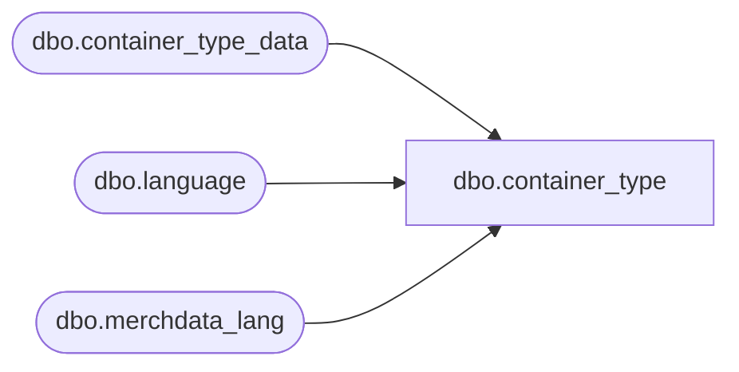

# dbo.container_type

**Database:** me_01  
**Server:** bedrockdb02  

## Architecture Diagram



## Table Dependencies

| Referenced Table |
|---|
| dbo.container_type_data |
| dbo.language |
| dbo.merchdata_lang |

## View Code

```sql
CREATE VIEW [dbo].[container_type]
AS
SELECT a.container_type_id,
       a.container_type_code,
       COALESCE(mdl.[description], a.container_type_label) as container_type_label,
       a.active_flag,
       a.updatestamp
  FROM [dbo].[container_type_data] a
  LEFT OUTER JOIN
      (SELECT * FROM [dbo].[merchdata_lang] mdl2
        WHERE mdl2.language_id = (SELECT [dbo].[language].language_id
                                    FROM [dbo].[language]
                                   WHERE [dbo].[language].default_desc_language_flag = 1)
          AND mdl2.parent_type=N'container_type'
       ) mdl
    ON (mdl.parent_id=a.container_type_id);
dbo,container_type_lang,Create view [dbo].container_type_lang as

SELECT	a.container_type_id,
		a.container_type_code,
		COALESCE(mdl.[description], a.container_type_label) as container_type_label,
		a.active_flag,
		mdl.language_id,
		l.locale_identifier
FROM	[dbo].[container_type_data] a
		Cross join		[dbo].[language] l
		LEFT outer JOIN	[dbo].[merchdata_lang] mdl 
on		mdl.parent_type=N'container_type' 
		and mdl.parent_id=a.container_type_id 
		and mdl.language_id=l.language_id;
```

