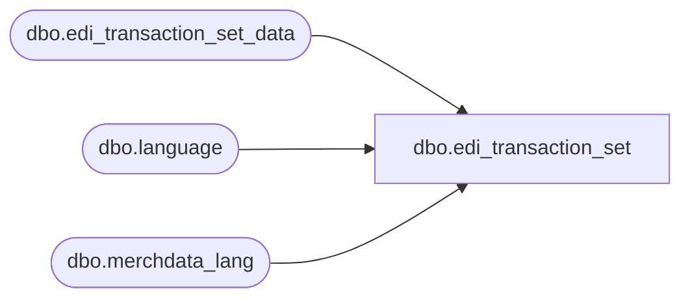

# dbo.edi_transaction_set

**Database:** me_01  
**Server:** bedrockdb02  

## Architecture Diagram



## Table Dependencies

| Referenced Table |
|---|
| dbo.edi_transaction_set_data |
| dbo.language |
| dbo.merchdata_lang |

## View Code

```sql
CREATE VIEW [dbo].[edi_transaction_set]
AS
SELECT a.edi_transaction_set_id,
       a.edi_transaction_set_code,
       COALESCE(mdl.[description], a.edi_transaction_set_desc) as edi_transaction_set_desc,
       a.edi_version_id
  FROM [dbo].[edi_transaction_set_data] a
  LEFT OUTER JOIN
      (SELECT * FROM [dbo].[merchdata_lang] mdl2
        WHERE mdl2.language_id = (SELECT [dbo].[language].language_id
                                    FROM [dbo].[language]
                                   WHERE [dbo].[language].default_desc_language_flag = 1)
          AND mdl2.parent_type=N'edi_transaction_set'
       ) mdl
    ON (mdl.parent_id=a.edi_transaction_set_id);
```

