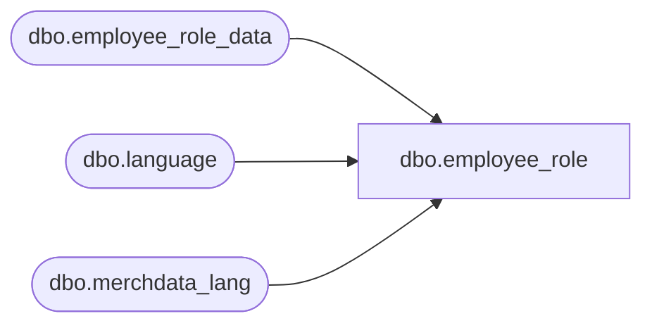

# dbo.employee_role

**Database:** me_01  
**Server:** bedrockdb02  

## Architecture Diagram



## Table Dependencies

| Referenced Table |
|---|
| dbo.employee_role_data |
| dbo.language |
| dbo.merchdata_lang |

## View Code

```sql
CREATE VIEW [dbo].[employee_role]
AS
SELECT a.employee_role_id,
       COALESCE(mdl.[description], a.role_label) as role_label,
       a.role_mask,
       a.exclusivity_flag,
       a.active_flag,
       a.updatestamp,
       a.last_item_id
  FROM [dbo].[employee_role_data] a
  LEFT OUTER JOIN
      (SELECT * FROM [dbo].[merchdata_lang] mdl2
        WHERE mdl2.language_id = (SELECT [dbo].[language].language_id
                                    FROM [dbo].[language]
                                   WHERE [dbo].[language].default_desc_language_flag = 1)
          AND mdl2.parent_type=N'employee_role'
       ) mdl
    ON (mdl.parent_id=a.employee_role_id);
```

