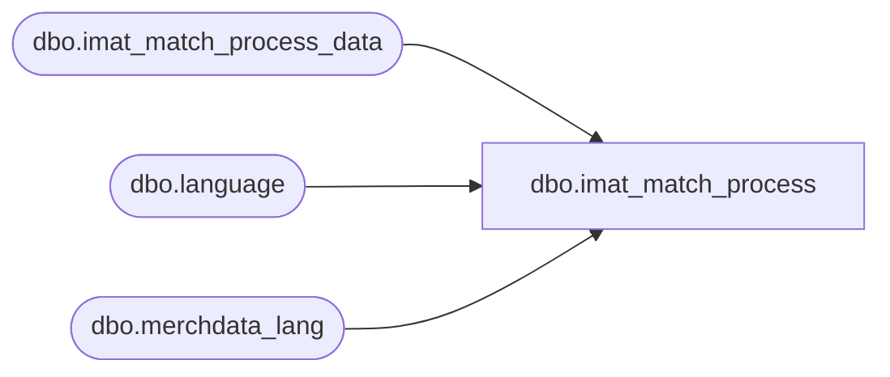

# dbo.imat_match_process

**Database:** me_01  
**Server:** bedrockdb02  

## Architecture Diagram



## Table Dependencies

| Referenced Table |
|---|
| dbo.imat_match_process_data |
| dbo.language |
| dbo.merchdata_lang |

## View Code

```sql
CREATE VIEW [dbo].[imat_match_process]
AS
SELECT a.imat_match_process_id,
       a.imat_flow_process_code,
       COALESCE(mdl.[description], a.imat_flow_process_desc) as imat_flow_process_desc
  FROM [dbo].[imat_match_process_data] a
  LEFT OUTER JOIN
      (SELECT * FROM [dbo].[merchdata_lang] mdl2
        WHERE mdl2.language_id = (SELECT [dbo].[language].language_id
                                    FROM [dbo].[language]
                                   WHERE [dbo].[language].default_desc_language_flag = 1)
          AND mdl2.parent_type=N'imat_match_process'
       ) mdl
    ON (mdl.parent_id=a.imat_match_process_id);
```

