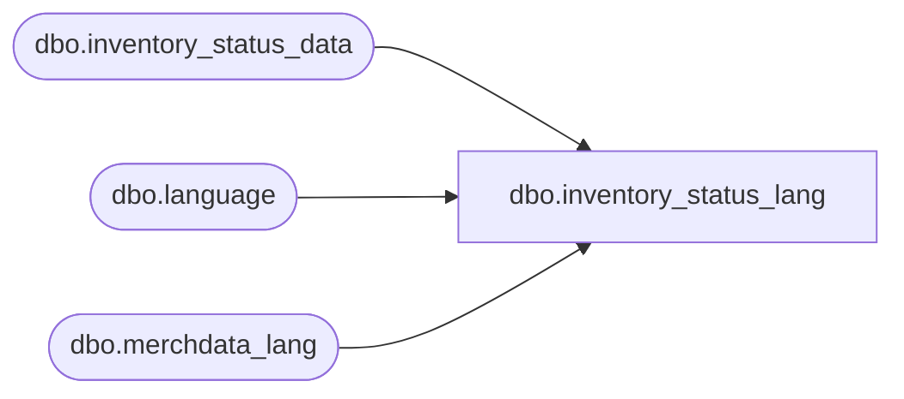

# dbo.inventory_status_lang

**Database:** me_01  
**Server:** bedrockdb02  

## Architecture Diagram



## Table Dependencies

| Referenced Table |
|---|
| dbo.inventory_status_data |
| dbo.language |
| dbo.merchdata_lang |

## View Code

```sql
Create view [dbo].[inventory_status_lang] as

SELECT a.inventory_status_id,
       a.inventory_status_code,
       COALESCE(mdl.[description], a.inventory_status_desc) as inventory_status_desc,
       a.user_defined_flag,
       a.active_flag,
       a.include_on_hand_totals_flag,
       mdl.language_id,
       l.locale_identifier
FROM	[dbo].[inventory_status_data] a
		Cross join		[dbo].[language] l
		LEFT outer JOIN	[dbo].[merchdata_lang] mdl 
on		mdl.parent_type=N'inventory_status' 
		and mdl.parent_id=a.inventory_status_id 
		and mdl.language_id=l.language_id;
```

