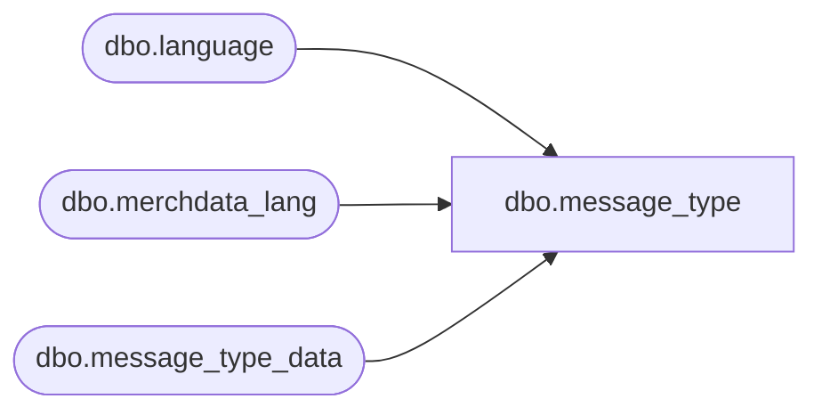

# dbo.message_type

**Database:** me_01  
**Server:** bedrockdb02  

## Architecture Diagram



## Table Dependencies

| Referenced Table |
|---|
| dbo.language |
| dbo.merchdata_lang |
| dbo.message_type_data |

## View Code

```sql
CREATE VIEW [dbo].[message_type]
AS
SELECT a.message_type_id,
       COALESCE(mdl.[description], a.message_type_description) as message_type_description,
       a.exclusive_flag,
       a.max_length,
       a.transaction_type,
       a.edi_support_flag,
       a.print_message_for_vendor_flag,
       a.print_on_po_receipt_flag,
       a.user_defined_flag,
       a.active_flag,
       a.updatestamp
  FROM [dbo].[message_type_data] a
  LEFT OUTER JOIN
      (SELECT * FROM [dbo].[merchdata_lang] mdl2
        WHERE mdl2.language_id = (SELECT [dbo].[language].language_id
                                    FROM [dbo].[language]
                                   WHERE [dbo].[language].default_desc_language_flag = 1)
          AND mdl2.parent_type=N'message_type'
       ) mdl
    ON (mdl.parent_id=a.message_type_id);
dbo,message_type_lang,Create view [dbo].[message_type_lang]
AS
SELECT a.message_type_id,
       COALESCE(mdl.[description], a.message_type_description) as message_type_description,
       a.exclusive_flag,
       a.max_length,
       a.transaction_type,
       a.edi_support_flag,
       a.print_message_for_vendor_flag,
       a.print_on_po_receipt_flag,
       a.user_defined_flag,
       a.active_flag,
       mdl.language_id,
       l.locale_identifier
FROM	[dbo].[message_type_data] a
		Cross join		[dbo].[language] l
		LEFT outer JOIN	[dbo].[merchdata_lang] mdl 
on		mdl.parent_type=N'message_type' 
		and mdl.parent_id=a.message_type_id 
		and mdl.language_id=l.language_id;
```

