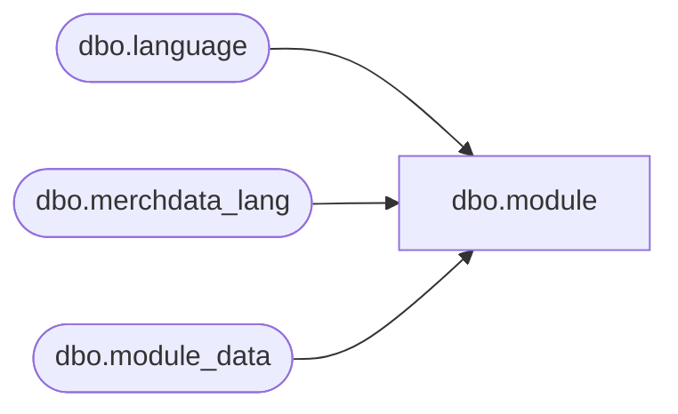

# dbo.module

**Database:** me_01  
**Server:** bedrockdb02  

## Architecture Diagram



## Table Dependencies

| Referenced Table |
|---|
| dbo.language |
| dbo.merchdata_lang |
| dbo.module_data |

## View Code

```sql
CREATE VIEW [dbo].[module]
AS
SELECT a.module_id,
       a.module_code,
       COALESCE(mdl.[description], a.module_desc) as module_desc,
       a.updatestamp
  FROM [dbo].[module_data] a
  LEFT OUTER JOIN
      (SELECT * FROM [dbo].[merchdata_lang] mdl2
        WHERE mdl2.language_id = (SELECT [dbo].[language].language_id
                                    FROM [dbo].[language]
                                   WHERE [dbo].[language].default_desc_language_flag = 1)
          AND mdl2.parent_type=N'module'
       ) mdl
    ON (mdl.parent_id=a.module_id);
dbo,nsb_db_install,CREATE VIEW [dbo].[nsb_db_install] (execution_id, install_id, original_filename, generated_by, executed_by, execution_date, execution_status, application_name) AS SELECT execution_id, install_id, original_filename, generated_by, executed_by, execution_date, execution_status, application_name FROM [dbo].[db_install]
dbo,nsb_db_install_detail,CREATE VIEW [dbo].[nsb_db_install_detail] (execution_id, module_id, object_version_id, object_name, object_type_name, execution_status, error_message) AS SELECT execution_id, module_id, object_version_id, object_name, object_type_name, execution_status, error_message FROM [dbo].[db_install_detail]
dbo,nsb_db_install_module,CREATE VIEW [dbo].[nsb_db_install_module] (execution_id, module_id, module_name, from_release_no, from_build_no, to_release_no, to_build_no, execution_status) AS SELECT execution_id, module_id, module_name, from_release_no, from_build_no, to_release_no, to_build_no, execution_status FROM [dbo].[db_install_module]
dbo,pack_cs_$seq,
create view [pack_cs_$seq] 
as 
SELECT pack_seq_id pack_cs_seq_id, dummycol from pack_$seq
```

