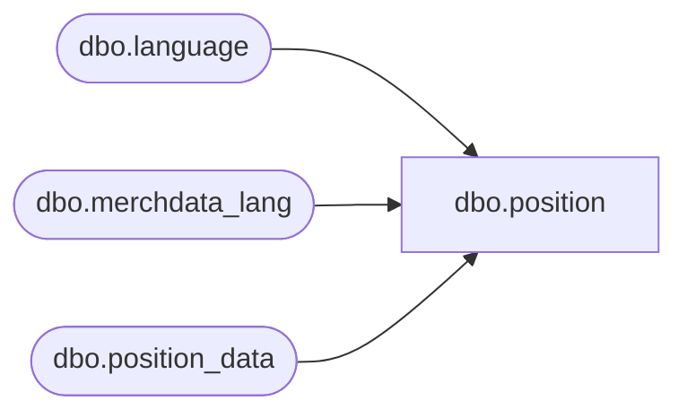

# dbo.position

**Database:** me_01  
**Server:** bedrockdb02  

## Architecture Diagram



## Table Dependencies

| Referenced Table |
|---|
| dbo.language |
| dbo.merchdata_lang |
| dbo.position_data |

## View Code

```sql
CREATE VIEW [dbo].[position]
AS
SELECT a.position_id,
       COALESCE(mdl.[description], a.position_label) as position_label,
       a.approved_by_position_id,
       a.employee_role_id,
       a.active_flag,
       a.position_code
  FROM [dbo].[position_data] a
  LEFT OUTER JOIN
      (SELECT * FROM [dbo].[merchdata_lang] mdl2
        WHERE mdl2.language_id = (SELECT [dbo].[language].language_id
                                    FROM [dbo].[language]
                                   WHERE [dbo].[language].default_desc_language_flag = 1)
          AND mdl2.parent_type=N'position'
       ) mdl
    ON (mdl.parent_id=a.position_id);
```

