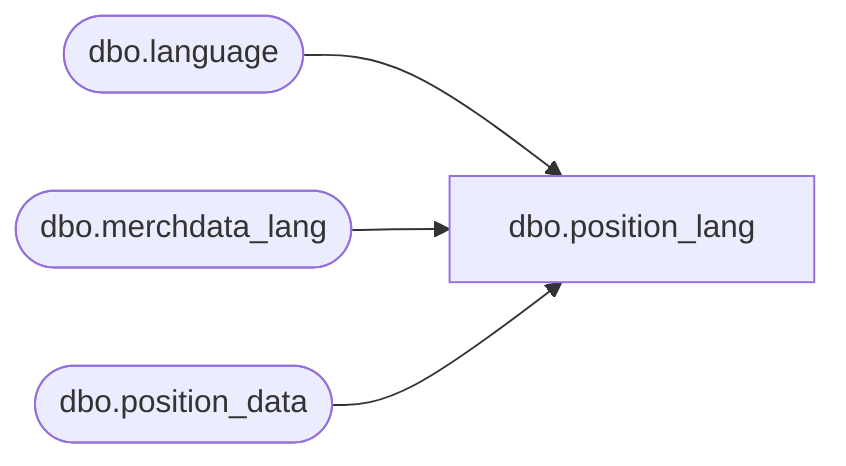

# dbo.position_lang

**Database:** me_01  
**Server:** bedrockdb02  

## Architecture Diagram



## Table Dependencies

| Referenced Table |
|---|
| dbo.language |
| dbo.merchdata_lang |
| dbo.position_data |

## View Code

```sql
Create view [dbo].[position_lang]
AS
SELECT a.position_id,
       COALESCE(mdl.[description], a.position_label) as position_label,
       a.approved_by_position_id,
       a.employee_role_id,
       a.active_flag,
       a.position_code,
       mdl.language_id,
       l.locale_identifier
  FROM [dbo].[position_data] a
		Cross join	[dbo].[language] l
		LEFT outer JOIN	[dbo].[merchdata_lang] mdl 
on		mdl.parent_type=N'position' 
		and mdl.parent_id=a.position_id 
		and mdl.language_id=l.language_id
```

