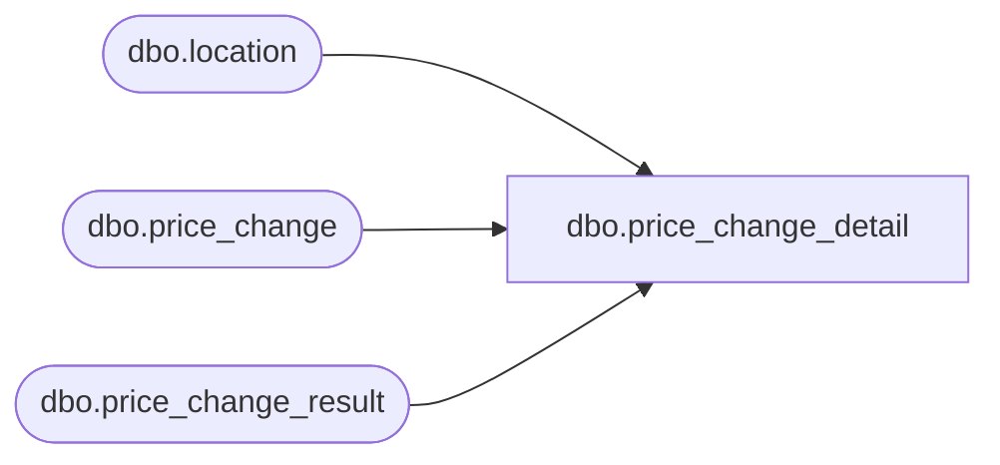

# dbo.price_change_detail

**Database:** me_01  
**Server:** bedrockdb02  

## Architecture Diagram



## Table Dependencies

| Referenced Table |
|---|
| dbo.location |
| dbo.price_change |
| dbo.price_change_result |

## View Code

```sql
-----------------------------------------------------------------------------------------------------------------------------
--	Main Query: Create View
-----------------------------------------------------------------------------------------------------------------------------

CREATE VIEW dbo.price_change_detail

AS

SELECT
	PC.price_change_id
	,PCR.price_change_instruction_id
	,PCR.style_id
	,PCR.color_id
	,PCR.sku_id
	,PCR.jurisdiction_id
	,L.location_id
	,PCR.original_retail_price
	,PCR.current_retail_price
	,PCR.selling_retail_price
	,PCR.calculation_method
	,PCR.base_calculation_on
	,PCR.calculation_value
	,PCR.price_status_id
	,PCR.current_valuation_retail_price
	,PCR.valuation_retail_price
	,PCR.is_pseudo_instruction
	,PCR.final_exception_level
	,PCR.alternate_exception_level
	,PCR.original_valuation_retail_price
	,PCR.old_exception_level
	,PCR.result_id
FROM
	dbo.price_change_result PCR
INNER JOIN dbo.location L ON L.jurisdiction_id = PCR.jurisdiction_id AND PCR.location_id IS NULL
LEFT OUTER JOIN dbo.price_change PC ON PC.result_id = PCR.result_id
WHERE
	NOT EXISTS
		(
			SELECT 1
			FROM
				dbo.price_change_result LPCR
			WHERE
				LPCR.result_id = PCR.result_id
				AND LPCR.location_id = L.location_id
				AND LPCR.sku_id = PCR.sku_id
		)

UNION ALL

SELECT
	PC.price_change_id
	,PCR.price_change_instruction_id
	,PCR.style_id
	,PCR.color_id
	,PCR.sku_id
	,PCR.jurisdiction_id
	,PCR.location_id
	,PCR.original_retail_price
	,PCR.current_retail_price
	,PCR.selling_retail_price
	,PCR.calculation_method
	,PCR.base_calculation_on
	,PCR.calculation_value
	,PCR.price_status_id
	,PCR.current_valuation_retail_price
	,PCR.valuation_retail_price
	,PCR.is_pseudo_instruction
	,PCR.final_exception_level
	,PCR.alternate_exception_level
	,PCR.original_valuation_retail_price
	,PCR.old_exception_level
	,PCR.result_id
FROM
	dbo.price_change_result PCR
LEFT OUTER JOIN dbo.price_change PC ON PC.result_id = PCR.result_id
WHERE
	PCR.location_id is not null
```

