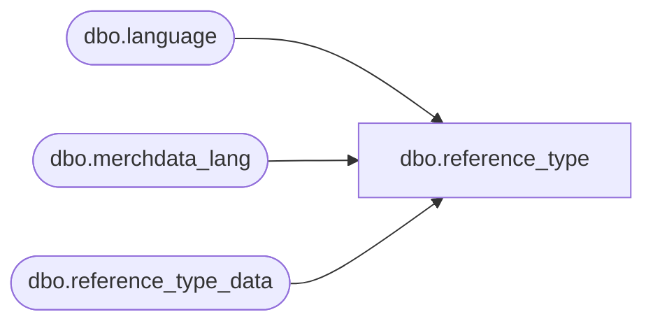

# dbo.reference_type

**Database:** me_01  
**Server:** bedrockdb02  

## Architecture Diagram



## Table Dependencies

| Referenced Table |
|---|
| dbo.language |
| dbo.merchdata_lang |
| dbo.reference_type_data |

## View Code

```sql
CREATE VIEW [dbo].[reference_type]
AS
SELECT a.reference_type_id,
       a.reference_type,
       COALESCE(mdl.[description], a.reference_type_description) as reference_type_description,
       a.active_flag,
       a.updatestamp
  FROM [dbo].[reference_type_data] a
  LEFT OUTER JOIN
      (SELECT * FROM [dbo].[merchdata_lang] mdl2
        WHERE mdl2.language_id = (SELECT [dbo].[language].language_id
                                    FROM [dbo].[language]
                                   WHERE [dbo].[language].default_desc_language_flag = 1)
          AND mdl2.parent_type=N'reference_type'
       ) mdl
    ON (mdl.parent_id=a.reference_type_id);
dbo,style_cs_$seq,
create view dbo.style_cs_$seq 
as 
SELECT style_seq_id style_cs_seq_id, dummycol from style_$seq

dbo,style_detail_cs_$seq,
create view [style_detail_cs_$seq] 
as 
SELECT style_detail_seq_id style_detail_cs_seq_id, dummycol from style_detail_$seq
```

