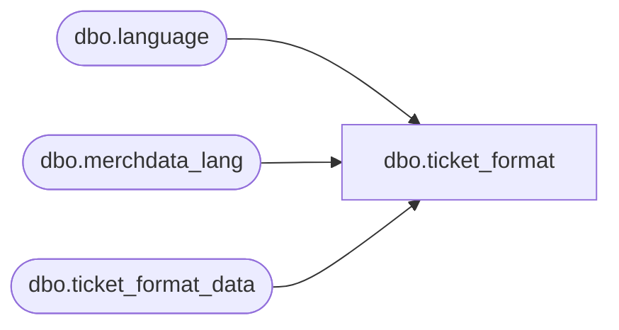

# dbo.ticket_format

**Database:** me_01  
**Server:** bedrockdb02  

## Architecture Diagram



## Table Dependencies

| Referenced Table |
|---|
| dbo.language |
| dbo.merchdata_lang |
| dbo.ticket_format_data |

## View Code

```sql
CREATE VIEW [dbo].[ticket_format]
AS
SELECT a.ticket_format_id,
       a.ticket_format_code,
       COALESCE(mdl.[description], a.ticket_format_description) as ticket_format_description,
       a.active_flag,
       a.updatestamp,
       a.last_modified,
       a.format_type,
       a.format_text1,
       a.format_text2,
       a.format_text3,
       a.format_text4,
       a.format_text5,
       a.format_text6,
       a.format_text7,
       a.format_text8,
       a.no_of_parts,
       a.header_format_id,
       a.header_position_flag,
       a.ticket_type
  FROM [dbo].[ticket_format_data] a
  LEFT OUTER JOIN
      (SELECT * FROM [dbo].[merchdata_lang] mdl2
        WHERE mdl2.language_id = (SELECT [dbo].[language].language_id
                                    FROM [dbo].[language]
                                   WHERE [dbo].[language].default_desc_language_flag = 1)
          AND mdl2.parent_type=N'ticket_format'
       ) mdl
    ON (mdl.parent_id=a.ticket_format_id);
```

