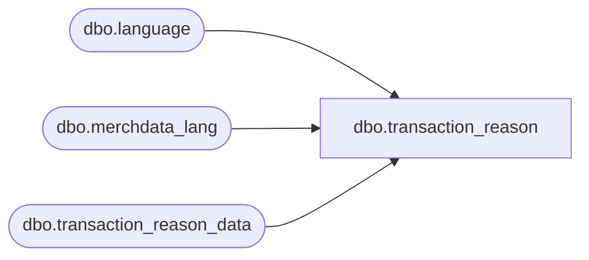

# dbo.transaction_reason

**Database:** me_01  
**Server:** bedrockdb02  

## Architecture Diagram



## Table Dependencies

| Referenced Table |
|---|
| dbo.language |
| dbo.merchdata_lang |
| dbo.transaction_reason_data |

## View Code

```sql
CREATE VIEW [dbo].[transaction_reason]
AS
SELECT a.transaction_reason_id,
       COALESCE(mdl.[code], a.transaction_reason_code) as transaction_reason_code,
       COALESCE(mdl.[description], a.transaction_reason_desc) as transaction_reason_desc,
       a.user_defined_flag,
       a.reason_type_id,
       a.active_flag,
       a.updatestamp
  FROM [dbo].[transaction_reason_data] a
  LEFT OUTER JOIN
      (SELECT * FROM [dbo].[merchdata_lang] mdl2
        WHERE mdl2.language_id = (SELECT [dbo].[language].language_id
                                    FROM [dbo].[language]
                                   WHERE [dbo].[language].default_desc_language_flag = 1)
          AND mdl2.parent_type=N'transaction_reason'
       ) mdl
    ON (mdl.parent_id=a.transaction_reason_id);
dbo,transaction_reason_lang,Create view [dbo].[transaction_reason_lang]
AS
SELECT	a.transaction_reason_id,
		COALESCE(mdl.[code], a.transaction_reason_code) as transaction_reason_code,
		COALESCE(mdl.[description], a.transaction_reason_desc) as transaction_reason_desc,
		a.user_defined_flag,
		a.reason_type_id,
		a.active_flag,
		mdl.language_id,
		l.locale_identifier
FROM	[dbo].[transaction_reason_data] a
		Cross join		[dbo].[language] l
		LEFT outer JOIN	[dbo].[merchdata_lang] mdl 
on		mdl.parent_type=N'transaction_reason' 
		and mdl.parent_id=a.transaction_reason_id 
		and mdl.language_id=l.language_id;
```

