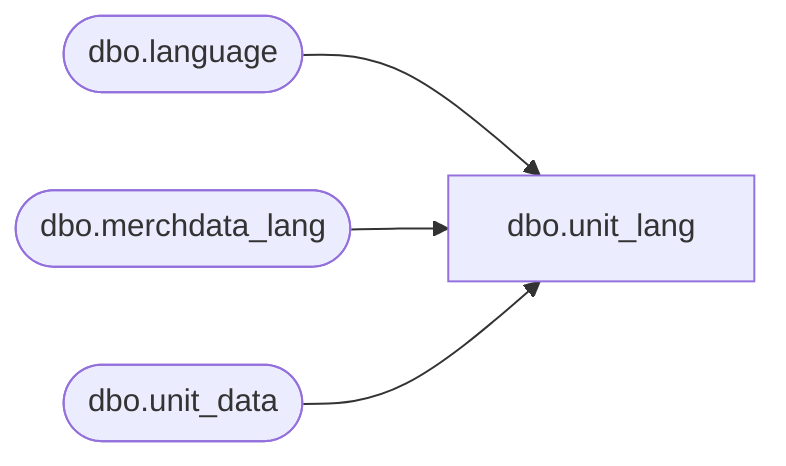

# dbo.unit_lang

**Database:** me_01  
**Server:** bedrockdb02  

## Architecture Diagram



## Table Dependencies

| Referenced Table |
|---|
| dbo.language |
| dbo.merchdata_lang |
| dbo.unit_data |

## View Code

```sql
CREATE VIEW [dbo].[unit_lang]
AS
SELECT	a.unit_id,
		a.unit_type_id,
		COALESCE(mdl.[code], a.unit_code) as unit_code,
		COALESCE(mdl.[description], a.unit_label) as unit_label,
		a.unit_abbreviation,
		mdl.language_id,
		l.locale_identifier
FROM	[dbo].[unit_data] a
		Cross join		[language] l 
		LEFT outer JOIN	[dbo].[merchdata_lang] mdl 
on		mdl.parent_type=N'unit' 
		and mdl.parent_id=a.unit_id 
		and mdl.language_id=l.language_id;
```

