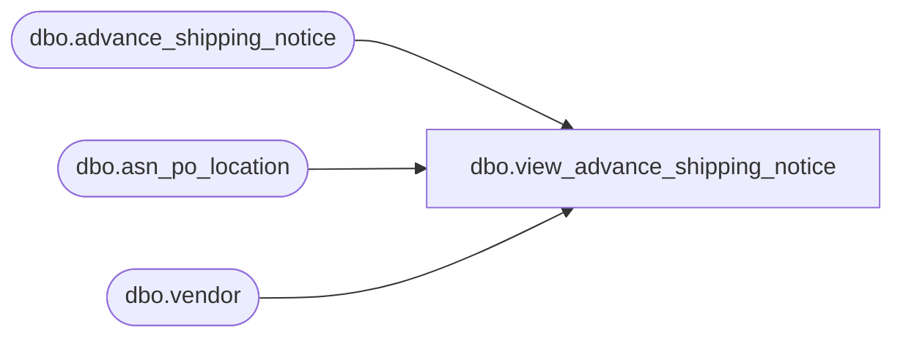

# dbo.view_advance_shipping_notice

**Database:** me_01  
**Server:** bedrockdb02  

## Architecture Diagram



## Table Dependencies

| Referenced Table |
|---|
| dbo.advance_shipping_notice |
| dbo.asn_po_location |
| dbo.vendor |

## View Code

```sql
create view dbo.view_advance_shipping_notice 
         (doc_type,
          doc_no,
          from_location_id,
          to_location_id,
          create_date,
          receive_date,
          status,
          description,
          doc_id,
          display_location_id,
          grouping_label,
          secondary_type,
          vendor_code,
          vendor_name,
          transaction_reason_id,
          performed_by, 
          cartons_arrived, 
          total_cartons,
          match_status,
          shipment_ref_no)
AS
   SELECT N'ASN',  
          advance_shipping_notice.document_no, 
          CAST(null AS smallint),  
          asn_po_location.location_id,  
	  convert(smalldatetime,convert(char(12),advance_shipping_notice.create_date,109)),
          advance_shipping_notice.expected_receipt_date,
          advance_shipping_notice.asn_status,  
          CAST(null AS nvarchar(60)), 
          advance_shipping_notice.advance_shipping_notice_id, 
          CAST(null AS smallint),  
          CAST(null AS nvarchar(20)),  
          0,  
          vendor.vendor_code,  
          vendor.vendor_name, 
          CAST(null AS smallint), 
          CAST(null AS nvarchar(60)),
          CAST(null AS int),
          CAST(null AS int),
          CAST(null AS smallint) ,
         shipment_ref_no
     FROM dbo.advance_shipping_notice,
          dbo.asn_po_location,
          dbo.vendor
    WHERE advance_shipping_notice.advance_shipping_notice_id
        = asn_po_location.advance_shipping_notice_id       
      AND advance_shipping_notice.vendor_id = vendor.vendor_id  
      AND advance_shipping_notice.asn_status = 25
```

