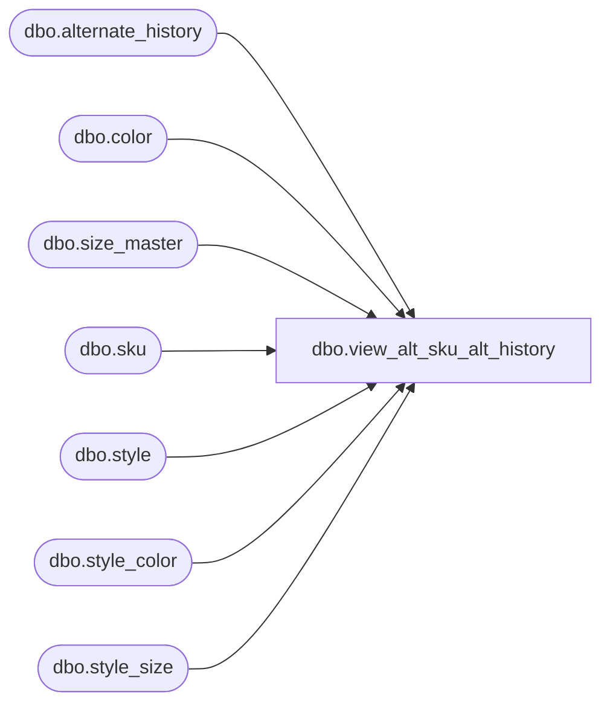

# dbo.view_alt_sku_alt_history

**Database:** me_01  
**Server:** bedrockdb02  

## Architecture Diagram



## Table Dependencies

| Referenced Table |
|---|
| dbo.alternate_history |
| dbo.color |
| dbo.size_master |
| dbo.sku |
| dbo.style |
| dbo.style_color |
| dbo.style_size |

## View Code

```sql
create view dbo.view_alt_sku_alt_history AS
SELECT DISTINCT
  sk.sku_id alt_sku_id,
  s.style_code alt_style_code,
  s.long_desc alt_long_desc,
  s.short_desc alt_short_desc,
  sc.long_desc alt_style_color_long_desc, 
  sc.short_desc alt_style_color_short_desc,
  c.color_code alt_color_code,
  c.color_long_description alt_color_long_desc,
  c.color_short_description alt_color_short_desc,
  sm.size_code alt_size_code,
  sm.prim_size_label alt_prim_size_label,
  sm.sec_size_label alt_sec_size_label
FROM sku sk
INNER JOIN style s
ON sk.style_id = s.style_id
INNER JOIN style_color sc
ON sk.style_color_id = sc.style_color_id
INNER JOIN color c
ON sc.color_id = c.color_id
INNER JOIN style_size ss
ON sk.style_size_id = ss.style_size_id
INNER JOIN size_master sm
ON ss.size_master_id = sm.size_master_id
WHERE sk.sku_id in (SELECT DISTINCT alt_sku_id FROM alternate_history)
```

